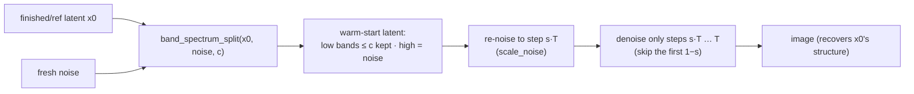

# E20 — spectral warm-start: can we "skip the beginning" of generation?

**TL;DR.** Diffusion is coarse-to-fine: the early denoising steps fix low-frequency
**structure**, the late steps fix detail. So we should be able to build an intermediate
latent whose **low Fourier bands are pre-set**, re-enter the trajectory partway, and
**skip the early steps**. We test this in SD3.5-medium (rectified flow, 28 steps) three
ways. The **oracle works strikingly well** — committing just the lowest bands
(`c=0.1`) recovers the image (CLIP-I ≈0.96) while skipping a large fraction of the
schedule, versus ≈0.55 when re-entering from pure noise at the same step.
**Conditioning** on a reference image's low bands gives a clean structure-vs-prompt
dial but does not beat full SDEdit. **Noise-shaping fails**: pre-coloring the step-0
noise toward a natural spectrum knocks the run off-manifold and tanks quality. The
working lever is **inject-the-low-bands-and-skip**, not pre-coloring noise.

*The HTML report (`experiments/results/e20/index.html`) carries the same glossary inline
and leads each result with its figure; defining every term here keeps this writeup
self-contained.*

## Schematic



## Background (plain language)

- **Latent / SD3.5 rectified flow** — SD3.5 generates in a compressed latent space
  (here `16×128×128`). It uses **rectified flow**: a sample at fraction `σ` along the
  trajectory is `x_σ = (1−σ)·x₀ + σ·ε` (`x₀` = clean latent, `ε` = Gaussian noise). The
  scheduler maps a re-entry **strength** to a start step.
- **2-D FFT: frequency vs phase/magnitude** — the 2-D Fourier transform gives a complex
  `F = |F|·e^{iφ}` at every frequency. Two **independent** axes: (a) **low vs high
  frequency** = coarse layout vs fine detail; (b) **magnitude vs phase** = which part of
  each coefficient. Classic result (Oppenheim–Lim): **phase carries structure**,
  magnitude/power carries texture-energy and palette. The warm-start keeps the low
  *frequencies* **whole** (magnitude + phase); it is their phase that supplies the coarse
  layout — the **opposite** of SBN (which clamps the magnitude axis only), which is why
  this is a genuinely new lever rather than a reskin of E19.
- **Warm-start band commit (cutoff `c`)** — `band_spectrum_split(x₀, noise, c)` keeps the
  full complex Fourier coefficients of a source latent `x₀` for all radial bands up to
  cutoff `c ∈ [0,1]`, and fills the rest with fresh noise. `c=0` = pure noise (nothing
  committed); `c=1` = the whole source latent; `c=0.1` = only the lowest 10% of the
  spectrum (coarse layout) committed.
- **Re-entry strength `s` (= skip)** — after building the warm-start latent we re-noise it
  to a mid-trajectory level and denoise only the rest. `s` is the fraction of the schedule
  actually run, so **skip = 1−s**. `s=0.4` runs 40% of steps (skips 60%); `s=0.8` runs 80%
  (skips 20%). **Lower `s` = more aggressive skipping = harder.**
- **Conditions (the three run parts)** —
  **oracle**: the committed source is a *finished run's own* latent `x₀*` (a ceiling — we
  already know the target).
  **condition**: the committed source is a *reference image's* encoded latent
  (band-controlled SDEdit); `c=1` is ordinary full SDEdit.
  **noiseshape**: no skipping — the step-0 *noise* is recolored (`color_noise`, a PSD-match)
  so its band power matches real photos' latents, then the full schedule runs
  (colored-init vs white-init).
- **Metrics** —
  **CLIP-I** (0–1 ↑, oracle/condition): image↔target cosine in CLIP space — does the
  warm-start reconstruct the oracle target (oracle) or the reference image (condition)?
  **latent L2** (≥0 ↓, oracle): RMS distance from the output latent to the target latent;
  0 = identical.
  **prompt CLIP-T** (0–1 ↑, condition): image↔prompt cosine — does it follow the text?
  **aesthetic** (≈1–10 ↑, noiseshape): LAION aesthetic-predictor score.
  **CLIP-T** (0–1 ↑, noiseshape): image↔prompt similarity.

*(A model-free **preflight** part also asserts the construction math —
`band_spectrum_split` endpoints, the `scale_noise` re-entry interpolation, and
`color_noise` matching a target spectrum at unit variance — and prints the cached E8
power-lock-in, the motivating prior that band **power** locks in *late* so the early steps
fix **phase**, not power.)*

## Method (`experiments/e20_warmstart.py`, SD3.5-medium, 28 steps)

- **oracle** — run the full schedule once to get `x₀*` + a reference image; for each
  cutoff `c` × strength `s`, build `band_spectrum_split(x₀*, noise, c)`, re-enter at `s`,
  denoise the rest, score CLIP-I + latent-L2 to the full run. *Given the true low bands up
  to `c`, how many steps can we skip and still recover the image?*
- **condition** — same construction, but the committed source is a reference *image's*
  latent and the score is structure (CLIP-I to the reference) vs prompt (CLIP-T). *Does
  committing only low bands keep structure while letting the prompt drive detail, better
  than full SDEdit (`c=1`)?*
- **noiseshape** — color the step-0 noise toward the mean band power of SD3.5-encoded real
  photos, run the full schedule at several step counts. *Does a natural-spectrum start
  reach quality in fewer steps than white noise?*

## Results (ran on cluster; SD3.5-medium, 28 steps, cfg 4.5; single seed per cell)

Numbers below are pulled directly from
`experiments/results/e20/{oracle,condition,noiseshape}.json`. Read **directions**, not
third decimals (n=1 per cell). Figures (recovery grids) are in
`experiments/results/e20/` and embedded in the self-contained `index.html`.

### 1. oracle — a small low-band cutoff recovers the image (the headline)

Committing the **lowest bands alone** snaps recovery near 1, while the pure-noise baseline
does not. CLIP-I to the full run, gentlest skip column where available:

| scene | `c=0` (noise) | `c=0.1` | `c=0.25` | `c=1` |
|---|---|---|---|---|
| fox `s=0.6` | 0.56 | **0.98** | 0.99 | 0.99 |
| market `s=0.6` | 0.50 | **0.99** | 0.99 | 0.99 |
| portrait `s=0.6` | 0.53 | **0.97** | 0.97 | 0.98 |

The `c=0` noise baseline only reaches CLIP-I ≈0.48–0.82 (and latent-L2 ≈1.0–1.2),
whereas `c=0.1` jumps to ≈0.93–0.99 with latent-L2 ≈0.34–0.57. Pushing `c` from 0.1 → 1
adds little (≤~0.02 CLIP-I) — **the coarse layout is carried by the lowest bands**, so a
small cutoff buys almost the whole image while skipping a large fraction of the schedule.
This is the method's *ceiling* (it uses the run's own bands), and it confirms the
coarse-to-fine premise: hand the model the destined low bands and it reconstructs.

### 2. condition — a clean structure-vs-prompt dial, but no free lunch over SDEdit

Committing a reference *painting's* low bands and generating from a photo prompt. The two
metrics trade off exactly as the dial predicts: higher re-entry strength `s` (more steps
run) raises **prompt CLIP-T** and lowers **structure CLIP-I**; lower cutoff `c` loosens
the grip on the reference. Example (`vangogh_starry_night → fox`):

| cell | struct CLIP-I ↑ | prompt CLIP-T ↑ |
|---|---|---|
| `c=0.1, s=0.5` | **0.78** | 0.23 |
| `c=0.1, s=0.7` | 0.60 | **0.31** |
| `c=1, s=0.5` (SDEdit) | 0.74 | 0.25 |
| `c=1, s=0.7` (SDEdit) | 0.63 | 0.31 |

So `c × s` is a usable structure-vs-prompt knob, but on this small reference set the
band-cut does **not** cleanly beat full SDEdit (`c=1`) — it is a softer version of the
same lever, not a free lunch.

### 3. noiseshape — pre-coloring the init noise *fails*

No skipping: we only reshape the step-0 noise so its band power matches real photos'
latents, then run the full schedule. It **hurts** at every step count (`fox`):

| steps | aesthetic white | aesthetic colored | CLIP-T white | CLIP-T colored |
|---|---|---|---|---|
| 8 | **6.41** | 4.00 | **0.31** | 0.08 |
| 16 | **6.39** | 4.05 | **0.31** | 0.07 |
| 28 | **6.39** | 4.03 | **0.31** | 0.07 |

Coloring the init drops aesthetic ≈6.4→4.0 and collapses prompt CLIP-T ≈0.31→0.07.
Rectified-flow generation expects a (near-)white Gaussian start; biasing its band power
off-distribution moves it off the trained manifold and the model never recovers.
**Spectrum-shaping the *init* is the wrong place to inject structure** — the oracle's
mid-trajectory band commit is the working lever.

**Bottom line.** The coarse-to-fine premise holds: injecting the destined **low Fourier
bands** and re-entering mid-trajectory recovers the image with a large step-skip (oracle).
Sourcing those bands from a reference image is a clean structure↔prompt dial but no better
than SDEdit, and pre-coloring the initial noise actively backfires. The actionable
takeaway is **inject-low-bands-and-skip**.

## Caveats & next

1. The oracle commits a finished run's **own** low bands — a ceiling, not a usable method;
   a practical version needs those bands cheaply (a reference image, as in `condition`, or
   a fast preview).
2. Single seed per oracle/condition cell, small reference set — read directions only.
3. Recovery is CLIP-I + latent-L2 (LPIPS not installed).
4. SD3.5-medium only; other models / VAEs may differ.

**Next:** use the oracle ceiling to set a realistic skip budget, and source the low bands
from a cheap preview rather than the full run.

## Reproduce

```bash
cd experiments
python e20_warmstart.py --part preflight                                   # model-free asserts
python e20_warmstart.py --part oracle      --num_prompts 3                  # SD3.5 (cluster)
python e20_warmstart.py --part condition   --refs results/e18/styles        # SD3.5 (cluster)
python e20_warmstart.py --part noiseshape  --num_prompts 1                  # SD3.5 (cluster)
# rebuild the HTML explainer offline (no GPU/model) from the jsons + cached grids:
python e20_warmstart.py --part site        # == python e20_site.py
```

> Cluster note: generation parts need the gated SD3.5 download; ship code/results with
> `kubectl cp` (the `/storage` checkout is not git). Watch the `flux-gen-ops` OOM /
> `/workspace` path traps; one prompt per subprocess.

## Status

**RAN.** The three generation parts (oracle / condition / noiseshape) ran on the cluster;
results pulled into `experiments/results/e20/` (`{oracle,condition,noiseshape}.json` +
recovery grids). The self-contained explainer is `experiments/results/e20/index.html`,
rebuildable offline via `--part site`.
