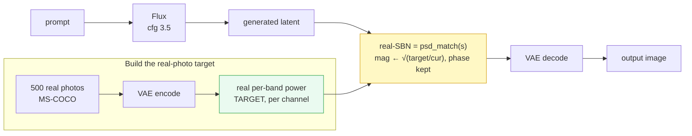

# E23 — Real-image spectral gap, and correcting toward it ("real-SBN")

**The direction.** A diffusion model's images are not quite like real photographs — and one
concrete, measurable way they differ is their **frequency spectrum**. Earlier work in this repo
(Spectral Band Normalization, "SBN") re-leveled a generated image's per-frequency-band power
toward a **cfg = 1** reference — but cfg = 1 is just a *softer model output*, not reality. E23
replaces that proxy: we **measure** the generated-vs-**real** spectral gap (against 500 real
photos) and **correct** each generated image's spectrum toward the real-photo spectrum. We call
that correction **real-SBN**.

## Schematic



*Phase carries layout/content and is kept untouched; only per-band magnitude (texture/palette) is
re-leveled toward the real target. `strength s` dials how far (s = 0 identity, s = 1 full match;
≈ 0.25 is the visual sweet spot — see below).*

## Background (plain language)

- **Latent.** Flux works in a compressed 16-channel 128×128 array; a VAE turns it into the
  1024×1024 image. All spectral analysis is on latents.
- **Fourier / radial band / PSD.** Any latent is a sum of waves at different spatial
  frequencies (low = coarse structure, high = fine texture). We bin frequencies into ~24 radial
  rings ("bands"); the **power spectral density (PSD)** is the curve of power vs band — the
  "fingerprint" of how much coarse vs fine content an image has.
- **Phase vs magnitude.** Each frequency has a magnitude (how strong) and a phase (where).
  In these latents **phase carries layout/content**, per-band **magnitude carries texture +
  palette**. This split is why we can change texture without moving the content.
- **CFG.** Classifier-free guidance — the knob for how strongly the image obeys the prompt.
  `cfg ≈ 3.5` is normal; `cfg = 1` is weak (soft, low-contrast). Higher cfg also **inflates**
  low-frequency power above the natural level (prior experiment E10).

## Method

- **The real target.** Encode 500 MS-COCO photos through the Flux VAE; take the mean
  per-(channel, band) power. This is the universal target (kept **per channel** — the gap is
  channel-structured, see below). (`real_spectral.py`, `e10_cfg_spectral.py --part coco,real`.)
- **The operator — `psd_match` (AdaIN-in-Fourier).** For each (channel, band), multiply the FFT
  magnitude by `sqrt(target / current)` and leave the phase alone. Layout preserved; texture and
  palette re-leveled. (`spectral_ops.psd_match`, `style_ops.restyle_latent`.)
- **`strength s`.** An exponent on the correction: magnitude × `(real/own)^(s/2)`. 0 = identity,
  1 = full match.
- **Three ways to apply it.** *offline* — correct the final latent post-hoc, then decode (the
  main one); *during generation, last step* — same correction inside the loop on the last step
  (matches offline); *initial-noise shaping* — shape the starting noise (fails; see below). We do
  **not** correct every step: the real target is a *clean*-image spectrum, but mid-denoising
  latents are mostly noise, so matching them every step is apples-to-oranges.

## Findings

**1. The gap is bimodal — not just the CFG story.** At the lowest bands the model has *more*
power than real (CFG low-frequency inflation); across the mid/high bands it has *less* (ratio
≈ 1.2–1.3) — a broad **high-frequency deficit**: generated images are systematically
under-textured vs real photos. The heatmap shows this is channel-specific (hence a per-channel
target).

**2. Correcting toward real helps** (means over prompt classes, 8 seeds; full strength offline or
last-step):

| condition | spec-dist→real ↓ | aesthetic ↑ | ImageReward ↑ | CLIP-T ↑ |
|---|---|---|---|---|
| cfg 3.5 (baseline) | 0.322 | 6.61 | 1.56 | 0.298 |
| SBN→cfg 1 (old) | 0.582 | 6.76 | 1.46 | 0.293 |
| real-SBN offline s=1.0 | 0.000 | 6.88 | 1.51 | 0.291 |
| real-SBN last-step | 0.000 | 6.89 | 1.51 | 0.291 |
| init-noise shaping | 2.08 | 3.90 | −2.28 | 0.098 |

Biggest aesthetic gain of any condition, ~zero adherence (CLIP-T) cost, and it **beats the old
cfg-1 SBN** (which moves *away* from real). The **strength sweep** shows the gain concentrates on
**photographic portraits** (Δaesthetic +0.55…+0.64). **But 0.5+ introduces grain/artifacts** —
the high bands have little real signal, so full strength over-amplifies them — so **≈ 0.25 is the
recommended setting**. (Note: the LAION aesthetic predictor *rewards* that over-sharpening, so its
score keeps rising past the point a human prefers — trust the eye.)

**3. Why not just use cfg = 1?** Because cfg = 1, though natural-looking, has **poor prompt
adherence** — it drops objects/attributes on long compositional prompts. On 6 long prompts
(market, desk, alley, still-life, fox-scene, blacksmith), the 3-way panels
(`results/e23/adherence/panels/`, cfg 1 | cfg 3.5 | real-SBN 0.25) show cfg 1 blurring/dropping
elements (market crowd, still-life goblet, alley neon/cat, blacksmith details) while cfg 3.5
renders them and **real-SBN keeps that composition with a more natural tone**. CLIP-T agrees
directionally (cfg1 0.301 < cfg3.5 0.315 ≈ real-SBN 0.313); B-VQA (BLIP-VQA, the compositional
T2I-CompBench metric) is the proper score and is being added.

## Caveats & next

- **The gap metric is partly circular**: `spec-dist→real` measures the channel-mean PSD that
  full-strength real-SBN directly matches, so its → 0 is by construction. The independent wins are
  the aesthetic gain and the near-zero adherence cost.
- **Init-noise shaping fails** — the flow prior expects white noise; coloring it collapses
  generation (documented negative).
- **Isotropic only** — radial bands carry texture-energy + palette, not oriented structure.
- **Next:** a single **fixed per-channel correction curve** (apply the average real/gen ratio to
  every image, no per-image matching) → would make real-SBN a free, deterministic post-step.

## Reproduce

```bash
# build the real target (once)
python e10_cfg_spectral.py --part coco,real --n_coco 500
# measure gap + corrections + scores + qualitative examples
python e23_real_sbn.py --part measure,gen,score,examples,analyze --seeds 16 --num_classes 6 \
    --strength_sweep 0.25,0.5,0.75,1.0
# cfg1-vs-cfg-vs-realSBN on long complex prompts (B-VQA adherence)
python e23_real_sbn.py --part adherence --prompt_set complex --strength_sweep 0.1,0.25,0.5 \
    --rec_strength 0.25 --seeds 8 --vqa
# HTML explainer (results/e23/index.html)
python e23_site.py
```

Code: `real_spectral.py`, `e23_real_sbn.py` (driver), `e23_site.py` (explainer),
`spectral_ops.psd_match`, `style_ops.restyle_latent`, `compbench.bvqa_scores`.
