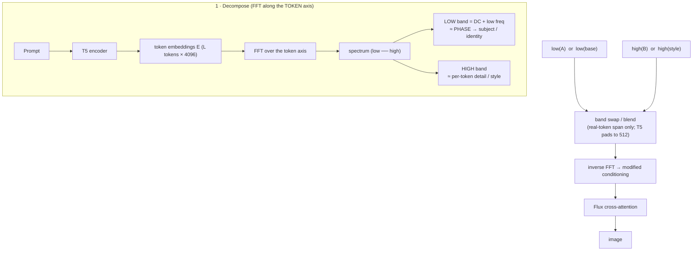

# E24 — Token-axis spectral surgery on the text conditioning

**The question.** Diffusion models are steered by a *text conditioning tensor*: the prompt
is run through a text encoder (Flux uses **T5-XXL**) into a sequence of token embeddings
`E` of shape `(1, L, 4096)` — one 4096-dim vector per prompt token — which is fed to the
transformer's cross-attention. **Can we treat that sequence as a signal, take its Fourier
transform along the *token* axis, and use the frequency bands to merge or edit images?**

**Why it's plausible — FNet.** Lee-Thorp et al. (2021) replaced Transformer self-attention
with a parameter-free DFT over the token-sequence axis and still reached ~92–97% of BERT.
That is evidence the **token-axis FFT is a meaningful token-mixing basis**: low
token-frequencies carry slow / global meaning (the DC term is the bag-of-words mean), high
token-frequencies carry sharp token-to-token detail. E24 is the text-side analogue of the
project's image-latent Fourier band-swap (E18 "AdaIN-in-Fourier", E20).

## Schematic



*(The HTML explainer `results/e24/index.html` carries the same schematic as an inline SVG.)*

## How the FFT works (1D per channel, on the full sequence)

A common point of confusion — to be explicit about what is and isn't transformed:

- **The signal is the token sequence.** The conditioning is `E ∈ (N_T × d)` with
  `N_T` = number of real prompt tokens and `d = 4096`. We take a **1‑D DFT along the
  token axis** (`torch.fft.rfft(E, dim=1)`), computed **independently for each of the
  4096 embedding channels** — i.e. `d` separate length‑`N_T` transforms. "Frequency"
  means *how fast a given channel's value oscillates as you walk along the tokens*
  (DC = that channel's average over the prompt). The transform **never mixes across
  the embedding dimension**.
- **This is not a 2‑D transform.** A 2‑D FFT over *(tokens × channels)* appears only in
  the `fnet_swap_2d` control condition (the literal FNet operation). Because the
  embedding dimension has no natural ordering, that 2‑D version is not interpretable and
  is included only as an "is the mixing transform itself enough?" baseline.
- **It operates on the full sequence, not the pooled vector.** All band ops act on the
  T5 **sequence** embeddings `(1, L, 4096)` that feed cross‑attention — *not* on the
  single pooled `(1, 4096)` vector. (The pooled CLIP vector is left untouched in most
  conditions; the `pooled_swap` baseline confirmed it barely steers the image — the
  sequence dominates.)

## Method

All ops live in `experiments/text_spectral_ops.py` and act on the **real-token span**
`E[:, :L]` (captured from the T5 tokenizer — T5 pads to 512, and FFTing the padding mixes
the content→padding cliff into the high band). They use `rfft`/`irfft` along the token axis
so everything is real-in / real-out. `cut` is the normalised crossover frequency
(`0`=DC … `1`=Nyquist).

- **probe** (one prompt): keep only a band — `dc_only`, `low`, `high`, `high_dc`, `full` —
  and regenerate. Tells us *what each band controls* and whether band-filtered embeddings
  stay on the encoder manifold (do they still make coherent images?).
- **merge** (prompt A + B): `lowA_highB`, `lowB_highA`, soft `blend` over a `cut` grid, the
  token-axis phase/magnitude swaps `phaseA_magB` / `magA_phaseB`, plus baselines
  `lerp@0.5` (token-space interpolation — **the bar to beat**), `pooled_swap` (T5 sequence
  from A, CLIP pooled from B), and `fnet_swap` (FNet-style 2D seq×hidden DFT swap).
- **edit** (base + style prompt): inject the style's high band into the base over a `cut`
  grid; compare to the full style prompt and a pooled-only inject.

**Hook & model.** Flux pre-encodes prompts to `(prompt_embeds, pooled)` and feeds them to
generation (`gen_emb` in `e10_cfg_spectral.py`); we modify `prompt_embeds` before
denoising. true-CFG=1 (single pass / trained field), guidance 3.5, 28 steps, 4 seeds.

**Metrics.** CLIP-T cosine (`e9_clipt.clip_scores`) to each source prompt — for merges,
`CLIP_A` vs `CLIP_B` is the **attribution**: which prompt does the image resemble? Plus
LAION aesthetic and ImageReward (`fidelity_metrics.py`).

## Results (`results/e24/`, RTX A5000, ~4 h)

**Probe — token-axis bands are meaningful and on-manifold.** Every band-filtered variant
produces a coherent, on-prompt image (CLIP 0.21–0.32, aesthetic 6–7). The **high band
alone reconstructs the prompt about as well as `full`**; `dc_only` is weakest. So the
conditioning is robust to band filtering — the FNet intuition holds at the conditioning
level.

**Merge — NEGATIVE for clean blending.** No condition blends A and B; results **snap to
whichever prompt owns the low band + phase**:

| cat_car condition | CLIP_A | CLIP_B | leans |
|---|---|---|---|
| pure_A / pure_B | 0.279 / 0.095 | 0.164 / 0.254 | anchors |
| **lerp@0.5** (baseline) | 0.272 | 0.165 | → A |
| lowA_highB | 0.274 | 0.162 | → A |
| lowB_highA | 0.139 | 0.222 | → B |
| phaseA_magB | 0.274 | 0.159 | → A |
| magA_phaseB | 0.212 | 0.254 | → B |
| pooled_swap | 0.275 | 0.162 | → A |
| fnet_swap | 0.100 | 0.262 | → B |

- The spectral merges **do not beat `lerp`** — and `lerp@0.5` *itself* collapses to A. The
  token spectrum behaves as a near-**binary identity selector**, not a continuous blender.
  (Only `blend_c0.15` on castle_forest got near-balanced: A 0.245 / B 0.226.)
- `pooled_swap` (sequence A + pooled B → A) shows the **T5 sequence dominates**; the CLIP
  pooled vector barely steers the image.

**Edit — PARTIAL POSITIVE.** Injecting the style's high band is a usable **style-strength
knob** via `cut`: gentle settings give a modest content-preserving nudge (house: style
0.150→0.18, content held 0.272→0.25); an aggressive `cut=0.15` (85% of the spectrum from
the style prompt) ≈ just using the style prompt (portrait: style 0.071→0.224).
`pooled_inject` does about the same, more cheaply.

**Mechanistic takeaway.** Content **identity is carried by the token-axis PHASE** (and the
low band): `phaseA_magB→A`, `magA_phaseB→B` — magnitude does not transfer identity. This
directly mirrors the project's image-domain finding that **phase carries structure** (E18 /
E20).

## Verdict

The hunch is **directionally right for editing** (high-band style injection works as a
knob) but **wrong for merging**: the token spectrum is too winner-take-all to blend two
full prompts, and it does not beat plain embedding interpolation — which was the bar. A
clean exploratory result: a negative (merge) + a partial positive (edit) + a mechanistic
insight (phase = identity).

## Run

```bash
# self-gating cluster job: smoke (probe+analyze) -> CLIP sanity gate -> full sweep
runai submit --name e24-text-spectral -g 1 \
  -i pytorch/pytorch:2.10.0-cuda12.8-cudnn9-runtime \
  --pvc=storage:/storage --large-shm --command -- \
  bash /storage/malnick/colorful-noise/experiments/cluster_e24_job.sh

# locally / single GPU
python experiments/e24_text_spectral.py --part probe --num_prompts 2 --seeds 1 --steps 8  # smoke
python experiments/e24_text_spectral.py --part probe,merge,edit,analyze                   # full
# -> results/e24/{probe,merge,edit}/grid.png, report.json, index.html
```

> **Cluster note.** `/storage/malnick/colorful-noise` is **not** a git checkout and the
> pytorch image has no `git`, so ship new code with `kubectl cp` into a PVC-mounted pod
> rather than an in-pod `git pull`.

## Open directions

- Chase the one near-balanced regime (soft `blend` at low `cut`) — is there a narrow band
  that genuinely co-presents A and B?
- Push the content-preserving edit: inject only a sub-band of the style's high frequencies,
  or renorm per token (`--renorm`) to stay closer to the base.
- Cross-model check on SD3.5 (dual CLIP + T5), as done for the E18 cross-domain finding.
