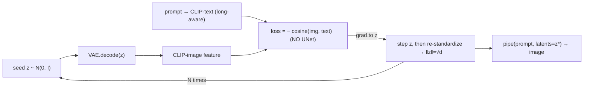

# E25–E26 — Seed alignment: biasing the initial noise toward the prompt

## TL;DR

Diffusion sampling starts from a random latent "seed" `z ~ N(0, I)`. There is a well-known
observation that **the seed leaves traces in the output** — the final generated latent stays
highly correlated (high cosine similarity) with the seed it started from, a consequence of the
near-linearity of the probability-flow ODE. So instead of sampling `z` purely at random, can we
spend a *tiny, cheap* amount of optimization to nudge the seed **toward the prompt** before
generation, and have that bias survive into the image? We optimize the seed **purely in latent
space** (decode `z`, score its CLIP-similarity to the text, step uphill) **never running the
UNet**, while a hard moment constraint keeps `z` a valid Gaussian sample (`‖z‖ = √d`). **E25**
piloted this on SD1.5; **E26** ports it to **SDXL** with long **DPG-Bench** prompts and **sweeps
N**, the number of inner gradient steps. **Headline:** the nudge is a genuinely **gentle,
do-no-harm, break-even** operation — a single cheap step (`N=1`) is the only clearly non-negative
point and **more steps do not help** (they drift slightly negative / off-manifold). This is a
deliberately gentle lever: the goal is **not** a large prompt-adherence jump, it is to characterize
a cheap, do-no-harm "better starting point" for the seed.

## Schematic



## Background (plain language)
*The HTML report (`results/e26/index.html`) carries the same glossary inline and leads each result
with its figure. Defining every term here keeps this writeup self-contained.*

- **Seed `z ~ N(0, I)`** — diffusion generation starts from a random Gaussian noise latent. For
  SDXL at 1024px this is a `4×128×128` array, `d = 65536` numbers; the sampler denoises it into the
  final latent the VAE paints into the image.
- **The Gaussian-sphere / moment constraint (`‖z‖ = √d`)** — after *every* gradient step we
  **re-standardize** `z ← (z − mean) / std`, forcing **zero mean and unit variance**. Because
  `‖z‖² = d·(var + mean²)`, this pins the norm to `‖z‖ = √d` **exactly** (SD1.5: `√16384 = 128`;
  SDXL: `√65536 = 256`), i.e. the optimization is a move **on the sphere of radius √d** where a true
  Gaussian sample lives — not off into low-probability latent regions. Measured `‖z*‖` equals `√d`
  to two decimals on every run.
- **The latent-space CLIP objective (no UNet, no x̂₀)** — we do **not** predict the clean latent
  `x̂₀` and **never run the UNet** in the optimization. We decode the seed itself and compare it to
  the prompt in CLIP space:

  ```
  loss = − cosine( CLIP_image( VAE.decode(z) ), CLIP_text(prompt) )
  ```

  Gradients flow only through the frozen VAE decoder and frozen CLIP image encoder back to `z`; the
  UNet is used **only** in the ordinary generation call afterwards. (An alternative that runs one
  UNet step to form `x̂₀` was tried in E25 and was more aggressive / destructive — see below. This
  latent-space version is the gentler, better-behaved one.)
- **Long-aware CLIP-T (the metric / target)** — SDXL's two text encoders **and** the CLIP scorer
  truncate at **77 tokens**, but DPG-Bench prompts run ~55–109 words, so plain CLIP-T cannot read
  the whole prompt. We instead split the prompt into clauses (each ≤77 tokens), CLIP-encode each,
  **mean-pool + renormalize**, and use that as *both* the optimization target and the evaluation
  metric. Higher = the image matches the (whole) prompt better. (This also reframes the idea: the
  seed is a side-channel that could carry prompt information the truncated text conditioning drops —
  a hypothesis for future work.)
- **Inner-step count `N`** — how many gradient steps we take on the seed before generating. **One**
  optimization is run to the max `N` and **snapshotted at each value** in the sweep `[1, 2, 3, 5]`
  (a prefix reuses work, so the sweep is nearly free). Re-standardization keeps `‖z‖=√d` at every
  snapshot.
- **The generation columns** — `baseline` = the untouched random seed `z₀` (no optimization);
  `N=1` = the cheap one-step **linear** nudge; `N=2 / N=3 / N=5` = more inner steps (snapshots of
  the same run); `N=1*strong` = a single **strengthened** step (larger lr, `0.20` vs `0.05`) —
  tests whether one bigger jump beats one small one.
- **ΔCLIP-T (the headline number, ↑ = good)** — per column, `long-CLIP-T(aligned image) −
  long-CLIP-T(baseline image)`. **Positive** = optimizing the seed moved the *generated image*
  toward the prompt; `0` = no net effect; **negative** = it hurt. The question is whether the seed
  nudge survives into the image, and whether more steps `N` help.

## Method

### E25 — pilot on SD1.5 (512px, `experiments/e25_seedalign.py`)
`d = 4·64·64 = 16384`, so `√d = 128`. Standalone `openai/clip-vit-large-patch14` for the objective
(SD1.5's own text encoder is not in the joint image/text CLIP space). Knobs are env vars
(`E25_MODE`, `E25_STEPS`, `E25_TARGET`, `E25_LR`, `E25_DTYPE`). It characterizes the two objective
modes — the **x̂₀ mode** (runs one UNet step) and the **latent mode** (decode `z` directly, no
UNet). *Which formulation is do-no-harm?*

### E26 — SDXL + long prompts + N-sweep (`experiments/e26_seedalign_sdxl.py`)
The E25 latent mode, ported to **SDXL** (1024px, fp16; `d = 4·128·128 = 65536`, `√d = 256`). The
stock SDXL fp16 VAE NaNs on decode, so we swap in `madebyollin/sdxl-vae-fp16-fix`; dropping the
UNet from the objective makes this comfortably fit a 24 GB A5000 (only VAE+CLIP backprop). Long,
dense **DPG-Bench** prompts (`experiments/dpg_bench.py`, cached from the public ELLA repo;
`load_dpg_prompts`) — 10 prompts of ~55–109 words — with the long-aware CLIP-T as target and
metric. Then **sweep N** over `[1, 2, 3, 5]` plus a strengthened single step, generate from each
snapshot (40-step, guidance 7.0), and score Δ long-CLIP-T. *Does the seed nudge survive into the
image on a stronger model with long prompts, and do more steps help?*

## Results — E26 (10 DPG prompts, 1 seed; `results/e26/`)

*Read the figure first, then the numbers. n=1 per cell (single seed), so read **directions**, not
third decimals.*

### Δ long-CLIP-T vs number of inner steps N (`deltaclip_vs_N.png`)

**What to look for.** The y-axis is Δ long-CLIP-T (aligned − baseline); **0 = no effect**. Faint
dots are per-prompt deltas; the line is the mean over prompts; the red star is the strengthened
single step. We are asking whether any `N` sits clearly **above 0**, and whether the curve
**rises** with `N` (more steps help) or **not** (break-even).

**Reading — break-even, and the cheapest setting wins.** Mean **Δ long-CLIP-T** (aligned −
baseline) by number of steps:

| N steps | 1 | 1 (strengthened) | 2 | 3 | 5 |
|---|---|---|---|---|---|
| mean Δ | **+0.0015** | +0.0001 | −0.0004 | −0.0017 | −0.0005 |

`N=1` (the one-step linear solution) is the only clearly non-negative point; adding more steps does
**not** help and drifts slightly negative (off-manifold). The strengthened single step is ~0.
Per-prompt deltas are tiny (±0.01). A single cheap gradient step captures whatever benefit there is.

### The images — do the aligned columns stay sane? (`grid.png`)

**What to look for.** Rows = DPG prompts (one seed each); columns =
`baseline | N=1 | N=2 | N=3 | N=5 | N=1*strong`. Read across each row: do the aligned columns stay
close to the `baseline` image (gentle palette / saturation / detail shifts), or does any column
lose composition / collapse? Do later `N` drift further from baseline?

**Reading.** The aligned columns stay very close to baseline — gentle palette / saturation / detail
shifts, **no structural damage** (unlike E25's x̂₀ mode, which produced CLIP-adversarial seeds).
This is the do-no-harm behavior the latent-space objective was chosen for.

**Constraint check:** every `z*` has `mean≈0, std=1, ‖z‖=256.00 = √d` at every snapshot, so each
step is a move on the Gaussian sphere.

**Interpretation.** On a stronger model with long prompts, the latent-space seed nudge is a
genuinely *gentle, break-even* operation, and a **single cheap gradient step captures whatever
benefit there is**. That is consistent with the original motivation: a one-step linear nudge is a
sensible, low-cost *better starting point* for the seed, not a heavy optimizer. It does not, by
itself, move long-prompt adherence much — which is expected given SDXL's 77-token bottleneck.

## E25 pilot results — why the latent objective

Findings (mean Δ CLIP-T over baseline, 4 prompts × 2 seeds):
- **Moments / norm:** held exactly (`mean≈0, std=1.000, ‖z‖=128.00`) in every run — the constraint
  and the objective are jointly satisfiable.
- **x̂₀ mode (runs one UNet step in the objective):** the inner objective **over-optimizes** (CLIP
  cosine shoots to ~0.50, higher than any *natural* image's ~0.25–0.30) and the seed becomes
  **CLIP-adversarial** — leopard-print for "cat", swirls for "blue sphere", lost composition. Net
  **−0.022 to −0.025**: it slightly *hurts*. Early-stopping at a natural CLIP-T reduces the damage
  but not the sign.
- **latent mode (decode `z` directly, no UNet — the method used in E26):** the **gentlest** and
  best-behaved. Mean Δ **−0.010** (4↑/4↓), visually stays very close to baseline and behaves like a
  controlled **palette / global-appearance nudge** that occasionally helps (e.g. nudged a red
  sphere into existence, kept a bench+umbrella scene and just saturated it).

**Takeaway from E25:** the seed's trace is a **palette / global-appearance** trace, not a
composition one. The latent-space objective is the right, do-no-harm formulation — which is why E26
uses it.

## Caveats & next

- **(1)** Single seed per cell on the E26 sweep — read **directions**, not third decimals; the
  small ΔCLIP-T sign is within noise.
- **(2)** SDXL's 77-token bottleneck means the model literally cannot read the whole long prompt at
  generation time, so seed alignment cannot do much for long-prompt adherence by construction.
- **(3)** The robust, reproducible findings are the constraint (`‖z‖=√d`, moments held) and the
  do-no-harm behavior, *not* a CLIP-T win.

**Next:**
- **Beat the 77-token bottleneck** so the seed can actually carry the long-prompt tail: Long-CLIP /
  T5-conditioned models (SD3.5 / Flux) — but those are NF4-quantized here, so gradient backprop to
  the seed is heavy (left for later).
- **Structure, not just palette:** restrict the nudge to a **low-frequency band of `z`** (ties into
  the project's spectral toolbox) to bias global layout without touching texture.
- **Stronger metric than CLIP-T:** the official DPG score (VQA-based) or `vqascore.py`.

## Status

- E25 (SD1.5): **done**, both objective modes characterized.
- E26 (SDXL + DPG-Bench + N-sweep): **done**; `√d`-sphere constraint verified, N=1 best, effect is
  gentle / break-even on long-aware CLIP-T.
- The constraint (`‖z‖=√d`, moments held) and the do-no-harm behavior are the robust, reproducible
  parts; the small ΔCLIP-T sign is within noise.

## Reproduce

```bash
# prompts (downloads + caches the DPG-Bench CSV on first call)
python experiments/dpg_bench.py 8

# SD1.5 pilot (modes via env: E25_MODE=latent|x0, E25_STEPS, E25_TARGET, E25_LR)
python experiments/e25_seedalign.py            # full
E25_MODE=latent python experiments/e25_seedalign.py

# SDXL + DPG-Bench + N-sweep (knobs: E26_PROMPTS, E26_LR, E26_STRONG_LR, E26_SIZE=768 if OOM)
python experiments/e26_seedalign_sdxl.py quick # 2 prompts smoke
python experiments/e26_seedalign_sdxl.py       # full -> results/e26/{grid.png, deltaclip_vs_N.png, report.json}

# rebuild the HTML explainer offline (no GPU) from report.json + cached figures
python experiments/e26_seedalign_sdxl.py --part site
```
