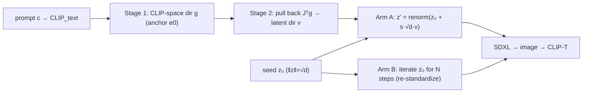

# E27 — A single "concept direction" in the diffusion seed (CLIP→latent pullback)

**TL;DR.** A diffusion model starts from a random **seed** (a Gaussian noise array) and the
seed leaves traces in the output. So: can we compute **one direction per prompt** in seed
space that means "more of this prompt" and simply **add** it to any seed — a linear
*concept/steering vector* — instead of optimizing every seed (E25/E26)? We build the
direction in two stages (a CLIP-space direction, then a pull-back through the decoder into
latent space) and keep the edited seed Gaussian by re-standardizing so it stays on the
`‖z‖=√d=256` sphere. **Findings:** the two stages collapse to a **single chain-rule backward
pass**, and the **anchor barely matters** (every anchor gives nearly the same latent
direction, cos 0.89–0.97). The single additive direction is **too blunt** — gentle = no
measurable change, strong (`s≈1`) = destroyed image. The heavy *iterative* version (Arm B) is
well-behaved but gives **palette/appearance, not composition** (CLIP-T stays flat). Consistent
with E25/E26: the seed's trace is an appearance signal, not a composition lever.

## Schematic



## Background (plain language)
*The HTML report (`results/e27/index.html`) carries the same glossary inline and leads each
result with its figure. Defining every term here keeps this writeup self-contained.*

- **Seed / latent** — image diffusion works in a compressed **latent** space. For SDXL a
  **seed** is a `4×128×128` Gaussian noise array (dimension `d = 65536`); the model denoises it
  into the final 1024×1024 image. The same seed produces the same image.
- **The ‖z‖=√d sphere** — a standard Gaussian vector in `d` dims has norm ≈ `√d = 256` (since
  `‖z‖²=d·(var+mean²)`, var≈1, mean≈0). We keep every seed we make exactly on that sphere by
  **re-standardizing** to zero-mean/unit-variance after any edit (`renorm(z)=(z−mean)/std`), so
  edits are moves *along the sphere real seeds live on*, not off into low-probability noise.
- **CLIP** — a model with an **image encoder** and a **text encoder** into one shared space;
  **cosine similarity** there measures image↔text match. Used both to build the direction and to
  score results.
- **Decoder Jacobian `J`** — `decode` maps latent→pixels; `CLIP_image∘decode` maps latent→CLIP
  vector. `J` says how a small latent change moves the CLIP vector; `Jᵀ` (one backward pass)
  turns a desired CLIP direction into the latent direction that best produces it.
- **The two-stage direction** —
  - **Stage 1 (CLIP space):** a unit direction `g` that raises
    `cosine(image-embedding, CLIP_text(c))`, taken as the one-step cosine gradient at a base
    image's embedding `e₀`: `g = normalize(e_text − ⟨e_text, e₀⟩·e₀)`.
  - **Stage 2 (decoder pullback):** the latent direction whose decoded image moves along `g`:
    `v = normalize(∇_z⟨CLIP_image(decode(z_base)),g⟩) = normalize(Jᵀg)`.
- **Chain-rule equivalence** — composing the two stages is a **single backward pass**:
  `v_chain = normalize(∇_z cosine(CLIP_image(decode(z)), text))`. The intermediate normalization
  of `g` is irrelevant because we normalize `v` at the end. So the **only substantive choice is
  where `g` is anchored** — the base image `e₀`:
  - `chain` — `g = e_text` anchored at the base latent's *own* decoded image (pure chain rule).
  - `noise` — `e₀` from random-pixel images.
  - `mean` — `e₀` from the *mean* of a small image pool (a gray-ish prior).
  - `fit` — `e₀` from an image that **matches** the prompt.
  - `nofit` — `e₀` from an image that **does not** match the prompt.
- **Arm A — additive direction (strength s)** — apply once: `z' = renorm(z₀ + s·√d·v)`. Here
  `s` is the **ratio of the added vector's norm to the seed's own norm**, so `s=1` is a ~45°
  tilt (expected destructive); useful regime is small `s`. Sweep `[−0.25, 0, 0.1, 0.25, 0.5,
  1.0]` (note the negative −v column).
- **Arm B — heavy optimization (N)** — for contrast, **iterate the seed itself** for `N` steps
  on the same decode→CLIP→cosine objective, re-standardizing each step (E25/E26 latent-mode
  taken hard). Sweep `N = [0, 1, 5, 20, 60]`. Each step is a small, re-projected, on-manifold
  move — which is why it doesn't blow up like Arm A.
- **ΔCLIP-T (↑)** — the metric. **CLIP-T** = cosine(generated image, prompt text). **Δ** =
  aligned − baseline (edited seed minus unedited seed), so **Δ>0 means the edit moved the image
  toward the prompt**. Means over all prompt×seed cells.

## Method (`experiments/e27_seeddir.py`, SDXL 1024px)

Reuses `e26_seedalign_sdxl.{load_sdxl, clip_pixel_values, moments, optimize_seed}`,
`clip_sim.{load_clip, clip_image_features, clip_text_features, cosine}`,
`common.{save_grid, generate}`. Prompts: 5 medium scenes from `e9_bandnorm_classes.CLASSES`
× 2 seeds. fp16 models + fp16-fix VAE; `z` fp32. The pullback is a single VAE-decode+CLIP
backward per (base, direction), averaged over `B=2` random base latents (the Jacobian is
point-dependent, so averaging makes the direction more transferable). All heavy GPU ops have
OOM-retry; the seed is re-standardized after every edit (`‖z‖≡256` verified).

Parts / questions:
- **Anchor comparison** (fixed `s=0.25`) — build the direction from each anchor and compare
  ΔCLIP-T *and* the pairwise cosines of the resulting latent directions. *Does the anchor choice
  change the direction?*
- **Arm A** — add `v_chain` at each `s`. *Is there a small `s` that reliably raises CLIP-T?
  Where does it collapse?*
- **Arm B** — iterate the seed for `N` steps. *What does "pushing on-manifold" do — does it raise
  CLIP-T, and does it change composition or just appearance?*

## Results (5 prompts × 2 seeds; `results/e27/`, mean ΔCLIP-T = aligned − baseline ↑)

**Anchor comparison (fixed `s = 0.25`)** — all break-even, `chain` marginally best
(`grid_anchors.png`):

| anchor | chain | noise | mean | fit | nofit |
|---|---|---|---|---|---|
| mean ΔCLIP-T ↑ | **+0.000** | −0.006 | −0.016 | −0.009 | −0.008 |
| mean cos(v_chain, v_·) | 1.00 | 0.97 | 0.92 | 0.89 | 0.97 |

**The Stage-1 anchor barely matters**: every anchor yields nearly the same latent direction
(`cos = 0.89–0.97`). The `fit` anchor (an image *of* the prompt) deviates most (0.89) and helps
least — subtracting the already-on-prompt component changes `g` the most. So "the prompt
direction in seed space" is essentially **anchor-independent**; the rest uses `v_chain`.

**Arm A — additive direction `v_chain`, strength sweep** (`grid_direction.png`):

| s (·√d) | −0.25 | 0 | 0.1 | 0.25 | 0.5 | 1.0 |
|---|---|---|---|---|---|---|
| mean ΔCLIP-T ↑ | −0.002 | 0 | +0.000 | +0.000 | **−0.083** | **−0.144** |

A single additive direction is **too blunt**: at gentle strength (`s ≤ 0.25`) it is
**break-even** (no measurable CLIP-T change, image visually unchanged); at `s = 0.5` it washes
the image out; at `s = 1` (added vector ≈ the seed's own size, a ~45° tilt) it collapses to
noise. There is no "free lunch" additive `s` that raises CLIP-T.

**Arm B — heavy per-seed optimization, step sweep** (`grid_heavy.png`):

| N steps | 0 | 1 | 5 | 20 | 60 |
|---|---|---|---|---|---|
| mean ΔCLIP-T ↑ | 0 | +0.002 | **+0.003** | +0.001 | +0.001 |

Iterating *on the sphere* is far better-behaved than the single additive jump: it
**progressively intensifies palette / saturation / detail toward the concept while preserving
composition**, even at `N = 60` (not destroyed). CLIP-T stays ~flat (best `+0.003` at `N = 5`):
it enhances *appearance*, not object presence. The reason it doesn't blow up like Arm A is the
**per-step re-standardization** (each step is a small, re-projected, on-manifold move).

## Takeaways

1. **The two stages are one chain-rule backward pass**, confirmed; and the anchor is almost
   irrelevant (directions 0.89–0.97 correlated), with the pure chain-rule (`chain`) marginally
   best.
2. **A single additive concept-direction is too blunt for adherence**: gentle = no effect,
   strong = destruction. There is no additive `s` that raises CLIP-T.
3. **On-manifold iterative steering (Arm B) is the well-behaved version**: it intensifies the
   concept's palette/appearance gracefully up to many steps without wrecking structure — but it
   shifts *appearance*, not composition, so CLIP-T stays flat. This is the real positive use of
   seed-biasing.
4. Consistent with **E25/E26**: the seed's trace is a **palette / global-appearance** signal,
   not a composition one. Re-standardizing each step (staying on the √d sphere) is what makes
   steering safe.

## Caveats & next

(1) The direction `v` is computed at a few random base latents but applied to a different seed;
the decoder Jacobian is point-dependent, so transfer is imperfect (averaging over bases
mitigates). (2) CLIP-T is a coarse metric blind to dropped elements — the visual grids are the
real evidence; the small ΔCLIP-T signs are within noise. (3) This is a linear edit in a highly
nonlinear pipeline — expect it to shift palette/global-appearance more than composition.
**Next:** E28 takes this to hard compositional prompts with a metric (B-VQA) that *does* see
dropped elements, to ask whether biasing the seed can rescue a missing object.

## Status

Done. Constraint (`‖z‖≡√d`, moments held) verified on every edit. Both arms run; anchor
ablation + chain-rule equivalence quantified. The robust, reproducible parts are the
anchor-independence, the s-collapse threshold, and Arm B's do-no-harm intensification; the
small ΔCLIP-T signs are within noise.

## Reproduce

```bash
python experiments/e27_seeddir.py quick   # 1-prompt smoke
python experiments/e27_seeddir.py         # full -> results/e27/{grid_direction,grid_anchors,grid_heavy,deltaclip}.png, report.json
python experiments/e27_seeddir.py --part site  # model-free: rebuild results/e27/index.html from report.json + cached grids (no SDXL/CLIP load)
```

Artifacts: `results/e27/grid_direction.png` (Arm A s-sweep), `grid_heavy.png` (Arm B),
`grid_anchors.png` (anchor compare), `deltaclip.png` (trends), `report.json`,
`index.html` (self-contained explainer, embeds the grids). Lineage: see `EXPERIMENT_26.md`
(E25/E26 seed-alignment) for the thread; `EXPERIMENT_28.md` for the compositional sequel.
