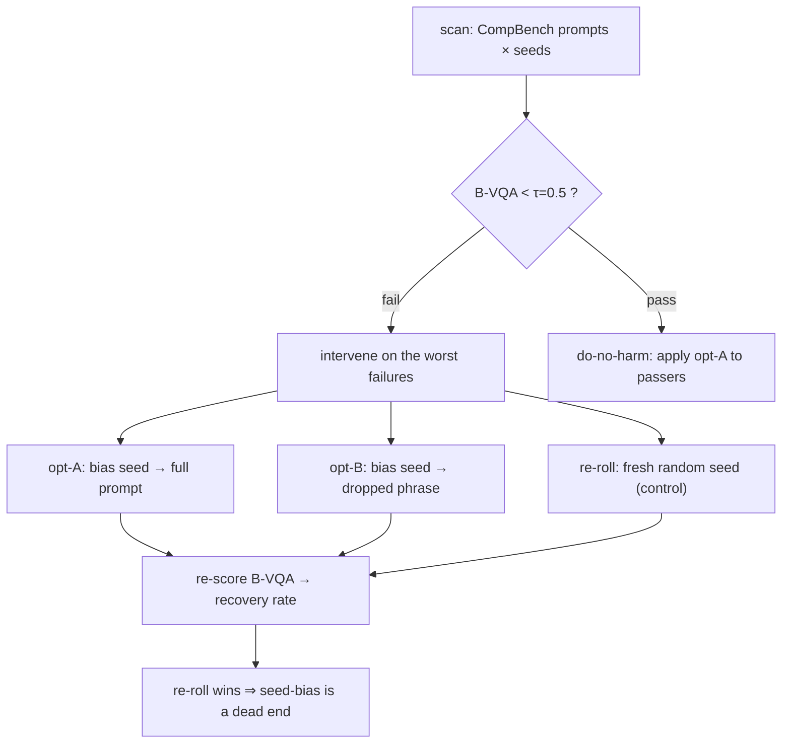

# E28 — Does biasing the seed RESCUE dropped elements on hard compositional prompts?

**TL;DR.** A diffusion model starts from a random **seed**, and on **hard compositional
prompts** (e.g. "a green bench and a blue bowl") it often **drops or mis-binds an element** —
and *which* element it drops depends on the seed. E25–E27 showed seed-biasing is a do-no-harm
*palette/appearance* lever on easy prompts (no headroom, and CLIP-T was blind to dropped
elements). Here we test the regime where the seed might actually matter, using a metric that
*sees* a dropped element (**B-VQA**): we scan compositional prompts × seeds, find the failures,
and on the worst ones **bias the failing seed toward the prompt** — then compare to simply
**re-rolling a fresh random seed**. **Verdict (a clean negative):** biasing the seed **loses to
plain re-rolling** (seed-dependent recovery **0.57** for re-roll vs **0.43 / 0.29** for the
biased seed) and it even **breaks compositions that already worked** (−0.176 on passers).
**Seed-as-adherence is a dead end; best-of-N random seeds + a B-VQA picker wins.** This closes
the seed-as-adherence line (E25→E28); the remaining positive use of seed-biasing is the
appearance/palette steering documented in E27 (Arm B).

## Schematic



## Background (plain language)
*The HTML report (`results/e28/index.html`) carries the same glossary inline and leads each
result with its figure. Defining every term here keeps this writeup self-contained.*

- **Seed / ‖z‖=√d** — SDXL denoises a random **seed** (a `4×128×128` Gaussian latent, ‖z‖≈√d=256)
  into the 1024×1024 image. The same seed gives the same image; *which* objects get rendered
  depends on the seed.
- **Seed bias / latent-mode optimization** — "biasing the seed" = nudging the seed toward a text
  target by **gradient on the seed**: backprop `cosine(CLIP_image(decode(z)), CLIP_text(target))`
  and take `K=8` small steps (lr 0.05), **re-standardizing** after each step so the seed stays on
  the ‖z‖=√d sphere (E25/E26 latent-mode, reused as `optimize_seed`). It is a smooth nudge of the
  *current* seed, not a new draw.
- **B-VQA (↑, 0–1)** — the metric (T2I-CompBench attribute binding). spaCy extracts the prompt's
  **noun phrases** ("a green bench", "a blue bowl"); BLIP-VQA answers "{phrase}?" per image,
  giving `P(yes)`; the score is the **product** of P(yes). Because it is a product, **one dropped
  or mis-bound element tanks it** — unlike CLIP-T, B-VQA *sees* a missing object. (We use
  `Salesforce/blip-vqa-base` — safetensors; the capfilt-large checkpoint is `.bin`-only and
  blocked on torch<2.6. Fine for *relative* recovery.)
- **FAIL threshold τ=0.5** — a (prompt, seed) generation **fails** if its B-VQA < τ. We intervene
  only on failures (the cases with headroom).
- **Per-prompt seed-dependence** — for each prompt, the **fraction of seeds that pass**. A prompt
  with passrate>0 is **seed-dependent** (some seed *can* render it, so a seed change *could*
  help); passrate=0 is **always-fail** (no seed in range works, so seed manipulation can't help).
  We stratify the verdict by this.
- **Recovery rate (↑)** — of the intervened failures, the **fraction that cross τ** after the
  treatment. Reported overall and on the seed-dependent stratum (the fair comparison).
- **The treatments — intervention vs re-roll** — on each failure: **opt-A** = bias the seed toward
  the *full prompt*; **opt-B** = bias it toward the *single lowest-P(yes) noun phrase* (the
  dropped element); **re-roll** = the control, just draw a *fresh random seed* (no optimization).
  The whole question is whether the gradient bias (A/B) beats luck (re-roll).
- **Do-no-harm (↑, want ≈0)** — apply opt-A to *passing* pairs and measure ΔB-VQA. ≈0 = safe;
  negative = the bias **breaks compositions that already worked**.

## Method (`experiments/e28_seedrescue.py`, SDXL 1024px)

Reuses `compbench.{load_compbench_prompts, load_bvqa, noun_phrases, _p_yes}`,
`e26_seedalign_sdxl.{load_sdxl, optimize_seed, ...}`, `clip_sim`, `common`.

1. **scan** — 30 CompBench prompts (color/shape/texture) × 4 seeds = 120 baseline gens; B-VQA +
   per-phrase P(yes); locate **FAILS** (B-VQA<τ=0.5) and each prompt's seed-dependence. *How often
   does SDXL drop an element, and is it seed-dependent?*
2. **intervene** on the worst 37 failures — run **opt-A**, **opt-B** (`optimize_seed`, K=8,
   re-standardized so `‖z‖=√d=256`), and the **re-roll** control; re-score. *Does biasing the seed
   recover the dropped element — and does it beat just drawing a new seed?*
3. **do-no-harm** — apply opt-A to a sample of **passing** pairs. *Is biasing the seed at least
   safe on cases that already work?*

## Results

Baseline fail rate **0.308** (37/120) — good headroom. On the failing subset:

| (37 failures) | opt-A (full prompt) | opt-B (dropped phrase) | **re-roll** |
|---|---|---|---|
| mean ΔB-VQA ↑ | +0.101 | +0.125 | **+0.230** |
| recovery rate (cross τ) ↑ | 0.189 | 0.243 | **0.324** |
| recovery on **seed-dependent** (n=21) ↑ | 0.286 | 0.429 | **0.571** |

**do-no-harm: FAILED.** Applying the optimization to *passing* pairs **dropped** B-VQA by
**−0.176** on average — biasing the seed toward the prompt actively *breaks* compositions that
already worked. (`summary.png`, `grid_recovered.png`, `grid_nochange.png`.)

## Verdict (a clean negative)

- **Biasing the seed does not beat simply re-rolling it.** Even in the regime the seed genuinely
  matters (seed-dependent compositional failures), a fresh random seed recovers **0.57** of
  failures vs **0.43 / 0.29** for the gradient-biased seed — re-roll wins on every metric, by a
  wide margin.
- **Always-fail prompts** (passrate 0 — e.g. the 4–5-element `shape_008`, `texture_009`) recover
  with *nothing*: no seed exists in range that the model can render, so seed manipulation can't help.
- **The bias even hurts working cases** (−0.176 on passers), so it is not a safe default.

**Why.** Consistent with E25–E27: the gradient toward CLIP/text moves *palette/appearance*, which
keeps the latent in the **same compositional basin** while degrading it — it does not jump the
sampler to a different "which objects appear" mode. Changing *which* mode renders requires a
genuinely different seed (a re-roll), not a smooth nudge of the current one. The seed's influence
on composition is real (seeds differ a lot — that's the seed-dependence) but **not steerable by
gradient toward the prompt**.

**Practical takeaway:** for compositional adherence, *best-of-N random seeds + a B-VQA picker* beats
optimizing a seed; the gradient-bias direction is a dead end for adherence. This closes the
seed-as-adherence-lever line (E25→E28). The remaining real, positive use of seed-biasing is the
**appearance/palette steering** documented in E27 (Arm B).

## Caveats & next

(1) B-VQA uses `blip-vqa-base` (the larger capfilt checkpoint is blocked on torch<2.6); fine for
*relative* recovery, less so for absolute scores. (2) The negative is robust across 37 failures
and a seed-dependence stratification — the decisive comparison (re-roll > opt-B > opt-A on the
seed-dependent stratum) is unambiguous — but n per stratum is modest, so read the direction, not
third decimals. (3) Constraint `‖z‖=√d` held on every edit. **Next:** the practical lever for
compositional adherence is best-of-N random seeds + a B-VQA/VQA picker (not gradient on the seed);
seed-biasing stays an appearance tool (E27 Arm B).

## Status

Done. Negative result is robust across 37 failures and a seed-dependence stratification; the
decisive comparison (re-roll > opt-B > opt-A on the seed-dependent stratum) is unambiguous. HTML
explainer added (`e28_site.py`, model-free `--part site` rebuild) to document the closing of the
seed-as-adherence thread.

## Reproduce

```bash
python experiments/e28_seedrescue.py quick   # smoke
python experiments/e28_seedrescue.py         # full -> results/e28/{grid_recovered.png, grid_nochange.png, summary.png, report.json}
python experiments/e28_seedrescue.py --part site  # model-free: rebuild results/e28/index.html from report.json + figures (no SDXL/BLIP load)
```

Artifacts: `results/e28/grid_recovered.png` (cols: baseline-fail | opt-A | opt-B | re-roll),
`grid_nochange.png` (do-no-harm on passers), `summary.png`, `report.json`, `index.html`
(self-contained explainer). Lineage: `EXPERIMENT_26.md`, `EXPERIMENT_27.md` (E25–E27 seed-bias thread).
