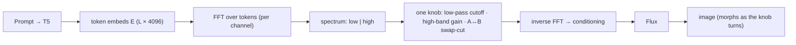

# E30 — Continuous text-frequency control & extraction

**Follow-up to E24** (numbered E30 — E28/E29 are unrelated seed experiments). E24 found
token-axis frequency bands of Flux's T5 **sequence** embedding are meaningful and
on-manifold, that *merging* two prompts snaps to the low-band/phase owner (and doesn't beat
a `lerp` baseline), and that high-band injection is a *style-strength knob*. E30 (a)
characterizes the bands more finely, (b) turns the manipulation into a **continuous knob**
with image-strip visualizations, and (c) asks what frequency filtering does to **long** and
**compositional** prompts.

## Schematic



## Background (plain language)
*The HTML report (`results/e30/index.html`) carries the same glossary inline and leads each
result with its figure. Defining every term here keeps this writeup self-contained.*

- **Token-axis FFT** — a prompt becomes a T5 embedding `(1, L, 4096)` (`L` word-pieces, each a
  4096-dim vector). We take a **1-D real FFT along the token axis** (length `L`), **separately
  per channel** — *not* a 2-D image FFT and *not* the single pooled vector. It measures how each
  embedding dimension varies *from word to word*.
- **Token-frequency / DC / bands** — frequencies are normalized to `[0, 1]`. **DC** (freq 0) =
  the per-channel average over tokens (bag-of-words gist); **low** = slow drift across the
  sequence; **high** = fast token-to-token change. Default split is the cut `0.25`; the per-band
  probe slices `[0,1]` into 6 equal bands `b0..b5`.
- **Single-prompt variants** — `full` = unmodified (baseline); `low` = low-pass (keep DC..0.25);
  `high` = high-pass (keep 0.25..1 + DC); `notch_lo` = **remove only the low band [0,0.25], keep
  everything above** (is the low band *necessary*?); `phase_only` = keep phase, set all magnitudes
  to 1; `mag_only` = keep magnitude, zero all phases; `notch_b0..b5` = knock out one of the 6 bands.
- **Two-prompt merge variants** — `band_swap` = low(A)+high(B), hard cut; `band_blend` = soft
  cosine crossover; `lerp` = plain 50/50 embedding average (baseline); `concat` = the
  **gold-standard baseline**, encode the literal text `"A and B"`.
- **Metrics** — **CLIP-T** (0–1 ↑): image↔prompt similarity in CLIP space. **B-VQA** (0–1 ↑):
  VQA check that each named object appears *with its correct attribute* (attribute binding).
  **sharpness / hf_frac / colorful**: image statistics used as sanity signals.

## Method (`experiments/e30_text_freq_control.py`, Flux)

New ops in `text_spectral_ops.py`: `band_gain_1d(E, lo, hi, gain)` (continuous band
attenuate/amplify) and `band_notch_1d(E, lo, hi)` (per-band knockout). Generation reuses
E24's `load_flux_preencoded_lens` + e10's `gen_emb` (true-CFG=1, guidance 3.5); strips via
`common.save_grid`; metrics via `e9_clipt` (CLIP-T), `e9_bandnorm_classes.image_metrics`
(sharpness / hf_frac / colorfulness), `fidelity_metrics` (aesthetic), `compbench`
(B-VQA = per-object attribute binding), `vqascore` (VQAScore = compositional entailment).

Parts (`--part`):
- **probe_deep** — one prompt: per-band **knockout**, **phase-only vs magnitude-only**
  reconstruction, low/high families. *What does each band control?* (CLIP + image stats).
- **continuous** — the headline visual: image **strips** as one knob varies —
  low-pass cutoff sweep, high-band gain sweep, and a two-prompt **A↔B morph**
  (`band_swap` cut swept), with a fine sweep around E24's one near-balanced regime.
- **concat** — *blend vs one big prompt*: compare `band_swap` / `band_blend` / `lerp`
  merges to a single concatenated prompt "A and B" (CLIP_A / CLIP_B + B-VQA: are **both**
  objects present?).
- **longprompt** — DPG-Bench (`load_dpg_prompts`, ~80-word prompts): low-pass / high-pass /
  band-knockout; **does dropping high freq drop the tail objects while low keeps the
  gist?** (VQAScore + B-VQA retention).
- **compositional** — T2I-CompBench (color/shape/texture): band filtering vs **per-object
  attribute binding** (B-VQA).
- **analyze** — `report.json`, strips/grids, self-contained `index.html` (inline-SVG
  schematic).

## What we expect to learn
- A *continuous* controllability story (the strips): how cutoff/gain/swap-cut smoothly move
  the image, and where transitions are gradual vs abrupt.
- Whether the token spectrum carries **structured semantics** (e.g. high band = specific
  objects/attributes, low band = global gist) — via which objects survive band filtering on
  long/compositional prompts.
- Whether spectral blending offers anything over simply writing "A and B".

## Results (runai `e30-text-freq`, Flux, 28 steps, true-CFG=1 / guidance 3.5)
Full sweep ran clean (`probe_deep,continuous,concat,longprompt,compositional,analyze`),
`--no_vqa` (VQAScore deferred to an isolated env — CLIP-T + B-VQA already settle the story).
Headline strips/sweeps/morph grids generated (`results/e30/index.html`, self-contained).
Metrics below are CLIP-T (prompt adherence) and B-VQA (per-object attribute binding); n=1
per cell (single seed), so read **directions**, not third-decimal differences.

**1. Phase carries the conditioning; magnitude is nearly discardable** (`probe_deep`).
Decomposing the per-channel token-axis spectrum into phase vs magnitude:
`phase_only` (unit magnitude, keep phase) ≈ `full` CLIP — cat .316 vs .313, car .296 vs
.286, castle .316 vs .300 — while `mag_only` (keep magnitude, zero phase) **collapses** for
object prompts (cat .019, car .049) and only partly survives for the style-heavy castle
(.276). The token-axis phase spectrum holds almost all the content; magnitude is close to
noise. (Mirrors the classic image-FFT "phase carries structure" result, now in the *text
embedding* domain — and sharpens E24's "phase≈identity" observation.)

**2. No single band is load-bearing** (`probe_deep`). Knocking out any one of 6 bands
(`notch_b0..b5`) moves CLIP by ≤~0.02 — content is redundantly distributed across bands, so
narrow-band surgery is a weak lever.

**3. Writing "A and B" still beats spectral blending** (`concat`). Literal concat B-VQA
(both objects present): cat_car **0.852**, castle_forest 0.350. Every spectral merge
(`band_blend`/`band_swap`/`lerp`) drops object B (clip_B ~0.10–0.16, B-VQA ~0.001–0.006),
snapping to the low-band / prompt-A owner. Lone exception: `band_blend` matched concat on
castle_forest (0.377 vs 0.350). Confirms E24's "merge snaps to the low-band owner, doesn't
beat the baseline" at scale.

**4. Attribute–object binding lives in the MID/HIGH bands, not the low band**
(`compositional`, CompBench color/shape/texture, B-VQA = binding). Low-pass (`low`)
**destroys** binding almost everywhere (color_000 .945→2e-5, color_003 .921→1e-4,
texture_000 .998→.002), but `notch_lo` (remove *only* the low band, keep mid+high) **retains**
it in many cases (shape_000 .87, shape_003 .92, texture_000 .99, texture_001 .91,
texture_002 .92). High-pass is mixed (great on some textures/colors, collapses on others).
So the token spectrum *is* structured: **low band = coarse gist / global object presence;
mid+high bands = which-adjective-binds-to-which-noun**. (`longprompt`: B-VQA too sparse on
~80-word DPG/Parti prompts to read object retention; CLIP corroborates that `notch_lo` hurts
most — low band carries the gist.)

**Bottom line.** Continuous control works visually and the token spectrum is genuinely
structured (low=gist, mid/high=binding, phase=content), but spectral *blending* still offers
nothing over just writing the prompt. The structure is descriptive, not a better control knob.

## Reproduce

```bash
# self-gating cluster job (smoke probe_deep -> CLIP gate -> full sweep)
runai submit --name e30-text-freq -g 1 -i pytorch/pytorch:2.10.0-cuda12.8-cudnn9-runtime \
  --pvc=storage:/storage --large-shm --command -- \
  bash /storage/malnick/colorful-noise/experiments/cluster_e30_job.sh

# local / single GPU
python experiments/e30_text_freq_control.py --part continuous --num_prompts 1 --steps 8  # smoke
python experiments/e30_text_freq_control.py   # full -> results/e30/{...,index.html}

# rebuild the HTML explainer offline (no GPU) from report.json + cached strips
python experiments/e30_text_freq_control.py --part site
```

> Cluster note: ship code with `kubectl cp` (the `/storage` checkout is not git; the image
> has no git). Heavy scorers (VQAScore ~11 GB, B-VQA) load in `analyze` after Flux is freed.

## Status
Complete. Full sweep ran on runai (`e30-text-freq`, Succeeded). Results above;
artifacts in `experiments/results/e30/` (`report.json` + self-contained `index.html`).
Optional follow-up: VQAScore over the saved PNGs from an isolated env to corroborate B-VQA.
