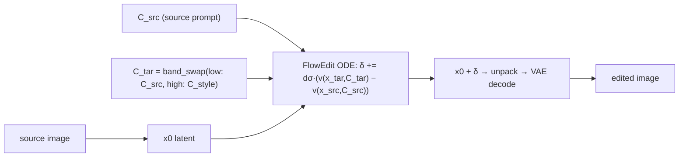

# E31 — Real-image editing via FlowEdit + frequency-surgery conditioning

**Follow-up to E24/E30** (numbered E31). FlowEdit (Kulikov et al. 2024) edits a flow
model's output **without inversion** by integrating the difference between target- and
source-conditioned velocity fields and adding the resulting delta to the source latent.
E31's twist: the **target conditioning is a token-frequency surgery** of the source
conditioning (E24/E30 ops) — e.g. low band from the source prompt + high band from the edit
prompt — instead of a plain different prompt.

## Schematic



## Method (`experiments/e31_flowedit_freq.py`, Flux)

- **Flux velocity accessor** `flux_velocity(pipe, packed_x, sigma, pe, ppe, gids)` — a
  manual Flux transformer forward (packed latents + `img_ids`/`txt_ids` + guidance embed),
  mirroring `FluxPipeline`'s denoising call and the SD3.5 `velocity()` in
  `e21_spectral_edit.py`. `flux_sigmas` reproduces Flux's resolution-shifted σ grid.
- **FlowEdit (inversion-free):** `δ=0; for σ high→low: x_src=(1-σ)x0+σε; x_tar=x_src+δ;
  δ += (σ_next−σ)·(v(x_tar,C_tar) − v(x_src,C_src))`; edited `= x0 + δ`. `--skip` controls
  how many top (noisy) steps are skipped = edit strength.
- **Target conditioning** `C_tar = freq_surgery(C_src, C_style)` via `band_swap_1d` (low
  from source, high from style) at a couple of cuts; plus `full` (C_tar = style, plain
  prompt-swap FlowEdit) for comparison.
- **Source latent** `x0`: generated from the source prompt (exact caption — clean
  evaluation) by default, or VAE-encoded from a real image via `--real_dir <dir>/<key>.png`.
- **Reuse:** `load_flux_preencoded_lens` (E24), `flux_vae_decode` (E7), `gen_emb` (E10),
  `text_spectral_ops` band ops, `e9_clipt`/`fidelity_metrics` metrics, `e27_site` HTML.

## The identity property (and the gate)
If `C_tar == C_src` the velocity difference is **exactly zero**, so `δ=0` and the `recon`
condition reproduces the source **exactly by construction** — independent of the σ schedule.
The reconstruction gate (recon pixel-distance to source < 0.05) therefore validates the
VAE/packing path before any GPU is spent on the full run. A model-free `--part preflight`
checks the FlowEdit accumulation math on a synthetic linear field.

## Metrics
- **Edit adherence:** CLIP-to-style (and optionally VQAScore).
- **Content preservation:** CLIP-to-source + pixel-distance to the source image.
- Aesthetic. `recon` should show ~0 pixel distance.

## Run

```bash
# self-gating cluster job (preflight -> smoke 1 scene -> recon gate -> full)
runai submit --name e31-flowedit -g 1 -i pytorch/pytorch:2.10.0-cuda12.8-cudnn9-runtime \
  --pvc=storage:/storage --large-shm --command -- \
  bash /storage/malnick/colorful-noise/experiments/cluster_e31_job.sh

# local
python experiments/e31_flowedit_freq.py --part preflight                 # math only
python experiments/e31_flowedit_freq.py --part gen,analyze --num 1 --steps 8   # smoke
python experiments/e31_flowedit_freq.py   # full -> results/e31/{<key>/strip.png, index.html}
# real images: place <key>.png files and pass --real_dir <dir>
```

> Cluster note: ship code with `kubectl cp` (the `/storage` checkout is not git; the image
> has no git).

## Results (runai `e31-flowedit`, Flux, 3 scenes, 28 steps, skip=0.33, guidance 3.5)
Preflight (model-free) and the reconstruction gate both passed, then the full run completed.
Per-scene CLIP-to-style / CLIP-to-source / pixel-distance below; n=1 per cell.

**Reconstruction identity holds** (the gate). `recon` (C_tar=C_src) reproduces the source by
construction: px-dist **0.0031 / 0.0022 / 0.0029** (house_storm / cat_paint / street_snow).
The Flux velocity accessor, σ schedule, packing, and VAE path are all validated.

**Plain prompt-swap FlowEdit (`full`) edits — unevenly.** Strong on street_snow
(CLIP-style 0.093→**0.208**, px-dist 0.121), modest on house_storm (px-dist 0.063 but
CLIP-style barely moves, .094→.099), near-recon on cat_paint. So inversion-free FlowEdit
works on Flux, scene-dependent.

**Frequency-surgery target conditioning barely edits — the negative result.**
`swap_c0.25` / `swap_c0.4` (`band_swap`: low band from source, high band from style) leave
CLIP-style at **recon level** (street_snow 0.086 — *below* recon's 0.093; cat_paint 0.169 ≈
recon 0.168; house_storm 0.088–0.096) with small px-dist. Mechanism: the kept low band
anchors the conditioning to the source (E24/E30's "low band = owner"), so the velocity
difference `v(x,C_tar) − v(x,C_src)` stays ≈0 ⇒ δ≈0 ⇒ no edit; the style's high band is too
weak to redirect the flow (E24's "high band = weak style-strength knob"). Caveat: short
prompts collapse the two cuts onto the same integer frequency index (`swap_c0.25` ==
`swap_c0.4` exactly for street_snow).

**Bottom line.** Token-frequency surgery is **not** a usable handle for inversion-free
editing — it can't out-edit a plain prompt swap, and usually does nothing. This unifies the
text-freq thread (E24→E30→E31): the low band owns the result, and high-band injection is a
weak style knob, never a compositional or editing lever.

## Status
Complete. Preflight + recon gate + full run all passed on runai (`e31-flowedit`, Succeeded).
Results above; artifacts in `experiments/results/e31/` (`report.json` + per-scene
`<key>/strip.png` + self-contained `index.html`). Real-image editing (`--real_dir`) untested.
