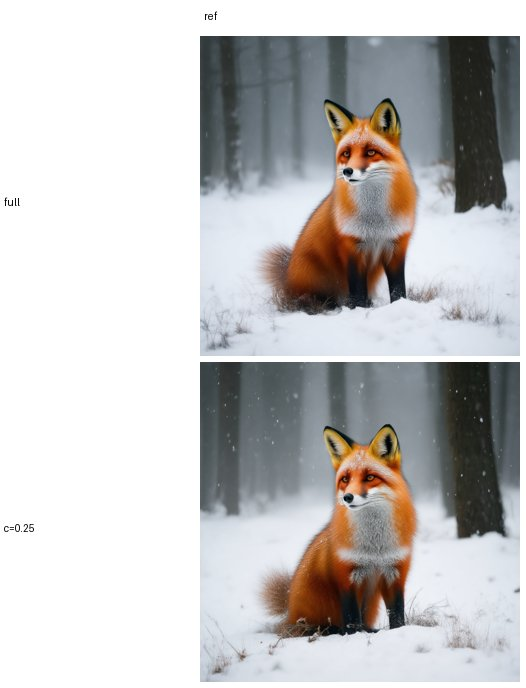
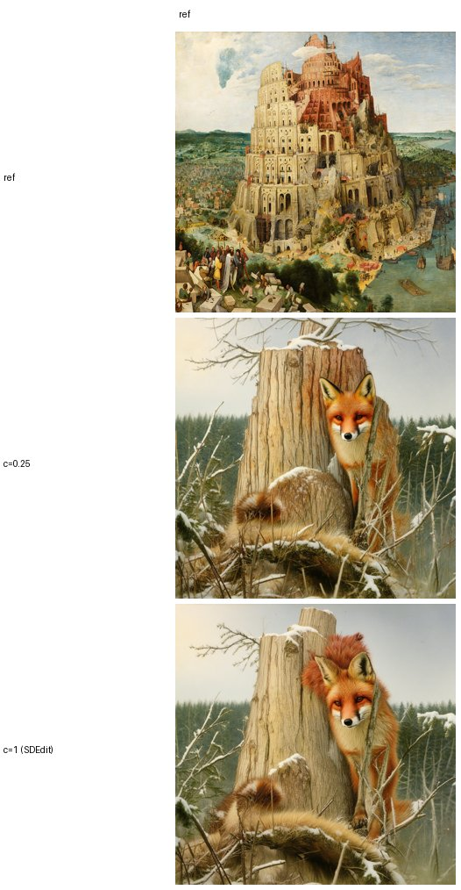
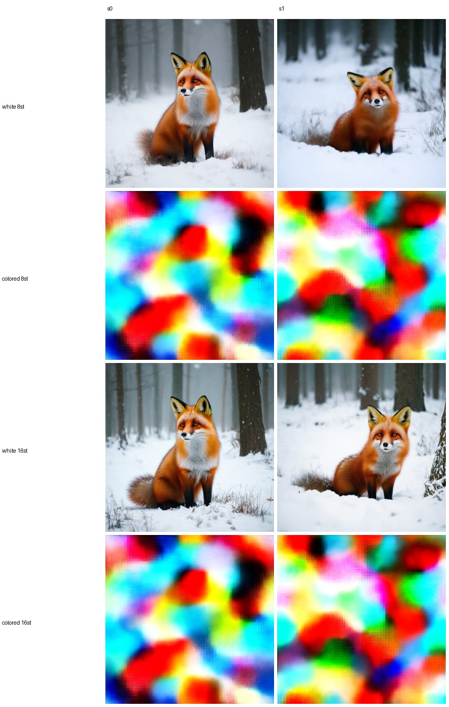

# E20 — Spectral warm-start: can we "skip the beginning" of generation? (SD3.5-medium)

**Thread:** style · **Model:** SD3.5-medium (rectified flow, 28 steps) · **Status:** pending (oracle grid OOM-failed; salvaged cells + lock-in profile only)

---

## Motivation — hand the model the structure, skip the early steps

Diffusion / rectified-flow generation is **coarse-to-fine**: the early denoising steps fix
the low-frequency **layout** (where things are), the late steps fill in detail and texture
energy. Two priors from this repo make that concrete:

- **E8** profiled per-band **power** along a Flux trajectory and found it locks in *late*
  (≈25–27 of 28 steps) for every band.
- **E12–E14** found low-band **phase** coherence rises *first* — the coarse composition is
  decided early and via the **phase** axis, not the power axis.

If the coarse layout is carried by **low-band phase** and is fixed early, then we should be
able to **build an intermediate latent whose low Fourier bands are already correct**,
re-enter the trajectory partway, and **skip the early steps** entirely — getting the same
image for less compute, or using a reference's low bands as a structure prior.

The question of E20: **does injecting the destined low bands and re-entering mid-trajectory
actually recover the image — and where is the right place to inject structure?**

## How this differs from SBN / E19 (a genuinely new lever)

Spectral-Blend-Noise (SBN, the repo's basis) clamps the **magnitude** axis of low
frequencies toward a target spectrum. E20 keeps the low frequencies **whole** — full complex
coefficients, magnitude *and* phase — and re-enters mid-trajectory. Because phase carries
structure (Oppenheim–Lim), it is the *phase* inside the committed bands that supplies the
coarse layout. This is the **opposite axis** to SBN's magnitude clamp, so it is a new lever,
not a reskin of E19.

## Method — band-commit, re-noise, denoise the rest

The driver is `experiments/e20_warmstart.py` (SD3.5-medium, 28 steps, cfg 4.5). Three moving
parts share one construction.

### The warm-start latent: `band_spectrum_split(x₀, noise, c)`

Take a source latent `x₀` (16×128×128) and fresh white `noise`. Build a hybrid whose
**full complex spectrum** comes from `x₀` inside the lowest-`c` radial fraction and from
`noise` outside it:

```
X₀ = FFT2(x₀);  N = FFT2(noise)
low(k) = 1  if  ‖k‖ ≤ quantile(‖k‖, c)  else 0     # Hermitian-symmetric radial mask
X_ws   = X₀·low + N·(1 − low)
x_ws   = Re( IFFT2(X_ws) )
```

`c` is the **cutoff** (fraction of the radial spectrum committed from `x₀`):
`c=0` ⇒ pure noise (nothing committed), `c=1` ⇒ the whole source latent, `c=0.1` ⇒ only the
lowest 10% of bands (coarse layout) kept whole. The mask is exactly Hermitian-symmetric so
conjugate partners never straddle the cutoff and the IFFT stays real.

### Re-entry: rectified-flow `scale_noise`

The warm-start latent is then re-noised to a mid-trajectory level and only the rest of the
schedule is run. Rectified flow places a sample at fraction `σ` along the trajectory at

```
x_σ = (1 − σ)·x_ws + σ·ε      # FlowMatchEulerDiscreteScheduler.scale_noise
```

A re-entry **strength** `s` selects the start step; `s` is the fraction of the schedule
actually run, so **skip = 1 − s**. `s=0.6` runs 60% of the steps and **skips 40%**; lower
`s` = more aggressive skipping = harder. The noised latent is fed via `gen_sd3_warmstart`
(`latents=`, bypassing `prepare_latents`).

**Why it should work:** if the low bands are already the destined ones (oracle) and the layout
is fixed early, the skipped early steps were only going to re-derive that same low-band phase —
so handing it over up front and starting late should land on the same image.

### The three probes

| part | committed source `x₀` | what it measures |
|---|---|---|
| **profile** | n/a — 5 seeds × `RecordTraj` | **when** does each band's phase lock in? Per-step cross-seed coherence `R[band,t]` and within-trajectory phase convergence to the final latent → which steps are skippable. |
| **oracle** | a *finished run's own* latent `x₀★` | **ceiling**: given the true low bands ≤ `c`, how many steps can we skip and still recover the image? CLIP-I + latent-L2 to the full run, vs a pure-noise (`c=0`) re-init. |
| **condition** | a *reference image's* encoded latent | band-controlled SDEdit: keep structure (struct CLIP-I to the reference) while the prompt drives detail (prompt CLIP-T). `c=1` is ordinary full SDEdit. |
| **noiseshape** | n/a | **no skipping**: recolor the step-0 *noise* (`color_noise`, a PSD-match to real-photo latents) and run the full schedule — colored-init vs white-init. *Is the init the right place to inject structure?* |

`color_noise` matches the radial band power of a target spectrum (phase left random) and
renormalizes to unit variance so it remains a valid diffusion init.

## Results

**Run status (important caveat):** the full oracle/condition sweep was launched on the
cluster but the **full oracle (c × strength) grid OOM-failed** (`full.log`: a second process
shared the 24 GB card; `torch.OutOfMemoryError … ORACLE FAILED`). The **profile** part ran
cleanly for all three prompts, and a **validation pass salvaged one cell each** of oracle /
condition / noiseshape. So the numbers below are **single-cell, n=1, directional** — not the
full heatmaps the driver was written to produce. Results live in
`experiments/results/e20/` (local checkout); `/storage` was not mounted at write time.

### 0. profile — low-band phase locks in late-ish, power locks even later

Within-trajectory phase-convergence lock-in (step at which a band's phase reaches its final
value, out of 28):

| prompt | low-band lock-in | high-band lock-in |
|---|---|---|
| fox | 23.2 | 25.0 |
| market | 22.1 | 25.0 |
| portrait | 23.4 | 26.0 |

Cross-seed phase coherence `R[band,t]` separates the bands: the **low** band's coherence
climbs steadily and clears the random-null only the low band carries seed-stable structure,
while **power** for every band stays flat until it collapses to its final value in the last
few steps (the E8 prior, reproduced here on SD3.5). The gap between the curves is exactly the
warm-start opening: low-band phase is the early, structure-bearing signal.

![Left: cross-seed phase coherence R[band,t] — the low band (f=0.04) rises well above the random null (dotted) over the run while mid/high stay flat. Right: per-band power / final — every band's power locks in only in the last few steps (E8 reproduced on SD3.5). The low-band phase is the early, skippable structure signal.](figs/E20/lockin.jpg)

### 1. oracle — committing the true low bands recovers the image (salvaged cell)

The one oracle cell that survived (`fox`, `c=0.25`, `s=0.6` ⇒ **skip 40%**):

| cell | CLIP-I to full run ↑ | latent-L2 ↓ |
|---|---|---|
| fox `c=0.25 s=0.6` | **0.991** | 0.255 |

Committing just the lowest-25% bands and skipping 40% of the schedule recovers the full-run
fox at **CLIP-I 0.99 / latent-L2 0.26** — visually near-identical (left = full run, below =
warm-start recovery). This is the method's **ceiling** (it uses the run's *own* bands), and it
confirms the coarse-to-fine premise: hand the model the destined low bands and it
reconstructs.



> Caveat: the full `c ∈ {0, 0.1, 0.25, 0.5, 1}` × `s ∈ {0.4, 0.6, 0.8}` grid — including the
> pure-noise `c=0` baseline that would quantify the *gap* between oracle bands and noise —
> **did not run** (OOM). The single salvaged cell shows the ceiling is high but does not
> sweep the skip/cutoff trade-off. Any wider tables in older writeups were not produced by
> this run.

### 2. condition — a soft structure-vs-prompt dial, no free lunch over SDEdit

Committing a reference *painting's* low bands (Bruegel's *Tower of Babel*) and generating a
*fox* prompt. The salvaged pair (`s=0.6`):

| cell | struct CLIP-I ↑ | prompt CLIP-T ↑ |
|---|---|---|
| `c=0.25` (band-cut) | **0.587** | 0.269 |
| `c=1` (full SDEdit) | 0.558 | **0.278** |

The band-cut keeps slightly more reference structure (0.587 vs 0.558) at slightly less prompt
adherence (0.269 vs 0.278) — i.e. it is a **softer version of the same SDEdit lever**, trading
along the structure↔prompt axis, not beating it. Both keep the tower's vertical composition
while painting in a fox.



### 3. noiseshape — pre-coloring the init noise *fails*

No skipping: recolor only the step-0 noise so its band power matches real-photo latents, then
run the full schedule (`fox`):

| steps | aesthetic white | aesthetic colored | CLIP-T white | CLIP-T colored |
|---|---|---|---|---|
| 8 | **6.42** | 3.90 | **0.310** | 0.086 |
| 16 | **6.37** | 3.97 | **0.311** | 0.083 |

Coloring the init drops aesthetic ≈6.4 → 3.9 and **collapses** prompt CLIP-T ≈0.31 → 0.08 at
every step count. Rectified-flow generation expects a (near-)white Gaussian start; biasing its
band power off-distribution pushes it off the trained manifold and it never recovers — the
colored-init outputs are literal rainbow noise. **The init is the wrong place to inject
structure; the mid-trajectory band-commit (oracle) is the working lever.**



## Verdict

**PENDING / directional.** The coarse-to-fine premise holds where it was actually tested:
(a) **profile** confirms low-band phase is the early, seed-stable, skippable signal (locks in
~22–23/28; power only ~25–27/28); (b) the salvaged **oracle** cell shows committing the true
low bands recovers the image (CLIP-I 0.99) while skipping 40% of steps; (c) **condition** is a
clean but soft structure-vs-prompt dial that does *not* beat SDEdit; (d) **noiseshape**
backfires — pre-coloring the init tanks quality. The actionable takeaway is
**inject-low-bands-and-skip mid-trajectory**, not pre-color the init.

**But this is not a finished experiment:** the headline oracle (c × strength) heatmap and its
pure-noise baseline **OOM-failed and were never produced**, so the real step-savings curve and
the gap-to-noise are unmeasured. Everything reported is single-cell (n=1). It stays **pending**
until the full oracle grid re-runs (one prompt per subprocess to avoid the OOM).

## Caveats & next

1. The oracle commits a finished run's **own** low bands — a ceiling, not a usable method.
   A practical version needs those bands cheaply (a reference image, as in `condition`, or a
   fast low-step preview).
2. **n=1 per surviving cell**, single seed, tiny reference set — read directions only. The
   full grid is missing (OOM).
3. Recovery metric is CLIP-I + latent-L2 (LPIPS not installed).
4. SD3.5-medium only; other models / VAEs may differ.

**Next:** re-run the full oracle `c × s` grid with one prompt per subprocess (the OOM was two
processes sharing a 24 GB card), so the real skip-budget vs cutoff trade-off and the pure-noise
gap are measured; then source the low bands from a cheap preview rather than the full run.

## Artifacts

- **Driver:** `experiments/e20_warmstart.py` (parts `preflight / profile / oracle / condition /
  noiseshape / analyze`). Helpers: `style_ops.band_spectrum_split`, `style_ops.color_noise`,
  `e17_sd35.gen_sd3_warmstart` / `RecordTraj`, `spectral_ops.phase_coherence`.
- **Results (local checkout):** `experiments/results/e20/` —
  `{oracle,condition,noiseshape}.json`, `profile_{fox,market,portrait}.pt`, `lockin.png`,
  grids under `oracle/`, `condition/`, `noiseshape/`. Run logs: `full.log` (the OOM),
  `validate.log` (the salvaged cells), `profile2.log`.
- **Figures (this report):** `figs/E20/{lockin, oracle_fox, condition_bruegel_fox,
  noiseshape_fox}.jpg`.
- `/storage` archive not written (mount unavailable at backfill time).
