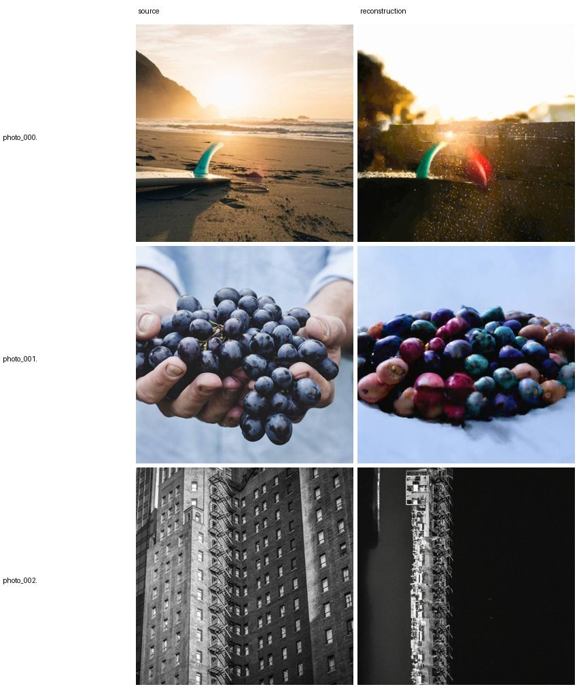

# E21 — RF-inversion frequency-band editing on SD3.5 (reconstruction gate fails)

**Thread:** style · **Model:** SD3.5-medium (rectified flow) · **Status:** dead-end (KILL)
**Successor:** [E22](EXPERIMENT_22.md) (DDIM-inversion band-edit on SDXL, where the gate passes)

---

## Motivation — frequency-decomposed editing of a *real* photo

The spectral-style thread (E18–E19) established two facts about the SD3.5 latent's Fourier
representation: **phase carries layout/content** and **per-band magnitude carries texture +
palette**, and that re-leveling per-band power transfers tone without moving the content. Those
experiments operated on *generated* latents. E21 asks: can the same decomposition give a
**training-free editing control on real images**?

The recipe is the obvious one:

1. **Invert** a real photo back to the noise that would have produced it.
2. **Regenerate** under a *new* prompt (oil painting / pencil sketch / watercolor),
3. while **locking** chosen source frequency bands — keep the source's low-band **phase** so the
   original composition survives, and let the new prompt repaint appearance.

Because low-band phase *is* the composition (E12–E14), locking it should preserve layout while the
prompt edits style — a frequency-decomposed editing knob. The catch is step 1: **the entire edit is
only meaningful if the inversion actually round-trips.** E21 turns out to be a story about that
prerequisite, not about the band-lock knob.

## Method — what was actually done

### Rectified-flow inversion (clean → noise)

SD3.5 is **not** a noise-predictor; it learns a **velocity field** `v(x, σ)` that flows a clean
latent (σ=0) along a near-straight path to pure noise (σ=1). Generation is the explicit Euler step
walking σ: 1 → 0:

```
x += (σ_next − σ_cur) · v(x, σ)
```

To recover the seed of a real image we integrate the *same* field in the **opposite** direction,
σ: 0 → 1 (this is the RF-Inversion / FlowEdit recipe, **not** DDIM inversion). Naive forward Euler
evaluates the velocity at the *current* σ and is exact only when `v` is state-independent. E21 uses
the more accurate **fixed-point (implicit) Euler**, solving each step by iterating `fp_iters=4`
times:

```
x_hi ← x_lo + (σ_hi − σ_lo) · v(x_hi, σ_hi)      # implicit: velocity at the NEXT σ
```

over the 28-step scheduler grid (`invert_sd3` in the driver). The output is the inverted noise
latent; its `noise_std` is reported as a sanity check (a valid Gaussian seed has std ≈ 1.0).


### The band-lock callback (`BandLock`)

A step-end hook applied for the first `until` fraction of generation steps, then released so the
target prompt drives the finish. Each spatial frequency has a **magnitude** (ripple strength →
texture/palette) and a **phase** (where ripples line up → structure/layout); frequencies are binned
into `N_BINS=24` radial rings, and a **cut `c`** selects the lowest `c` fraction (the coarsest
layout):

- `mode="phase"` — `band_phase_swap(src, gen, c, mag_from="B")`: take the **source's** low-band
  phase (layout) but the **generation's** magnitude and high-band phase. Locks composition.
- `mode="power"` — `restyle_latent(...)`: re-level per-band power to the source (palette lock).

**Conditions** per edit pair: `invert_only` (no lock) vs `lockphase_c{0.1,0.25}_u{0.6,1.0}` vs
`lockpower`. **Metrics:** `struct_clip` = CLIP-I to the source (composition ↑); `edit_clip_t` =
CLIP-T to the target prompt (edit followed ↑).

### The gate

`recon_clip_i` is the gate metric: invert a photo, regenerate from that noise with the **same**
prompt at guidance 1, and measure CLIP image-similarity to the original. **≈0.94 ≈ "round-trip
closed"**; anything lower means the inverted noise is wrong and *any* edit built on top is
measuring agreement with a drifted image, not the source. So the gate is a hard prerequisite: a
failed gate **invalidates** the downstream edit numbers rather than merely weakening them.

The **preflight** (model-free, passes) verifies the *math* is right so any real-model failure is the
field's fault, not a bug: (1) reverse-Euler is exact on a **state-independent** velocity field
(round-trip error < 1e-3); (2) the band-lock invariants — `c=1, mag_from="A"` reconstructs the
source exactly; `mag_from="B"` keeps the generation's magnitude.

## Results — the gate fails

Reconstruction grid (source | regenerate-from-inverted-noise with the **same** prompt, three photos
top to bottom). A faithful inversion would make each reconstruction *match its source*. Instead they
**drift** into different images — beach → a different scene, grapes → colorful blobs, building →
a dark distortion — so the recovered "noise" is not the seed that made the photo:



**The numbers** (`results/e21/invert.json`; ↑ better; every cell misses its target):

| photo | `recon_clip_i` ↑ (~0.94 = closed) | `noise_std` (target ~1.0) |
|---|---|---|
| photo_000.jpg | 0.744 | 1.109 |
| photo_001.jpg | 0.663 | 1.119 |
| photo_002.jpg | 0.633 | 1.113 |
| **mean** | **0.680** | **1.114** |

Every `recon_clip_i` sits well below the ~0.94 bar, and every `noise_std` is **inflated** above ~1.0
— two independent symptoms of the same drift. The preflight proves the integrator is *exact* on a
state-independent field, so the failure comes from the **trained velocity field being strongly
state-dependent**: per-step inversion errors compound over 28 steps and the recovered latent lands
off the manifold of valid Gaussian seeds (hence the inflated std).

### Edit (gated — not run)

There is **no `edit.json`**. The band-locked edit only makes sense once the inversion round-trips;
on SD3.5 it does not. Running the edit on a broken reconstruction would yield numbers that *look*
like a structure-vs-edit frontier but actually measure agreement with a *drifted* image. So the edit
awaits a working inversion — and the working inversion is what **E22** provides.

## Verdict

**KILL — RF inversion on SD3.5 is unreliable; editing is moot until the round-trip holds.** Both
naive forward-Euler and the `fp_iters=4` fixed-point inversion fail to reconstruct a real SD3.5
image (mean recon CLIP-I 0.68 ≪ 0.94, noise std ~1.11 ≠ 1.0). The weak link is the **RF inversion**,
not the band-lock idea: the spectral operators are model-agnostic and unit-checked in preflight. This
documented negative is exactly why the thread **pivots to an eps-prediction model with reliable DDIM
inversion → [E22](EXPERIMENT_22.md)** (SDXL), carrying the *identical* band-lock operators over
unchanged. (E22's gate passes — recon CLIP-I 0.91–0.97 — and low-band phase-lock then works as a
composition-preservation knob, confirming the idea was sound and only the SD3.5 inversion was at
fault.)

## Caveats & next

- **RF inversion is the weak link**, not the band-lock idea. What fails is recovering faithful noise
  from a real SD3.5 image via Euler integration of a state-dependent field.
- Locking **low-band phase** preserves layout but cannot, by construction, transfer *oriented*
  brushstrokes — radial bands are isotropic (the E18 caveat carries over).
- **Next = E22:** SDXL + `DDIMInverseScheduler`. SDXL's `4×128×128` latent shares SD3.5's
  `(H,W)=128` grid, so `spectral_ops`/`style_ops` apply with **no changes**; only the inversion
  backbone is swapped to one that round-trips.

## Artifacts

- **Driver:** `experiments/e21_spectral_edit.py` (`invert_sd3` RF inversion, `BandLock` callback),
  reusing `experiments/spectral_ops.py` (`band_phase_swap`, `band_index_map`),
  `experiments/style_ops.py` (`restyle_latent`, `latent_band_power`), and `experiments/e17_sd35.py`
  (`load_sd35`, `sd3_vae_encode/decode`, `gen_sd3`).
- **Results:** `results/e21/invert.json` (the gate numbers) and `results/e21/invert/grid.png` (the
  reconstruction grid), with a legacy self-contained `results/e21/index.html` explainer. On this
  machine these live in the main checkout at
  `/home/shimon/research/colorful-noise/experiments/results/e21/`; no `edit.json` exists (edit
  gated). Full-res figures archived to `/storage/malnick/colorful-noise/roadmap_results/E21/`.
- **Figures:** `figs/E21/recon_grid.jpg` (source vs reconstruction, extracted from the archived
  `index.html`), `figs/E21/gate_diagram.jpg` (generated matplotlib schematic + gate bar chart).

### Reproduce

```bash
cd experiments
# 1) model-free sanity: reverse-Euler exactness + band-lock invariants
python e21_spectral_edit.py --part preflight
# 2) THE GATE: invert real photos, reconstruct with same prompt, report CLIP-I fidelity
python e21_spectral_edit.py --part invert  --num 3 --steps 28
# 3) edit (only meaningful once the gate passes): band-lock variants under the target prompt
python e21_spectral_edit.py --part edit --num 3 --steps 28 --cfg 4.5 --cuts 0.1,0.25 --untils 0.6,1.0
# 4) dump the JSON tables
python e21_spectral_edit.py --part analyze
```
