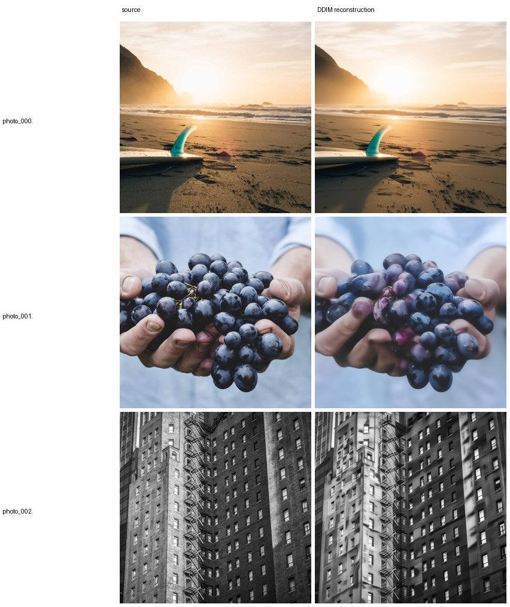
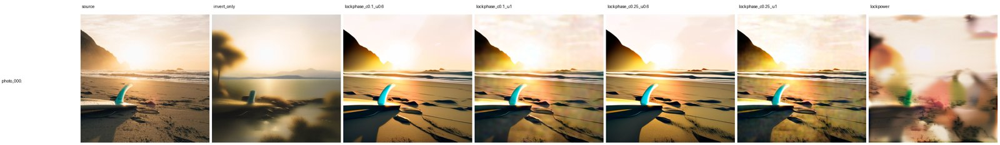
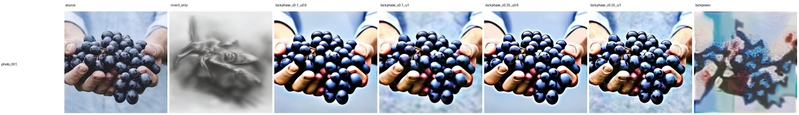
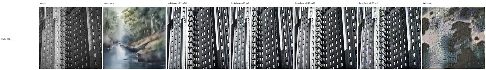

# E22 — DDIM-inversion frequency-band editing on a real photo (SDXL pivot)

**Thread:** style · **Model:** SDXL · **Status:** mapped (a real structure⇄edit frontier)
**Predecessor:** E21 (same band-lock control on SD3.5 — **inversion drifted, KILLed**)

---

## Motivation — edit a *real* photo by spectral surgery

Most of the spectral-noise line (E12–E19) manipulates *generated* latents, where you already own the
seed. The harder, more useful task is editing a **real photograph**: restyle it (oil painting / pencil
sketch / watercolor) while keeping the **composition** — same scene geometry, same layout. To touch a
real image's latent you first have to **invert** it: find the noise that, run forward, reproduces the
photo. Then you can regenerate from that noise under a new prompt and intervene mid-denoising.

E21 tried exactly this band-lock control on **SD3.5** and hit the gate: the rectified-flow inversion
**would not close** — the round-trip clean→noise→clean drifted, so nothing downstream was
interpretable. **Reconstruction is the gate for everything.** E22 asks two questions:

1. **Does the gate pass on a different backbone?** SDXL is an **ε-prediction** model with a clean,
   deterministic DDIM inversion. Pivot the backbone, keep the editing control unchanged.
2. **Given a passing gate, is low-band *phase* locking a real composition-preservation knob on a real
   image** — and what does it cost in prompt adherence?

## Method — invert, then lock source frequency bands during regeneration

**Backbone.** SDXL (`StableDiffusionXLPipeline`, fp16), `DDIMScheduler` for generation +
`DDIMInverseScheduler` for inversion, 1024px, latent `(1,4,128,128)`, 30 steps, inversion guidance
1.0, edit CFG 5.0. The latent grid `(H,W)=128` is **identical** to SD3.5's, so the radial-band
operators (`spectral_ops`, `style_ops`) port over **unchanged** — they are channel-agnostic.

### The gate — DDIM inversion (`--part invert`)

ε-prediction makes the DDIM map a deterministic, invertible ODE. We VAE-encode the photo (in fp32 for
stability) to `x₀`, then run the pipeline with the **inverse scheduler** (timesteps 0→T) to recover
the noise `x_T` that produces it, regenerate from `x_T` with the **same** prompt at guidance 1, and
score CLIP-I of the reconstruction to the original. High CLIP-I ⇒ the inverted noise is faithful ⇒
edits from it are meaningful. (Code: `ddim_invert` swaps in `DDIMInverseScheduler`, runs the pipe to
the final latent, restores the normal scheduler.)

### The editing control — frequency-band locking (`--part edit`)

Each spatial frequency `k` of the latent carries a **magnitude** `|X(k)|` (ripple strength →
texture/palette) and a **phase** `∠X(k)` (alignment → structure/layout). The classic Oppenheim–Lim
result is that **phase carries layout** — so *locking phase locks layout*. We bin frequencies into
`N_BINS=24` radial rings from DC; band 0 is the coarsest layout.

During regeneration toward the **target** prompt, a step-end callback (`BandLock`) overwrites the
generating latent `g` with source content on the chosen bands. The phase variant (`band_phase_swap`,
`mag_from="B"`) keeps the **source's** low-band phase while letting the new prompt own the magnitude
and the high-band phase:

```
keep low band k < c:   ∠X_new(k) = ∠X_source(k),   |X_new(k)| = |X_gen(k)|   (mag from generation)
let go  k ≥ c:         X_new(k)  = X_gen(k)
active only for the first  u·steps  steps, then released.
```

Two dials:

- **`c` (cut)** — the lowest fraction of the spectrum that gets locked (`c=0.1` coarsest only;
  `c=0.25` a bit more layout).
- **`u` (until)** — the lock is active for the first `u` fraction of denoising steps, then released
  (`u=0.6` lets go early; `u=1.0` holds to the end).

**`lockpower` (the control).** `BandLock` `mode="power"` (`restyle_latent`) instead re-levels each
band's *power* (magnitude energy) to the source. Magnitude carries palette/texture, **not** layout, so
this should barely preserve structure — it isolates the phase⇄magnitude split rather than competing
with phase locking.

**Why it should work.** Holding the coarse-band phase fixed pins the scene geometry while leaving the
prompt free to repaint everything finer; the further we extend the lock (larger `c`, longer `u`) the
more layout we freeze and the less the prompt can move — a tunable structure⇄edit trade, not a single
operating point.

### Model-free preflight (`--part preflight`, passes)

Verifies the band-lock invariants before any model loads: `band_phase_swap(c=1, mag_from="A")`
reconstructs the source to `<1e-2`; `mag_from="B"` returns a valid same-shape float latent.

**Metrics.** `recon_clip_i` ↑ = CLIP-I of the reconstruction to the source (**~0.94 = round-trip
closed**, the gate). `struct_clip` ↑ = CLIP-I of the edit to the **source** (composition preserved).
`edit_clip_t` ↑ = CLIP-T of the edit to the **target prompt** (edit followed). A good knob negotiates
the last two.

## Results

SDXL, 3 real photos (beach/surfboard, hands-with-grapes, building), 3 edits
(oil painting / pencil sketch / watercolor), 30 steps, edit CFG 5.0. Numbers from
`results/e22/invert.json` and `results/e22/edit.json`.

### Reconstruction — the gate passes

The round-trip **closes** on SDXL, unlike E21's SD3.5 drift: ε-prediction's deterministic DDIM
inversion recovers a faithful noise latent, so clean→noise→clean returns the source.

| photo | recon CLIP-I ↑ (round-trip; ~0.94 = closed) | noise_std |
|---|---|---|
| photo_000 (beach) | **0.974** | 0.87 |
| photo_001 (grapes) | 0.906 | 0.88 |
| photo_002 (building) | 0.926 | 0.90 |
| **mean** | **0.935** | 0.89 |

Every cell sits at/above the ~0.94 bar (mean 0.935) — the gate passes, so the edit cells below are
interpretable (on E21 they were not). This is the core win of the E21→E22 pivot.



### Band-lock edit — a real structure⇄edit frontier

Locking the source's low-band **phase** lifts structure-to-source CLIP-I from **0.60** (no lock) to
**~0.90** — a large, unanimous gain across all three edits, confirming **low-band phase = layout**
end-to-end on a *real* image edit, not just on generated latents. But it is a **frontier, not a free
lunch**: every `lockphase` cell **drops** edit CLIP-T from the **0.237** baseline to **≈0.15–0.17**,
because freezing the layout constrains how far the prompt can repaint.

| condition (mean over 3 edits) | struct→source (CLIP-I) ↑ | edit→prompt (CLIP-T) ↑ |
|---|---|---|
| `invert_only` (baseline, no lock) | 0.602 | **0.237** |
| `lockphase_c0.1_u0.6` | 0.902 | 0.146 |
| `lockphase_c0.1_u1.0` | **0.900** | **0.169** |
| `lockphase_c0.25_u0.6` | 0.884 | 0.153 |
| `lockphase_c0.25_u1.0` | 0.892 | 0.173 |
| `lockpower` (palette control) | 0.637 | 0.164 |

Reading the table:

- **The frontier is the gap between rows.** Max adherence (`invert_only`, 0.237) and max structure (a
  `lockphase` cell, ~0.90) live in *different* rows; `c` and `u` tune where you sit between them.
- **`u=1.0` beats `u=0.6`** at essentially equal structure, consistently across all three edits —
  counter-intuitive (holding the lock longer keeps *more* edit-CLIP), suggesting early release lets
  the layout partly wash out without buying back edit strength. `c=0.1, u=1.0` is the current sweet
  spot (max structure, best edit-CLIP among the strong-lock cells).
- **`lockpower` falls off the frontier** — struct 0.637, barely above the 0.602 baseline, with no
  edit-adherence gain. Magnitude carries palette, not layout: re-leveling per-band power does **not**
  hold composition. This confirms the phase/magnitude split rather than competing with it.


The qualitative grids are the real evidence of the look. In the oil-painting grid below, `invert_only`
drifts hard (a spurious tree appears, the surfboard fin migrates), every `lockphase` cell keeps the
beach/surfboard composition while the style shifts toward paint, and `lockpower` mangles the image into
a palette smear — exactly the predicted phase=layout, magnitude=palette split.







## Verdict

**MAPPED — a real structure⇄edit frontier on real images.** The E21→E22 backbone pivot works: SDXL's
ε-prediction DDIM inversion **closes the round-trip** (recon CLIP-I ≈ 0.94 mean, vs E21's drift), so
the editing experiments are finally interpretable. Given that gate, **low-band phase locking is a
strong, tunable composition-preservation knob** (struct 0.60 → 0.90) that **trades away prompt
adherence** (edit CLIP-T 0.237 → ≈0.15–0.17) — a genuine frontier, not a free lunch, with `c` (how much
layout to lock) and `u` (how long) as the two dials, `c=0.1, u=1.0` the current sweet spot. The
`lockpower` control fails to hold layout, confirming **phase = layout, magnitude = palette** on a real
photo, not just generated latents.

## Caveats & next

- **3 photos × 3 prompts** — directionally clear (the struct gap is huge and unanimous) but small;
  widen the photo/prompt set before any strong quantitative claim on the edit frontier.
- **CLIP-T is a weak metric for style words** ("oil painting") — absolute edit numbers are low even at
  baseline; the *relative* drop under lock and the qualitative grids are the trustworthy signal.
- **Isotropic radial bands** lock layout phase + texture energy, **not oriented strokes** (the E18
  caveat persists).
- **Next:** a soft/decaying lock (ramp the lock strength down over steps instead of a hard release) to
  recover edit-adherence without losing the layout; and per-edit picking along the `(c,u)` frontier
  rather than a single global setting.

## Artifacts

- **Driver:** `experiments/e22_ddim_edit.py` (`load_sdxl`, `ddim_invert` DDIM inversion, `BandLock`
  callback), reusing `experiments/spectral_ops.py` (`band_phase_swap`, `band_index_map`),
  `experiments/style_ops.py` (`restyle_latent`, `latent_band_power`), `experiments/clip_sim.py`.
- **Reproduce:** `python e22_ddim_edit.py --part preflight` (model-free) ·
  `--part invert --num 3 --steps 30 --inv_guidance 1.0` (the gate) ·
  `--part edit --num 3 --steps 30 --cfg 5.0 --cuts 0.1,0.25 --untils 0.6,1.0` ·
  `--part analyze` (dump JSON tables).
- **Results:** `experiments/results/e22/` on this checkout — `invert.json`, `edit.json`,
  `invert/grid.png`, `edit/grid_*.png`. Full-res grids archived at
  `/storage/malnick/colorful-noise/roadmap_results/E22/`.
- **Figures:** `docs/experiment-reports/figs/E22/` — `invert_grid` (gate), `edit_{oil,sketch,
  watercolor}` (per-edit variant grids), `frontier` (generated matplotlib scatter of the
  structure⇄edit trade).
