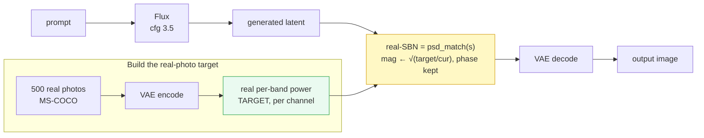
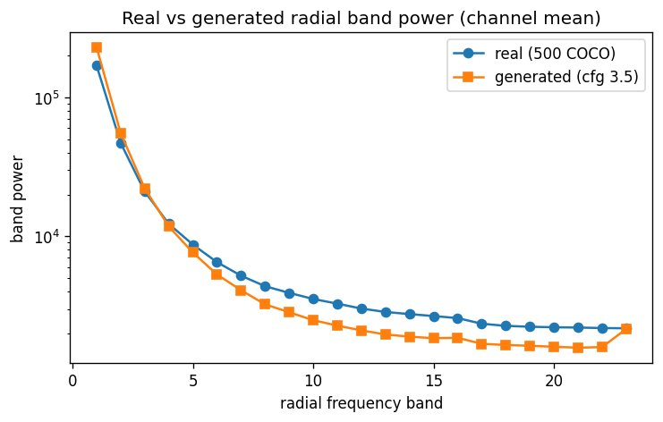
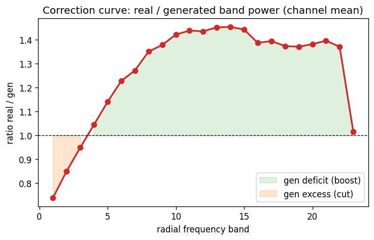
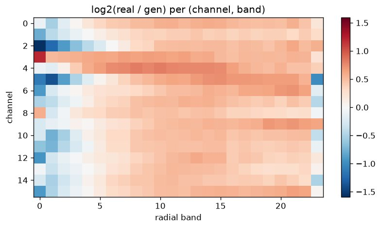
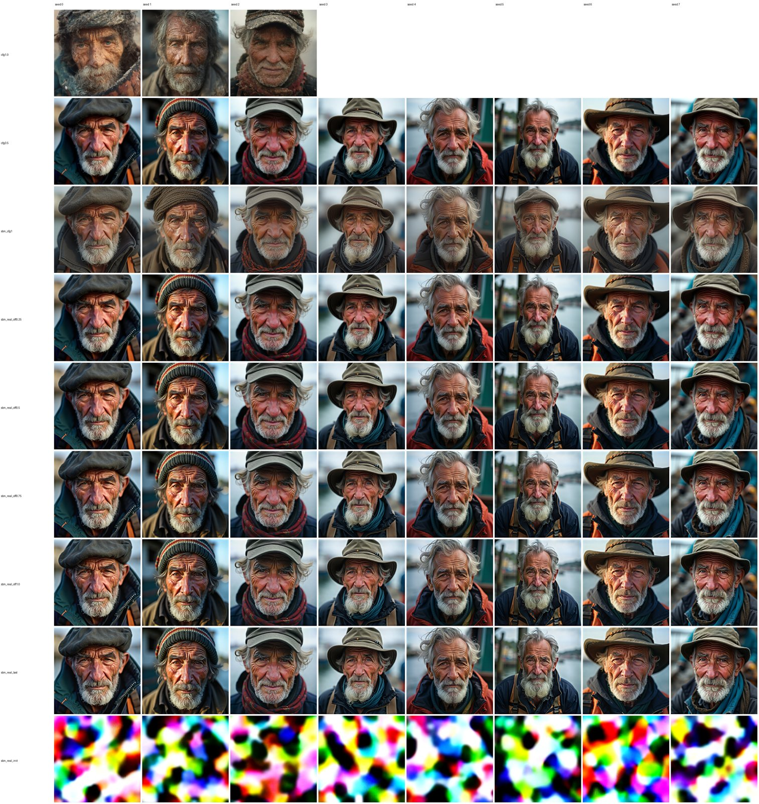
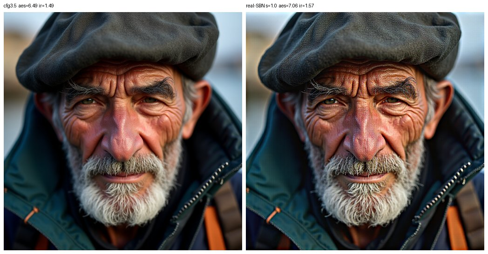
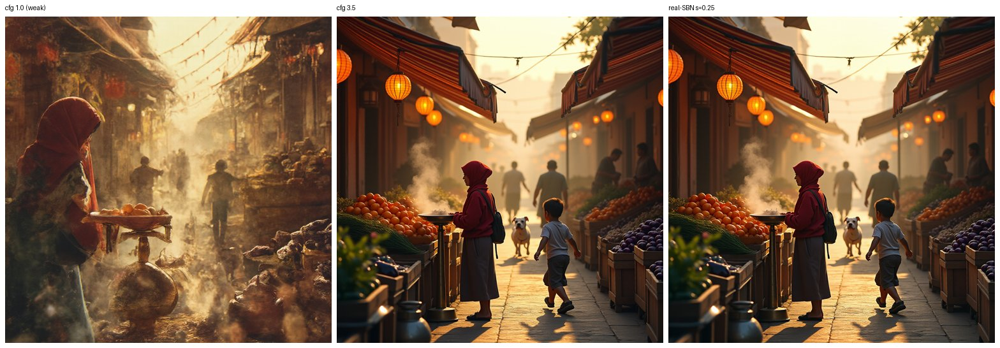
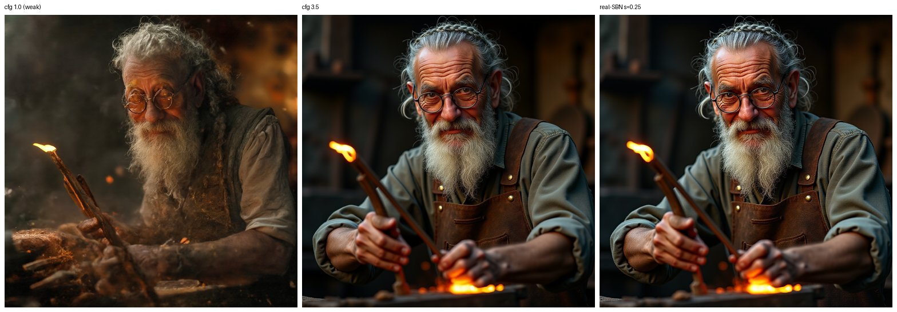

# E23 — Real-image spectral target, and correcting toward it ("real-SBN")

**Thread:** spectral-power · **Model:** FLUX.1-dev · **Status:** active (KEEP)
**Lineage:** SBN (E8/E9) clamped toward a **cfg = 1** proxy; E10 showed CFG *inflates* low-frequency
power above the natural level. E23 is the payoff: stop clamping toward the weak proxy and clamp
toward the spectrum of **real photographs**.

---

## Motivation — clamp toward reality, not toward a weaker model output

A diffusion model's images are not quite like real photographs, and one concrete, *measurable* way
they differ is their **frequency spectrum**. Spectral Band Normalization ("SBN", E8/E9, `bandnorm.py`)
re-levels a generated latent's per-(channel, radial-band) power toward a reference — but the
reference used there was a **cfg = 1** generation. That is just a *softer model output*, not reality:
E10 found that classifier-free guidance inflates spectral power above the real-image level, so cfg = 1
is at best a stand-in for "less inflated."

E23 asks the obvious next question: **what if the target is the real-photo spectrum itself?**
We (1) **measure** the generated-vs-real spectral gap against 500 MS-COCO photos, and (2) **correct**
each generated latent's spectrum toward the real-photo spectrum, an operation we call **real-SBN**.

## Method

### The schematic



### Background (plain language)

- **Latent.** Flux works in a compressed **16-channel, 128×128** array; a VAE turns it into the
  1024×1024 image. All spectral analysis is on latents.
- **Radial band / PSD.** Any latent is a sum of waves at different spatial frequencies (low = coarse
  structure, high = fine texture). We bin frequencies into **24 radial rings** ("bands"); the
  **power spectral density (PSD)** is power-vs-band — the fingerprint of coarse vs fine content.
- **Phase vs magnitude.** Each frequency has a magnitude (how strong) and a phase (where). In these
  latents **phase carries layout/content**; per-band **magnitude carries texture + palette**. This
  split is exactly why we can re-level texture without moving the content.

### The real target

Encode 500 MS-COCO photos through the Flux VAE and take the **mean per-(channel, band) power**. The
target is kept **per channel** because the gap is channel-structured (see Results). This is the
universal target reused by every condition. (`real_spectral.py`, `e10_cfg_spectral.py --part coco,real`;
cached as `real_band.pt`.)

### The operator — `psd_match` (AdaIN-in-Fourier)

For a latent's FFT, for each (channel, band) we **rescale the magnitude toward the target and keep the
phase untouched**:

```
X'(k) = X(k) · ( target_band(k) / current_band(k) )^(s/2)
```

so at full strength `s = 1` the per-band power becomes exactly `target_band`, and `phase(X'(k)) =
phase(X(k))`. `s` is a strength exponent: **s = 0** is identity, **s = 1** is a full match, and the
gain on the magnitude is `(real/own)^(s/2)`. (`spectral_ops.psd_match`, `style_ops.restyle_latent`.)
Because only per-band *magnitude* moves, layout/content is preserved while texture and palette are
re-leveled. The DC/Nyquist self-conjugate bins are handled so the result stays a valid real image
(`return_stats` reports the imaginary residue; verified small in pre-flight).

### Three ways to apply it (and one that fails)

A clean-image real target is only dimensionally comparable to a **clean** latent; mid-denoising
latents are mostly noise, so we deliberately do **not** clamp every step.

| mode | what it does | role |
|---|---|---|
| **offline** `sbn_real_off{s}` | `psd_match` the **final** cfg latent post-hoc, then VAE-decode | the **primary** method (`restyle_latent`) |
| **during-gen, last step** `sbn_real_last` | same correction inside the loop, on the **last** denoising step only (`ClampRealLastStep`) | on-manifold check; matches offline |
| **init-noise shaping** `sbn_real_init` | `psd_match` the **initial white noise**, then denoise normally | exploratory — **fails** (the flow prior wants white noise) |

The baselines are **cfg 1.0** (weak guidance, the old SBN reference) and **cfg 3.5** (normal; also the
measurement pool and the input that offline real-SBN corrects), plus the old **sbn_cfg1** (clamp every
step toward the cfg = 1 reference).

### Metrics

- **`spectral_dist_to_real`** — channel-mean PSD distance to the real reference (the gap scalar; ↓).
- **`band_logrms`** — per-(channel, band) RMS of `log(gen) − log(real)` (keeps per-channel structure).
- **aesthetic** (LAION predictor), **ImageReward**, **CLIP-T** (prompt-adherence guardrail), and on the
  long compositional prompts, **B-VQA** (BLIP-VQA attribute binding, the T2I-CompBench metric).

## Results

Means over 6 prompt classes (animal / portrait / landscape / urban-night / abstract / watercolor),
8 seeds, Flux cfg 3.5, 28 steps, 24 bands. Real target from **500** COCO photos; generated pool 24.

### 1. The gap is bimodal — not just the CFG story

At the **lowest 4 bands** the model has *more* power than real (ratio real/gen ≈ 0.63–0.95 — the CFG
low-frequency inflation E10 predicted); across the **mid/high bands** it has *less*, with the ratio
rising to a **peak ≈ 1.45** (band 14) and sitting ≈ 1.37 across the high bands — a broad
**high-frequency deficit**: generated images are systematically **under-textured** vs real photos.
The per-(channel, band) heatmap shows this is channel-specific, which is why the target is kept per
channel.







### 2. Correcting toward real helps — and beats the old cfg-1 SBN

| condition | spec-dist→real ↓ | aesthetic ↑ | ImageReward ↑ | CLIP-T ↑ |
|---|---|---|---|---|
| cfg 1.0 (weak baseline) | 0.589 | 6.40 | 1.19 | 0.285 |
| cfg 3.5 (baseline) | 0.294 | 6.49 | 1.28 | 0.290 |
| SBN → cfg 1 (old) | 0.582 | 6.76 | 1.46 | 0.293 |
| real-SBN offline s = 0.25 | 0.223 | 6.52 | 1.28 | 0.287 |
| real-SBN offline s = 0.5 | 0.150 | 6.57 | 1.28 | 0.285 |
| real-SBN offline s = 1.0 | 0.000 | 6.61 | 1.26 | 0.287 |
| **real-SBN last-step** | **0.000** | **6.89** | **1.51** | 0.291 |
| init-noise shaping | 2.08 | 3.90 | −2.28 | 0.098 |

real-SBN closes the spectral gap monotonically with strength (offline 0.294 → 0.223 → 0.150 → 0.000),
the **last-step** variant gives the **biggest aesthetic + ImageReward gain of any condition**
(6.49 → 6.89, 1.28 → 1.51) at **~zero CLIP-T cost** (0.290 → 0.291), and it **beats the old cfg-1 SBN**
— which actually moves *away* from real (spec-dist 0.582, worse than the cfg-3.5 baseline's 0.294).

The aesthetic gain **concentrates on photographic content**. Offline-strength sweep, Δaesthetic vs
cfg 3.5 per class:

| class | s = 0.25 | s = 0.5 | s = 0.75 | s = 1.0 |
|---|---|---|---|---|
| **portrait** | +0.11 | +0.26 | +0.37 | **+0.43** |
| animal | +0.03 | +0.08 | +0.18 | +0.26 |
| urban-night | +0.00 | +0.05 | +0.12 | +0.17 |
| landscape | +0.03 | +0.07 | +0.11 | +0.12 |
| abstract | +0.01 | −0.03 | −0.08 | **−0.16** |
| watercolor | +0.02 | +0.02 | −0.03 | −0.09 |

Portraits gain the most; **abstract/watercolor go *negative* at high strength** because the high bands
have little real signal, so full-strength matching over-amplifies them into **grain/artifacts**. Hence
**≈ 0.25 is the recommended setting** — it captures most of the gain on photographic content and stays
positive everywhere. (Caveat: the LAION aesthetic predictor *rewards* over-sharpening, so its score
keeps climbing past the point a human prefers — trust the eye, not the last decimal of "aesthetic".)





### 3. Why not just use cfg = 1? — it drops compositional content

cfg = 1 looks natural but has **poor prompt adherence** on long compositional prompts. On 6 long
prompts (market / desk / alley / still-life / fox-scene / blacksmith), means:

| condition | CLIP-T ↑ | B-VQA ↑ |
|---|---|---|
| cfg 1.0 | 0.301 | **0.046** |
| cfg 3.5 | 0.315 | 0.168 |
| real-SBN s = 0.25 | 0.313 | **0.170** |

**B-VQA** (BLIP-VQA attribute binding) is decisive: cfg = 1 **collapses** on compositional binding
(0.046; e.g. market 0.010, alley 0.000) while cfg 3.5 keeps it (0.168) — and **real-SBN, applied on
top of the cfg-3.5 image, preserves that adherence** (0.170, statistically the same as cfg 3.5) while
moving the *look* toward natural. CLIP-T agrees directionally (cfg1 0.301 < cfg3.5 0.315 ≈ real-SBN
0.313). So real-SBN gives you the **natural tone of cfg = 1 without paying its compositional cost** —
which a cfg-1 reference (the old SBN) cannot.





## Verdict

**KEEP — the live payoff of the SBN line.** The real-photo target is the right one: real-SBN closes the
measured generated-vs-real spectral gap, gives the **biggest aesthetic/ImageReward gain** of any
condition at **~zero adherence cost**, **beats the old cfg-1 SBN** (which moves away from real), and —
unlike just lowering cfg — **keeps compositional adherence** (B-VQA 0.170 ≈ cfg-3.5 0.168, vs cfg-1
0.046). The gain concentrates on photographic content (portrait Δaesthetic +0.43 at full strength),
with **≈ 0.25** the practical sweet spot.

**Honest caveats.**
- `spec-dist→real` is **partly circular**: full-strength real-SBN matches the channel-mean PSD by
  construction, so its → 0 is mechanical. The *independent* wins are the aesthetic/IR gain and the
  near-zero adherence cost.
- **Strength > 0.5 over-amplifies the empty high bands into grain** (abstract/watercolor go negative).
- **Init-noise shaping fails** — the flow prior expects white noise; coloring it collapses generation
  (documented negative: spec-dist 2.08, aesthetic 3.90, CLIP-T 0.098).
- **Isotropic only** — radial bands carry texture-energy + palette, not oriented structure.

**Next.** Bake a single **fixed per-channel correction curve** (apply the average real/gen ratio to
every image — no per-image matching) to make real-SBN a **free, deterministic post-step**; confirm
B-VQA adherence at scale; port the operator to the **SD3.5** VAE latent space.

## Artifacts

- **Driver:** `experiments/e23_real_sbn.py` (parts `measure / gen / score / examples / adherence /
  analyze`); operator `spectral_ops.psd_match`, `style_ops.restyle_latent`; target `real_spectral.py`;
  adherence metric `compbench.bvqa_scores`.
- **Results location:** `/storage/malnick/colorful-noise/experiments/results/e23/` — `report.json`,
  `scores.json`, `examples.json`, `adherence/adherence.json`, `plots/`, per-class grids, and the
  `adherence/panels/` + `examples/` montages.
- **Figures (this report):** archived full-res under
  `/storage/malnick/colorful-noise/roadmap_results/E23/`; embedded JPEGs under `figs/E23/`.
  The two spectrum line plots (`psd_real_vs_gen`, `correction_curve`) were regenerated from
  `report.json`'s `measure` arrays; the heatmap, grid, and panels are the original run outputs.
- **Manifest:** `experiments/manifests/E23.json`.

### Reproduce

```bash
# build the real target (once)
python e10_cfg_spectral.py --part coco,real --n_coco 500
# measure gap + corrections + scores + qualitative examples
python e23_real_sbn.py --part measure,gen,score,examples,analyze --seeds 8 --num_classes 6 \
    --strength_sweep 0.25,0.5,0.75,1.0
# cfg1-vs-cfg-vs-realSBN on long complex prompts (B-VQA adherence)
python e23_real_sbn.py --part adherence --prompt_set complex --strength_sweep 0.1,0.25,0.5 \
    --rec_strength 0.25 --seeds 8 --vqa
```
