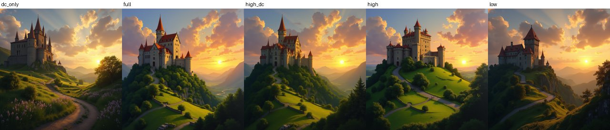
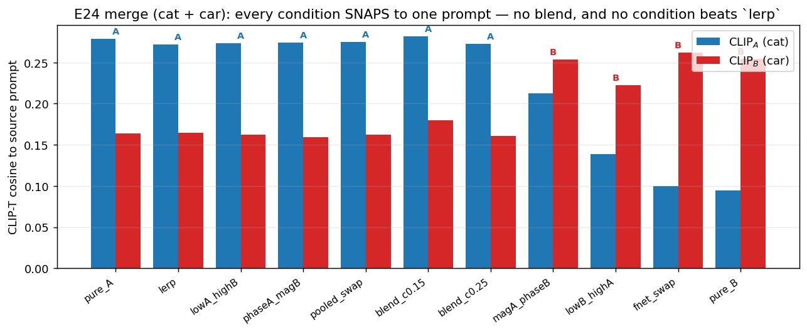

# E24 — Token-axis FFT on the TEXT conditioning (FNet-motivated)

**Thread:** text-freq · **Model:** FLUX.1-dev (T5-XXL conditioning) · **Status:** mapped
**Successor:** [E30](EXPERIMENT_30.md) (make it a continuous knob and characterise each band)

---

## Motivation — can you do spectral surgery on the *prompt*, not the image?

The project's spine is a spectral one: split a diffusion **image latent** into frequency
bands and manipulate them (E18 "AdaIN-in-Fourier", E20 — *phase carries structure*). E24
asks the dual question on the **text side**: a prompt is encoded into a sequence of token
embeddings `E ∈ (1, L, 4096)` (Flux uses **T5-XXL** — one 4096-dim vector per prompt token)
that is fed to the transformer's cross-attention. **Can we treat that sequence as a signal,
Fourier-transform it along the *token* axis, and use the frequency bands to merge or edit
images?**

**Why it's plausible — FNet.** Lee-Thorp et al. (2021) replaced Transformer self-attention
with a *parameter-free* DFT over the token-sequence axis and still reached ~92–97% of BERT.
That is direct evidence the **token-axis FFT is a meaningful token-mixing basis**: low
token-frequencies carry slow / global meaning (the DC term is the bag-of-words mean), high
token-frequencies carry sharp token-to-token detail. If that structure survives into the
conditioning tensor that *steers Flux*, then band-swapping two prompts' spectra might compose
two images (low band of A = subject, high band of B = detail/style) — a training-free,
encoder-only edit.

## Method — what is actually transformed

All ops live in `experiments/text_spectral_ops.py` and act on the **real-token span**
`E[:, :L]` (T5 pads every prompt to 512; FFTing the padding would fold the content→padding
cliff into the high band, so the padding is detached, transformed-around, and re-stitched via
`apply_on_span`). Everything is real-in/real-out via `rfft`/`irfft` along the token axis, so
there is no Hermitian bookkeeping.

### The transform is a 1-D DFT along the token axis, per channel

The signal is the token sequence. For each of the `d = 4096` embedding channels independently
we take a length-`L` DFT **along the token axis** (`torch.fft.rfft(E, dim=1)`):

```
Ê(k, c) = Σ_{n=0}^{L-1} E(n, c) · e^{−2πi·kn/L}        for each channel c = 0 … 4095
```

"Frequency" `k` means *how fast channel `c`'s value oscillates as you walk along the tokens*
(DC `k=0` = that channel's average over the prompt). Frequencies are normalised to `[0,1]`
(`0`=DC, `1`=Nyquist) so a `cut` fraction means the same thing for any prompt length `L`.
**Crucially the transform never mixes across the embedding dimension** — it is `d` separate
length-`L` transforms, not a 2-D image FFT.

The figure below illustrates the whole operation on a synthetic span (no model needed): the
embedding as a `L×d` image, its per-channel rfft, the channel-pooled band power (the token-axis
"PSD"), and the clean `low + high = full` split at `cut=0.25`.


### The band operations (the knobs)

Let `low/high` be the rfft split at normalised crossover `cut`. The decomposition is exact
(`low + high == E`, by linearity — not a lossy filter pair). The probes and merges built on it:

- **probe** (one prompt — *what does each band control?*): keep only a band and regenerate —
  `dc_only`, `low` (DC..cut), `high` (cut..1), `high_dc` (high + DC), `full`. Tells us whether
  band-filtered embeddings stay on the encoder manifold (do they still make coherent images?).
- **merge** (prompt A + B): `lowA_highB` / `lowB_highA` (hard complex band-swap), the soft
  cosine-ramp `blend` over a `cut` grid, and the token-axis **phase/magnitude** swaps
  `phaseA_magB` = `irfft(|Ê_B|·e^{i∠Ê_A})` / `magA_phaseB` (which one keeps the subject tells
  us whether *phase* or *magnitude* along the token axis carries identity). Baselines:
  - **`lerp@0.5`** = `(A+B)/2` in token space — **the bar to beat** (a flat per-band convex
    blend *equals* this, so the only meaningful spectral knob is the crossover *location* `cut`);
  - **`pooled_swap`** = T5 sequence from A, CLIP-pooled vector from B (isolates whether the
    sequence or the pooled vector steers the image);
  - **`fnet_swap`** = the literal FNet 2-D (seq × hidden) DFT swap — the hidden axis has no
    natural ordering so this is uninterpretable, included only as an "is the mixing transform
    *itself* enough?" control.
- **edit** (base + style prompt): inject the style prompt's **high band** into the base over a
  `cut` grid; compare to the full style prompt and a pooled-only inject.

**Why it *should* work:** if subject lives in the low band and detail/style in the high band
(the FNet intuition), `lowA_highB` would compose A's subject with B's texture — a clean
disentangled merge that plain `lerp` (which mixes everything uniformly) cannot give.

**Hook & model.** Flux pre-encodes prompts to `(prompt_embeds, pooled)`; we modify
`prompt_embeds` before denoising. true-CFG=1 (single pass / trained field), guidance 3.5,
28 steps, 4 seeds, `cut=0.25`. **Metrics:** CLIP-T cosine to each source prompt — for a merge,
`CLIP_A` vs `CLIP_B` is the **attribution** (which prompt does the image resemble?) — plus
LAION aesthetic and ImageReward.

## Results (`results/e24/`, RTX A5000, ~4 h)

### Probe — token-axis bands are meaningful and on-manifold

Every band-filtered variant produces a coherent, on-prompt image. The **high band alone
reconstructs the prompt about as well as `full`**; `dc_only` is the weak one (it keeps only
the bag-of-words mean direction and produces a washed-out, generic image). CLIP-T to the
prompt, averaged over 4 seeds:

| probe variant | cat | car | castle | reads as |
|---|---|---|---|---|
| `full` | 0.315 | 0.277 | 0.300 | full prompt |
| `high` (cut..1) | 0.316 | 0.286 | 0.298 | **≈ full** |
| `high_dc` | 0.316 | 0.273 | 0.291 | ≈ full |
| `low` (DC..cut) | 0.304 | 0.266 | 0.275 | softened |
| `dc_only` | 0.265 | 0.210 | 0.265 | **weakest** (mean only) |

So the conditioning is **robust to band filtering** — the FNet intuition holds at the
conditioning level. The probe grid (columns: `dc_only · full · high_dc · high · low`) shows
the same castle reconstructed from each band — `dc_only` is washed out, every other band is a
coherent castle:



### Merge — NEGATIVE for clean blending

No condition blends A and B. Results **snap to whichever prompt owns the low band + phase**,
and the spectral merges **do not beat `lerp` — which itself collapses to A**. The token
spectrum behaves as a near-**binary identity selector**, not a continuous blender
(`cat + car`, CLIP-T to each prompt):

| condition | CLIP_A (cat) | CLIP_B (car) | leans |
|---|---|---|---|
| pure_A / pure_B | 0.279 / 0.095 | 0.164 / 0.254 | anchors |
| **lerp@0.5** (baseline) | 0.272 | 0.165 | → A |
| lowA_highB | 0.274 | 0.162 | → A |
| lowB_highA | 0.139 | 0.222 | → B |
| **phaseA_magB** | 0.274 | 0.159 | **→ A** |
| **magA_phaseB** | 0.212 | 0.254 | **→ B** |
| pooled_swap | 0.275 | 0.162 | → A |
| blend_c0.15 | 0.281 | 0.180 | → A |
| fnet_swap | 0.100 | 0.262 | → B |



Three things this table says:

- **The spectral merges do not beat `lerp`** on disentanglement — and `lerp@0.5` itself
  collapses to A, so there is no win to be had. Only one regime got near-balanced —
  `blend_c0.15` on `castle_forest` (A 0.245 / B 0.226) — a narrow exception, not a method.
- **`pooled_swap` (sequence A + pooled B → A)** shows the **T5 sequence dominates**: the CLIP
  pooled vector barely steers the image.
- **Mechanistic takeaway — identity is carried by the token-axis PHASE** (and the low band):
  `phaseA_magB → A`, `magA_phaseB → B` (most cleanly on `castle_forest`: phaseA_magB =
  A 0.291 / B 0.083). Magnitude does **not** transfer identity. This directly mirrors the
  project's image-domain finding that **phase carries structure** (E18 / E20).

### Edit — PARTIAL POSITIVE (a usable style-strength knob)

Injecting the style prompt's high band into the base is a usable **style-strength knob** via
`cut`. Gentle settings give a modest content-preserving nudge; an aggressive low `cut` (most
of the spectrum taken from the style prompt) ≈ just using the style prompt. `house → Van Gogh`
and `portrait → cyberpunk`, CLIP-T to base vs style:

| condition | base CLIP_base | base CLIP_style | portrait CLIP_base | portrait CLIP_style |
|---|---|---|---|---|
| base (no edit) | 0.272 | 0.150 | 0.218 | 0.071 |
| inject (gentle) | 0.253 | 0.175 | 0.219 | 0.101 |
| inject `c0.15` (aggressive) | 0.245 | 0.181 | 0.175 | **0.224** |
| full_style | 0.095 | 0.241 | 0.114 | 0.274 |
| pooled_inject | 0.267 | 0.178 | 0.215 | 0.118 |

So the high-band inject moves style up while holding content (house: style `0.150 → 0.18`,
content `0.272 → 0.25`), and `cut=0.15` (≈85% of the spectrum from the style prompt) approaches
`full_style` (portrait: style `0.071 → 0.224`). The cheap `pooled_inject` does about the same,
which undercuts the case that the *spectral* machinery is what's buying the edit.

## Verdict

**MAPPED.** The hunch is **directionally right for editing** (high-band style injection is a
usable strength knob) but **wrong for merging**: the token spectrum is too winner-take-all to
blend two full prompts, and it **does not beat plain embedding interpolation** — which was the
bar. A clean exploratory result with three parts: a **negative** (merge), a **partial positive**
(edit), and a **mechanistic insight** — *content identity is carried by the token-axis phase*,
the text-side echo of the image-domain "phase = structure". The right follow-up is not "merge
two spectra" but "make the band a **continuous knob** and characterise what each band controls"
→ **E30**.

## Difference from FNet

FNet (Lee-Thorp 2021) replaces self-attention with a 2-D DFT over (token × hidden) as a *fixed
token-mixing layer inside training*. E24 (a) uses the **interpretable 1-D token-axis** DFT
(per channel; the hidden axis is unordered, so the literal 2-D `fnet_swap` is only a control),
(b) operates **post-hoc on a frozen Flux's conditioning tensor** as a training-free edit, and
(c) tests **composition/attribution between two prompts**, not classification accuracy. FNet
motivates *why the basis is meaningful*; E24 asks whether that meaning survives into a
generative model's steering signal (it partly does).

## Artifacts

- Driver: `experiments/e24_text_spectral.py` (`probe` / `merge` / `edit` / `analyze` parts +
  self-contained `index.html` explainer). Ops: `experiments/text_spectral_ops.py`
  (`band_filter_1d`, `split_bands_1d`, `band_swap_1d`, `band_blend_1d`, `phase_mag_split_1d`,
  `lerp_embeds`, `fnet_swap_2d`, `apply_on_span`).
- Cluster job: `experiments/cluster_e24_job.sh` (self-gating: smoke → CLIP sanity gate → full).
- Results: `/storage/malnick/colorful-noise/experiments/results/e24/` (`probe/`, `merge/`,
  `edit/` with per-cell PNGs + `grid.png`, `report.json`, `index.html`); a smoke run at
  `…/results/e24_smoke/`. Full-res grids archived to `…/roadmap_results/E24/`.
- Figures here: `method_diagram` (generated), `probe_castle_grid`, `merge_attribution`
  (generated from `report.json`), plus the merge/edit grids.
