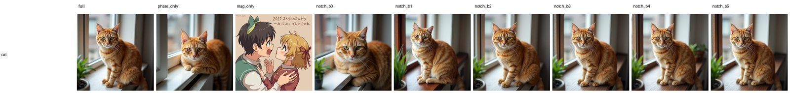
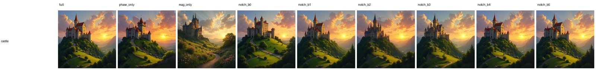
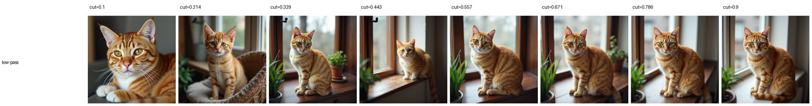
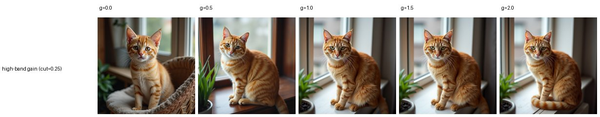
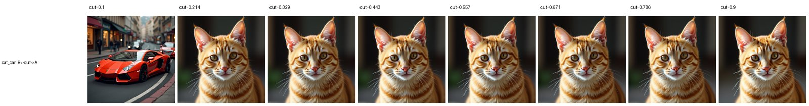
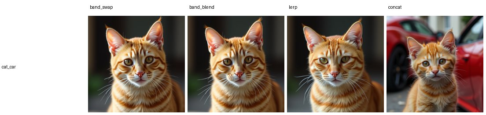
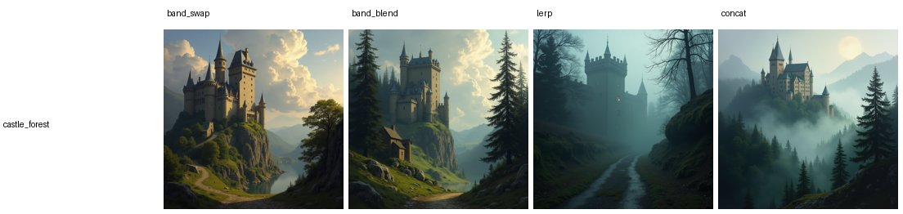
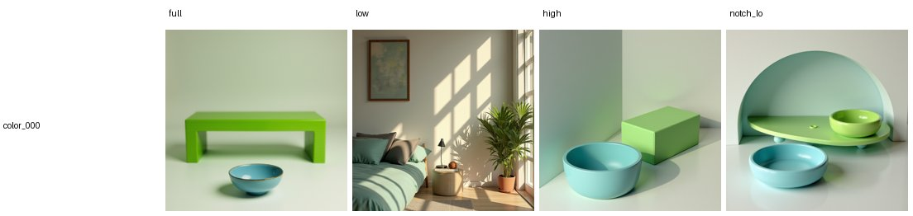
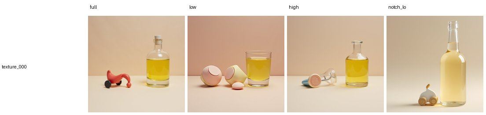

# E30 — Continuous text-frequency control & extraction (FLUX.1-dev)

**Thread:** text-freq · **Model:** FLUX.1-dev · **Benchmarks:** T2I-CompBench (color/shape/texture), DPG-Bench · **Status:** mapped
**Predecessor:** E24 (discrete token-axis band swap/blend on the T5 sequence embedding)

---

## Motivation — is the prompt's *spectrum* a usable control knob?

A text-to-image model never sees your words; it sees the **T5 sequence embedding** `E ∈ ℝ^(1×L×4096)`
— `L` word-pieces, each a 4096-dim vector. E24 made a surprising observation: if you take a **1-D
Fourier transform along the token axis** (separately per channel) and edit the resulting low/high
**bands**, the result stays on-manifold and the bands are *meaningful* (low ≈ global gist, high ≈
style strength). But E24's ops were discrete (a hard low/high swap) and the bands were never
*characterised*. E30 asks three concrete questions:

1. **Where in the spectrum does the meaning live** — in the phase or the magnitude? In one band or
   spread across all of them?
2. **Can the manipulation be a continuous knob** — sweep a cutoff / gain / two-prompt crossover and
   watch the image morph smoothly?
3. **Does spectral blending buy anything** over the dumbest baseline — literally writing `"A and B"`?

If the token spectrum is structured *and* a better lever, that is a new training-free control surface.
If it is structured but *not* a better lever, the line is mapped and closed.

## Method — 1-D FFT along the token axis

The operation is **not** a 2-D image FFT and **not** on the single pooled CLIP vector. It is a 1-D
real FFT along the **token** axis, applied independently to each of the 4096 channels:

```
F = rfft(E[:, :L], dim=token)          # E: (1, L, 4096) → F: (1, L//2+1, 4096), per-channel
E' = irfft( edit(F), n=L, dim=token )  # back to the embedding, edited
```

Frequencies are normalised to `[0,1]` (`0` = DC, `1` = Nyquist) so a cutoff means the same thing for
any prompt length. **DC** (freq 0) is the per-channel mean over tokens — the prompt's bag-of-words
gist; **low** frequencies are slow drift across the sequence; **high** are fast token-to-token change.
The default low/high split is the cut `c = 0.25` (matching E24). One subtlety baked into every op
(`apply_on_span`): T5 pads to 512 tokens, so the FFT runs **only on the real-token span** `E[:, :L]`
and the padding is reattached untouched — otherwise the content→padding cliff leaks into the high band.


### The operators (`text_spectral_ops.py`)

All real-in / real-out via `rfft`/`irfft`, so no Hermitian bookkeeping. Let `f(k)` be the normalised
frequency of bin `k`.

| op | definition | role |
|---|---|---|
| `band_filter_1d(lo,hi)` | zero bins outside `[lo,hi]` (keep DC) | low-pass / high-pass |
| `band_gain_1d(lo,hi,g)` | `F(k) ← g·F(k)` for `k∈[lo,hi]`, DC at unity | **continuous** attenuate (`g<1`) / amplify (`g>1`) |
| `band_notch_1d(lo,hi)` | `E − band_filter(lo,hi)` (knock out one band) | per-band ablation |
| `band_swap_1d(A,B,c)` | `F_low(A) + F_high(B)` (hard cut at `c`) | two-prompt merge |
| `band_blend_1d(A,B,c)` | cosine crossover of half-width 0.15 around `c` | soft two-prompt merge |
| `lerp_embeds(A,B,½)` | `½A + ½B` in token space | merge baseline |

**Phase / magnitude decomposition** (the `probe_deep` core). For each bin write `F = |F|·e^{iφ}`:

```
phase_only:  E_φ   = irfft( 1   · e^{iφ} )     # unit magnitude, keep phase
mag_only:    E_|·| = irfft( |F| · e^{i·0} )     # keep magnitude, zero phase
```

If `E_φ ≈ E` and `E_|·|` is noise, the **phase** carries the content — the text-embedding analogue
of the classic image-FFT "phase carries structure" result.

### The continuous knobs (`continuous`) and why they should work

Because `irfft` is linear, sweeping a single scalar (`cutoff c`, `gain g`, or the `band_swap` cut)
moves the conditioning continuously, so the image is expected to morph smoothly rather than snap. The
three knobs: **low-pass cutoff** (keep `[0,c]`, raise `c` from 0.1→0.9: coarse gist → full prompt),
**high-band gain** (scale `[0.25,1]` by `g` from 0→2×: strip vs over-emphasise detail), and an **A↔B
morph** (`band_swap(A,B,c)`: low band from A grows with `c`, so the image slides from B toward A).

### Metrics

**CLIP-T** (↑): image↔prompt cosine similarity. **B-VQA** (↑): a VQA check that each named object
appears *with its correct attribute* (attribute binding — the right number for compositional prompts).
Plus image stats (sharpness / hf_frac / colourfulness) as sanity signals. VQAScore was deferred
(`--no_vqa`); B-VQA already settles the binding story. **n=1 per cell** (single seed), so read
**directions**, not third decimals.

## Results

Full sweep ran clean on runai (`e30-text-freq`, Succeeded; 28 steps, true-CFG=1 / guidance 3.5).
Results live on `/storage/malnick/colorful-noise/experiments/results/e30/` (self-contained
`index.html` + `report.json`); figures below are aggregated from there.

### 1. Phase carries the conditioning; magnitude is nearly discardable (`probe_deep`)

`phase_only` (unit magnitude, keep phase) ≈ `full` in CLIP, while `mag_only` (keep magnitude, zero
phase) **collapses** for object prompts:

| variant | cat | car | castle |
|---|---|---|---|
| full | 0.313 | 0.286 | 0.300 |
| **phase_only** | **0.316** | **0.296** | **0.316** |
| mag_only | **0.019** | **0.049** | 0.276 |

The token-axis phase holds almost all the content; magnitude is close to noise (the style-heavy castle
partially survives mag-only at .276 — texture without layout). This sharpens E24's "phase≈identity"
observation into a clean phase/magnitude split.




### 2. No single band is load-bearing (`probe_deep`)

Knocking out any one of the 6 equal bands (`notch_b0..b5`) moves CLIP by **≤ ~0.02** (cat ranges
0.312–0.323, car 0.277–0.293) — content is redundantly distributed across bands, so narrow-band
surgery is a weak lever.

### 3. Continuous control works visually (`continuous`)

The image morphs smoothly as one knob turns — but the morph follows the **structure** found above
(low band = gist), not a new disentangled axis.





### 4. Writing "A and B" still beats spectral blending (`concat`)

The decisive test: do any spectral merges keep **both** objects (B-VQA) better than just writing them?

| variant | cat_car B-VQA | castle_forest B-VQA |
|---|---|---|
| band_swap | 0.003 | 0.003 |
| band_blend | 0.004 | **0.377** |
| lerp | 0.001 | 0.006 |
| **concat ("A and B")** | **0.852** | 0.350 |

Literal concat wins decisively (cat_car 0.852 vs every merge ≈ 0). Every spectral merge snaps to
whichever prompt owns the low band and drops object B. The lone exception is `band_blend` matching
concat on castle_forest (0.377 vs 0.350) — one soft scene pair, not a general win. Confirms E24's
"merge snaps to the low-band owner, doesn't beat the baseline" at scale.




### 5. Attribute–object binding lives in the MID/HIGH bands, not the low band (`compositional`)

T2I-CompBench (color/shape/texture), B-VQA = attribute binding. **Low-pass destroys binding** almost
everywhere, but `notch_lo` (remove *only* the low band, keep mid+high) **retains** it in many cases —
so the low band carries the gist and the mid/high bands carry which-adjective-binds-to-which-noun:

| prompt | full | low (low-pass) | notch_lo (drop low) |
|---|---|---|---|
| color_000 | 0.945 | **0.000** | 0.256 |
| color_003 | 0.921 | **0.000** | 0.013 |
| shape_000 | 0.172 | **0.000** | **0.867** |
| shape_003 | 0.539 | 0.864 | **0.922** |
| texture_000 | 0.998 | **0.002** | **0.989** |
| texture_001 | 0.988 | 0.040 | **0.911** |
| texture_002 | 0.976 | 0.953 | 0.924 |

Pattern: dropping the low band (`notch_lo`) often **keeps** binding (texture_000 .002→.989,
shape_000 .172→.867) where low-pass kills it. High-pass is mixed (great on some textures/colors,
collapses on others). On `longprompt` (DPG/Parti ~80-word prompts) B-VQA is too sparse to read object
retention; CLIP corroborates that `notch_lo` hurts most there — the long-prompt gist sits in the low band.




## Verdict

**MAPPED — the token spectrum is genuinely structured, but spectral blending is descriptive, not a
better control knob.** Three solid findings: **(1) phase carries the content** (phase_only ≈ full,
mag_only collapses), **(2) the spectrum is structured** — low band = coarse gist, mid/high bands =
attribute–object binding, **(3) no single band is load-bearing** (content is redundant across bands).
But the practical test fails: every spectral merge loses to literally writing `"A and B"` (concat
B-VQA 0.85 vs merges ≈ 0), because merges snap to the low-band owner rather than composing. The
structure is a clean *map* of the conditioning spectrum, not a new lever. The follow-up E31 (using
this surgery as target conditioning inside FlowEdit) confirmed the dead-end: the kept low band anchors
to the source so the velocity delta ≈ 0.

## Artifacts

- **Driver:** `experiments/e30_text_freq_control.py` (parts `probe_deep / continuous / concat /
  longprompt / compositional / analyze`); ops in `experiments/text_spectral_ops.py`; cluster job
  `experiments/cluster_e30_job.sh`.
- **Results:** `/storage/malnick/colorful-noise/experiments/results/e30/` — `report.json` + a
  self-contained `index.html`, plus per-prompt strips/sweeps (probe_deep, continuous, concat,
  compositional, longprompt). Full-res sources archived to
  `/storage/malnick/colorful-noise/roadmap_results/E30/`.
- **Figures:** `docs/experiment-reports/figs/E30/` (method diagram + probe_deep / continuous /
  concat / compositional strips).
- **Reproduce:** `python experiments/e30_text_freq_control.py` (full); `--part site` rebuilds the
  HTML explainer offline from `report.json`.
