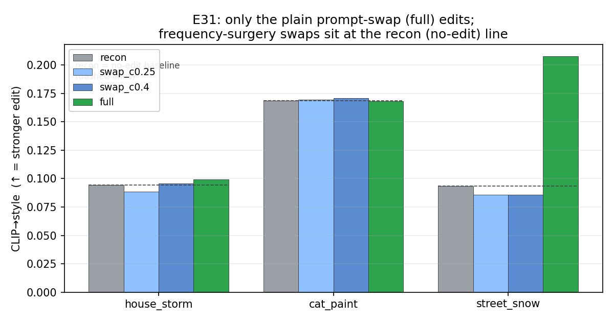
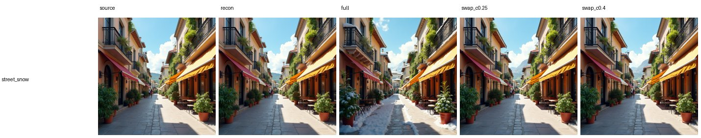
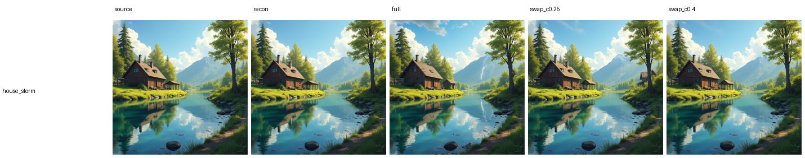
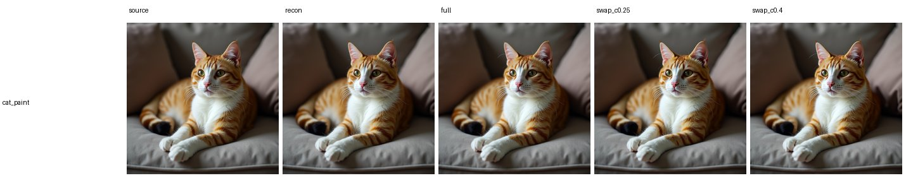

# E31 — Real-image editing via FlowEdit + frequency-surgery conditioning

**Thread:** text-freq · **Model:** FLUX.1-dev · **Status:** dead-end (KILL)
**Predecessors:** [E24](EXPERIMENT_24.md) (token-frequency merge), E30 (token-frequency band gain)

---

## Motivation — can token-frequency surgery *drive an edit*?

The text-freq thread (E24 → E30) found two facts about the **token axis** of a T5 prompt
embedding `C` (treat the per-token sequence as a 1-D signal and FFT it):

- the **low band owns the result** (subject / global layout), and
- the **high band is at most a weak style-strength knob**.

Those were *generation* findings. E31 asks the natural editing follow-up: **if I build a
target prompt by grafting the source's low band onto an edit prompt's high band, can that
graft steer an actual edit of an existing image?** A "yes" would turn the high band into a
real editing lever (change style/texture while the low band pins identity). A "no" closes the
route. To test it cleanly we drop the graft into **FlowEdit**, an inversion-free flow editor
whose edit is driven *only* by the difference between two conditionings — the perfect probe
for "does this conditioning difference do anything?"

## Method — FlowEdit, with a frequency-surgery target conditioning

### FlowEdit (inversion-free)

FLUX generates by integrating a learned **velocity field** `v(x, σ, C)` from noise (σ=1) to a
clean latent (σ=0). FlowEdit (Kulikov et al., 2024) edits **without inverting** the image back
to noise. It sets `δ = 0` and steps σ high→low, accumulating the *difference* between the
target- and source-conditioned velocities, then adds the accumulated nudge to the clean source
latent `x₀`:

```
δ = 0
for σ high → low:                                  # skip the top `skip` fraction of steps
    x_src = (1−σ)·x₀ + σ·ε                          # ε fixed across the loop
    x_tar = x_src + δ
    δ += (σ_next − σ) · [ v(x_tar, σ, C_tar) − v(x_src, σ, C_src) ]
edited = x₀ + δ                                     # → unpack → VAE decode
```

The edit is **purely the integral of the velocity difference**. This gives a free *identity
property*: if `C_tar == C_src`, every summand is exactly zero, so `δ = 0` and the output
reproduces the source **by construction** — independent of the σ schedule. The `recon`
condition exploits this as a **plumbing gate**: if `recon` doesn't reproduce the source, the
FLUX velocity accessor / packing / VAE path is wrong and nothing else is trustworthy. (A
model-free `--part preflight` separately checks the accumulation math on a synthetic linear
field: a constant difference field integrates to `(σ_end − σ_start)·(A_tar − A_src)`.)

`--skip` is the **edit-strength knob**: it skips the top (noisiest) steps, so a larger `skip`
preserves more of the source (here `skip = 0.33`).

### The new model piece: a manual FLUX velocity accessor

FLUX has no public per-step velocity call, so E31 reimplements `flux_velocity(...)` — a manual
transformer forward over **packed** latents with `img_ids` / `txt_ids` and the guidance embed,
mirroring `FluxPipeline`'s denoising call (and the SD3.5 `velocity()` from E21). `flux_sigmas`
reproduces FLUX's resolution-shifted σ grid. The `recon` gate is what validates all of this.

### The frequency-surgery target conditioning

This is the actual idea under test. The **target** conditioning is built by a **token-axis band
swap** of source and style embeddings (`band_swap_1d` in `text_spectral_ops.py`): rfft each
prompt's token sequence, keep the **low band (DC..cut) from the source** and the **high band
from the style**, irfft back:

```
F_src = rfft(C_src),  F_sty = rfft(C_style)        # FFT over the token axis
low(k)  = 1 if f(k) ≤ cut else 0                   # f(k) ∈ [0,1] normalized token-freq
C_tar(k) = F_src(k)·low(k) + F_sty(k)·(1 − low(k)) # low←source, high←style
C_tar    = irfft(C_tar)                            # stitched back over the real-token span
```

The swap is applied only over the real-token span (`apply_on_span`), padding left untouched.
Cuts are `0.25` and `0.4`, giving conditions `swap_c0.25` / `swap_c0.4`. Two reference arms
bracket them:

| condition | `C_tar` | role |
|---|---|---|
| `recon` | `C_src` | identity gate — must reproduce the source (px-dist ≈ 0) |
| `full` | `C_style` (whole prompt) | plain prompt-swap FlowEdit — the **edit baseline** |
| `swap_c0.25` / `swap_c0.4` | low←src, high←style | the **frequency-surgery** test |

All conditions share the same `x₀`, ε and σ schedule, so differences are purely the
conditioning. `x₀` is generated from the source caption (clean eval); a `--real_dir` path
VAE-encodes a real image instead (untested here).

**Why it *should* work, if the thread's story were the whole story:** keep the low band → keep
the subject/layout; inject the style's high band → repaint surface/texture. **Why it might
not:** if the low band really *owns* the conditioning, then `v(C_tar) ≈ v(C_src)`, the velocity
difference collapses, `δ ≈ 0`, and nothing edits — exactly the failure mode E31 is built to
detect.

### Metric

Per condition, scored against source and style prompts (n=1/cell, single seed):

- **CLIP→style** ↑ — edit adherence (image vs style prompt).
- **CLIP→source** ↑ — content kept (image vs source prompt).
- **px-dist→source** ↓ — raw pixel L2 to the source (≈0 for `recon`).
- **aesthetic** ↑ — LAION aesthetic (sanity).

A *good* edit raises CLIP→style while keeping CLIP→source reasonable.

## Results

Ran on runai (`e31-flowedit`, **Succeeded**), FLUX, 3 scenes, 28 steps, `skip=0.33`,
guidance 3.5. The headline is one figure: only the green `full` bar clears the dashed *recon
(no-edit)* line — and only on one scene; every frequency-surgery bar sits **at or below** it.



**1 · The gate holds — the plumbing is correct.** `recon` (`C_tar=C_src`) reproduces the
source to pixel precision: px-dist **0.0031 / 0.0022 / 0.0029** (house_storm / cat_paint /
street_snow). The FLUX velocity accessor, σ schedule, packing and VAE path are all validated;
the FlowEdit identity holds by construction.

**2 · Plain prompt-swap (`full`) edits — scene-dependently.** It works, unevenly:

| scene | CLIP→style: recon → full | px-dist→src | read |
|---|---|---|---|
| street_snow | 0.093 → **0.208** | 0.121 | strong edit (summer street → blizzard) |
| house_storm | 0.094 → 0.099 | 0.063 | barely moves (hard semantic jump) |
| cat_paint | 0.168 → 0.168 | 0.022 | near-recon (no real edit) |

So inversion-free FlowEdit on FLUX is sound but scene-dependent — it lands the easy
seasonal repaint and stalls on harder semantic jumps.



**3 · Frequency-surgery barely edits — the negative result.** `swap_c0.25` / `swap_c0.4`
leave CLIP→style **at recon level**, sometimes *below* it:

| scene | recon | swap_c0.25 | swap_c0.4 | full |
|---|---|---|---|---|
| street_snow | 0.093 | **0.086** | **0.086** | 0.208 |
| cat_paint | 0.168 | 0.170 | 0.171 | 0.168 |
| house_storm | 0.094 | 0.088 | 0.096 | 0.099 |

The swaps never beat `full`, and on street_snow — the one scene where editing is *possible* —
they sit **below the no-edit baseline** while `full` more than doubles it. Visually the swap
panels are indistinguishable from the source.





**Mechanism.** Keeping the source's low band anchors the conditioning to the source (E24/E30's
"low band = owner"), so `v(x, C_tar) − v(x, C_src) ≈ 0 ⇒ δ ≈ 0 ⇒ no edit`. The style's high
band is too weak to redirect the flow (E24's "high band = weak style-strength knob"). The
clean experiment design — FlowEdit's edit *is* the velocity difference — turns the failure into
a direct measurement: the difference collapses, so the edit does too.

**Caveat.** Short prompts collapse the two cuts onto the same integer frequency bin — for
street_snow, `swap_c0.25` and `swap_c0.4` are byte-identical (same numbers, same image). n=1
per cell, single seed; the `--real_dir` real-image path is untested.

## Verdict

**KILL.** Token-frequency surgery is **not** a usable handle for inversion-free editing: it
cannot out-edit a plain prompt swap and usually does nothing, because the retained low band
pins the conditioning to the source and zeroes the velocity difference FlowEdit integrates.
This closes the text-freq *editing* route and unifies the thread (E24 → E30 → E31): **the low
band owns the result; high-band injection is a weak style knob, never a compositional or
editing lever.** Latent-band editing (E22) remains the usable handle. (E32 then squeezed a
small but genuinely *controllable* per-object text lever out of the same band ops by windowing
to a single object's token span — see [E32](EXPERIMENT_32.md).)

## Artifacts

- **Driver:** `experiments/e31_flowedit_freq.py` (`flux_velocity` / `flux_sigmas` accessors;
  `flowedit` ODE; `edit_conditions` building `C_tar` via `band_swap_1d` + `apply_on_span`;
  `--part preflight|gen|analyze|site`).
- **Cluster job:** `experiments/cluster_e31_job.sh` (self-gating: preflight → 1-scene smoke →
  recon gate → full).
- **Band ops:** `experiments/text_spectral_ops.py` (`band_swap_1d`, `apply_on_span`).
- **Results:** `/storage/malnick/colorful-noise/experiments/results/e31/` —
  `report.json` + per-scene `{source,recon,full,swap_c0.25,swap_c0.4,strip}.png` +
  self-contained `index.html` (also a local copy of `index.html` in the repo's
  gitignored `experiments/results/e31/`). A 1-scene smoke run is at `…/results/e31_smoke/`.
- **Figures (this report):** `docs/experiment-reports/figs/E31/`; full-res archived to
  `/storage/malnick/colorful-noise/roadmap_results/E31/`. The CLIP→style bar chart is a
  generated matplotlib summary; the three strips are the run's own before/after grids.

### Reproduce

```bash
# self-gating cluster job (preflight → smoke 1 scene → recon gate → full)
runai submit --name e31-flowedit -g 1 -i pytorch/pytorch:2.10.0-cuda12.8-cudnn9-runtime \
  --pvc=storage:/storage --large-shm --command -- \
  bash /storage/malnick/colorful-noise/experiments/cluster_e31_job.sh

# local
python experiments/e31_flowedit_freq.py --part preflight                       # math only
python experiments/e31_flowedit_freq.py --part gen,analyze --num 1 --steps 8    # smoke
python experiments/e31_flowedit_freq.py    # full → results/e31/{<key>/strip.png, index.html}
python experiments/e31_flowedit_freq.py --part site   # rebuild index.html offline (no GPU)
```
