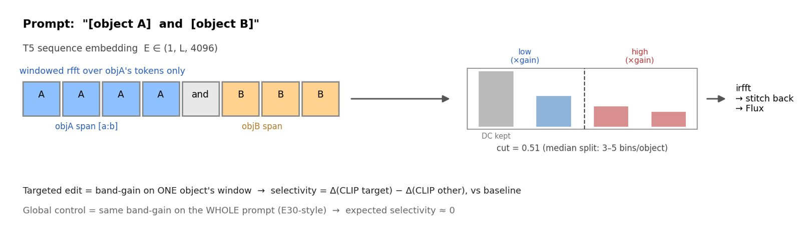
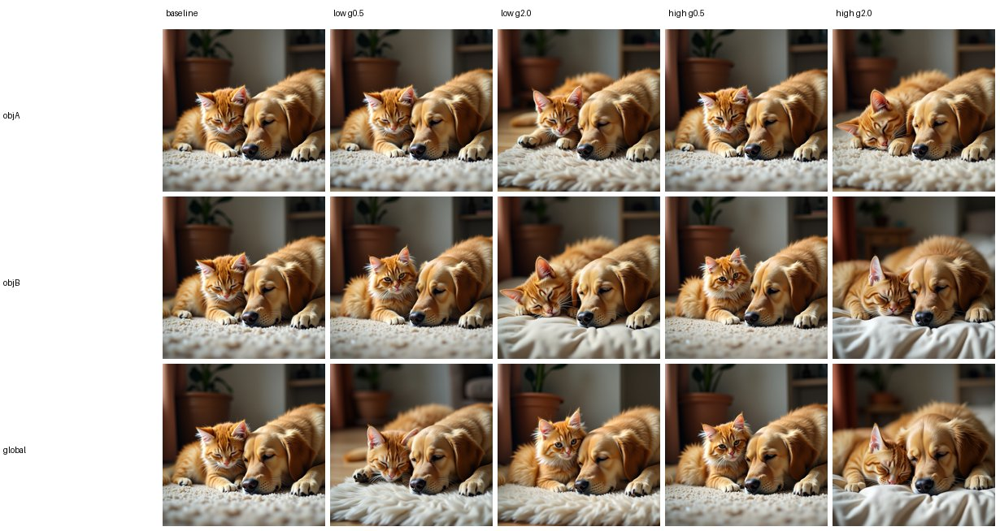
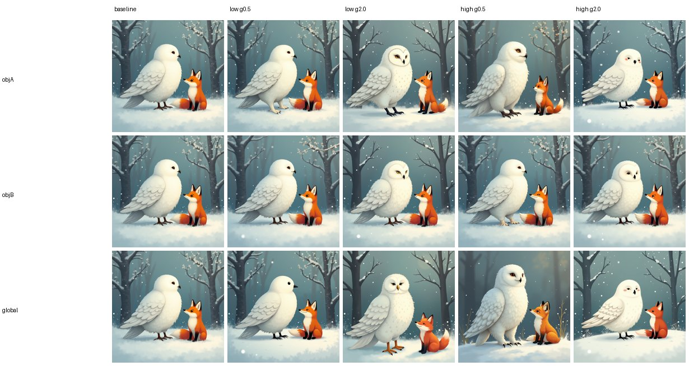

# E32 — Per-object token-frequency control on two-object prompts (FLUX)

**Thread:** text-freq · **Model:** FLUX.1-dev · **Status:** mapped (controllable but weak lever)
**Predecessors:** [E24](EXPERIMENT_24.md) (token-axis FFT bands are meaningful) · E30 (continuous but *global* band gain)

---

## Motivation — a *per-object* text-space editing handle

E24 found that token-axis FFT bands of Flux's T5 sequence embedding are meaningful and
on-manifold; E30 turned that into a **continuous but global** knob — it scales a frequency band
of the *whole* prompt. E32 asks the obvious next question for **editing**: in a prompt with two
objects, can we boost/cut the high or low token-frequencies of **one object**, and is the effect
**selective** to that object — or does it just behave like E30's global gain? A "yes" would be a
genuinely new, object-local text-space editing handle (the kind E24-MERGE and E31 failed to find).

## Method — windowed FFT band-gain on one object's token span



**Text conditioning.** Flux encodes a prompt to a T5 **sequence embedding** `E ∈ (1, L, 4096)`
(L = real tokens) plus a pooled vector. We modify `E` before generation and feed it straight to
the transformer (the E10 `gen_emb` hook, true-CFG = 1); the pooled vector stays at baseline.

**Token-axis FFT.** Following E24/FNet, we FFT `E` along the **token axis** (a 1-D DFT per
embedding channel). **Low** token-frequencies = slow variation across the prompt
(DC = the bag-of-words mean direction); **high** = sharp token-to-token detail.

**Why "per-object" forces a *windowed* FFT.** Frequency and token-position are **conjugate**:
a single FFT over the whole sequence cannot be told to "only touch object A's positions." The one
coherent per-object operation is a **windowed FFT over the object's contiguous token span**
`E[:, a:b]` — scale a band there, inverse-FFT, stitch the rest back unchanged. In code this is
`text_spectral_ops.apply_on_subspan(fn, E, a, b)` (clone `E`, replace only `[:, a:b]`) with
`fn = band_gain_1d`, which `rfft`s the span, multiplies the bins whose normalized frequency falls
in `[lo, hi]` by `gain`, leaves DC at unity (`keep_dc`), and `irfft`s back:

```
F = rfft(E[:, a:b], dim=token)          # (1, (b-a)//2+1, 4096)
F[f in [lo,hi], f≠0] *= gain            # gain<1 cut, gain>1 boost; DC untouched
E[:, a:b] = irfft(F, n=b-a)             # stitch back; tokens outside [a:b] unchanged
```

This is the per-object generalization of E24/E30, which only ever windowed the prefix `[:, :L]`.

**The cost of windowing — and why `cut = 0.51`, not 0.25.** An object phrase is only ~5–9 tokens,
so its windowed rfft has just `(b-a)//2+1` bins (**3–5 here**, see spans below) and its lowest
non-DC normalized frequency is already ≈0.33. E24/E30's `cut = 0.25` (tuned for the full
512-length sequence) would leave the **low band empty → a silent no-op**. E32 uses the
**median split `cut = 0.51`**, which keeps both bands non-empty even for a 3-bin (5-token) window
(the mid-bin at 0.5 → low, Nyquist 1.0 → high) and never scales DC, so an object's global level is
preserved. This coarseness is intrinsic to per-object frequency control and is reported explicitly
(bins-per-object).

**Word → token span.** No such utility existed in the repo. We map each object phrase to its T5
token span via the fast tokenizer's **char offset mapping** (every token whose char span overlaps
the phrase's), with a **token-id-subsequence** fallback. Spans are computed while the tokenizer is
alive (before the encoders are dropped to free GPU) and persisted to `results/e32/spans.json`.
Validated on all 10 prompts: spans are valid, **non-overlapping** (the "and" token sits in the
gap), 3–5 bins each. Measured spans:

| prompt | L | objA span (bins) | objB span (bins) |
|---|---|---|---|
| cat_dog | 16 | [0,7] (4) | [9,15] (4) |
| car_bike | 15 | [0,6] (4) | [8,14] (4) |
| castle_forest | 14 | [0,6] (4) | [8,13] (3) |
| teapot_cup | 16 | [0,7] (4) | [9,15] (4) |
| owl_fox | 16 | [0,8] (5) | [10,15] (3) |
| guitar_piano | 16 | [0,9] (5) | [11,15] (3) |
| lighthouse_boat | 15 | [0,7] (4) | [9,14] (3) |
| cactus_rose | 15 | [0,8] (5) | [10,14] (3) |
| robot_teddy | 16 | [0,5] (3) | [7,15] (5) |
| mountain_lake | 13 | [0,6] (4) | [8,12] (3) |

**Conditions** per prompt (`CUT0 = 0.51`, gains `{0.5 cut, 2.0 boost}`):

- `baseline` (unmodified) — 1
- **targeted**: `obj{A,B}` × band `{low, high}` × gain → 8
- **global control**: whole-prompt band gain (E30-style, `apply_on_span`), band `{low, high}` × gain → 4
- **13 conditions × 10 prompts × 3 seeds = 390 generations.**

**Model / sampling.** FLUX.1-dev (bnb 4-bit transformer, bf16), 28 steps, guidance 3.5,
true-CFG = 1 — identical stack to E24/E30.

**Metrics** (the claim is selectivity, so everything is per-object and paired to the same-seed
baseline):

- **Per-object CLIP** — `clip_scores(objA_phrase)` vs `clip_scores(objB_phrase)` (`e9_clipt.py`).
  For a targeted edit: `Δ_target`, `Δ_other`, and **selectivity = Δ_target − Δ_other**. For the
  global control: `Δ(objA)`, `Δ(objB)`, and `Δ(objA) − Δ(objB)` (expected ≈ 0 by symmetry).
- **B-VQA presence** per object phrase (`compbench.bvqa_scores`) — corroborates presence.
- Secondary context: whole-image `sharpness / hf_frac / colorfulness`.
- **Hypothesis:** targeted selectivity > 0 and > the global control's ≈0; i.e., localizing the
  *same fractional-band edit* to one object's tokens concentrates the effect on that object.

## Results

Ran on runai (FLUX.1-dev, A5000; 10 prompts × 13 conditions × 3 seeds = 390 generations;
per-cell n = 60 targeted / 30 global). Deltas are paired to the same-seed baseline;
**selectivity = Δ_target − Δ_other** (targeted) or Δ(objA) − Δ(objB) (global control).


**1. Per-object editing IS object-selective and directionally steerable (CLIP).** Boosting one
object's token-frequency band raises *that* object's CLIP and *lowers* the other's; cutting
reverses it — for **both** bands, with the sign tracking the gain:

| edit on target | Δtarget | Δother | **selectivity** | t |
|---|---|---|---|---|
| cut low (g0.5)   | −0.0041 | +0.0037 | **−0.0077** | −3.1 |
| boost low (g2.0) | +0.0033 | −0.0029 | **+0.0062** | +2.1 |
| cut high (g0.5)  | −0.0027 | +0.0019 | **−0.0047** | −2.3 |
| boost high (g2.0)| +0.0028 | −0.0017 | **+0.0045** | +1.6 |

All four cells move in the predicted direction; three reach |t| ≳ 2. This is the clean push-pull
signature of a genuine per-object effect.

**2. The global-gain control is a null (CLIP).** Whole-prompt gain gives selectivity
≈ −0.003…+0.003 with no consistent sign (grey bars above) — so the **localization**, not the gain,
produces the selectivity. Targeted beats the control on a controllable, sign-correct lever.

**3. Object presence (B-VQA): high band is where it concentrates, but it's noisy.** The high-band
edit shifts presence in the intended direction (boost target high → Δtarget +0.040 / Δother
−0.017; cut high → −0.047 / +0.029), echoing E30's "high/mid bands = attribute–object binding."
But per-image B-VQA variance is large (sd ≈ 0.12–0.32), so at n = 60 these are **not**
statistically significant (|t| ≤ 1.8); the low band is a null. Suggestive, not conclusive.

**4. Effect size is small.** CLIP shifts are ~0.005 on a ~0.22 baseline (sub-1%). Real and
directional, but a weak handle — consistent with the intrinsic bin-coarseness (3–5 bins/object).

### What it looks like

Per-prompt strips (seed 0): rows = objA-targeted / objB-targeted / global; columns = baseline +
band×gain edits. The effect is subtle (sub-1% CLIP), so these read as *small* per-object shifts in
prominence/detail of the named object rather than dramatic edits — which is exactly the honest
story.





## Verdict

**MAPPED — a real but weak per-object lever.** Unlike E24-MERGE (negative) and E31 (Δ≈0),
per-object token-frequency editing *is* object-selective and steerable in the intended direction
(significant in CLIP, the global control is a null) — the text-freq thread's first **controllable**
per-object lever. But the magnitude is small (~0.005 CLIP on a ~0.22 baseline) and the presence
(binding) effect, while concentrated in the high band, is within noise at this N. A real but weak
handle; the **high band carries the binding effect**.

## Caveats & next

- **Bin coarseness.** 3–5 bins per object means "low vs high" is a coarse 2–3-way split; the
  `cut = 0.51` median split is the most balanced available but cannot be fine-grained. This is
  intrinsic to per-object windowing, not a tuning choice — reported per object.
- **Pooled vector untouched.** Only the sequence embedding `E` is edited; the pooled vector stays
  at baseline (matches E24/E30).
- **Short prompts.** L ≈ 13–16 tokens, so the "global" control already covers few bins; it remains
  a fair locality control (same fractional band, all tokens vs one object).
- **Next (recorded follow-ups, not yet run):**
  1. **Strengthen** with longer object phrases (more bins) and larger N for presence significance.
  2. **Textual inversion → frequency control** ([E33], pending). Learn an embedding for a
     pseudo-token `<obj>` from a few images, place it in a two-object prompt, then boost/cut *its*
     span. No TI scaffolding exists in the repo today; diffusers `load_textual_inversion` or a
     custom loop adapted from the E25/E26 seed-optimization loops would be needed, and **SDXL/SD1.5
     are safer than Flux** for TI tooling.
  3. **Channel-axis interpretability** ([E34], pending) — the hidden D = 4096 axis. Find which
     *channels* of the embedding own which attributes (identity / color / texture / style) via
     attribute probing and causal ablation, then steer them directly. E24 noted the hidden axis is
     **not** semantically ordered, so this likely needs learned channel *directions*, not raw
     indices. Composes with E32's token-span masking for per-object × per-channel edits.

## Reproduce

```bash
# spans + bins-per-object, no GPU (fails fast if a phrase won't map):
python experiments/e32_object_freq.py --part preflight

# smoke (1 prompt, 1 seed, 8 steps):
python experiments/e32_object_freq.py --part gen,analyze \
    --num_prompts 1 --seeds 1 --steps 8 --no_vqa --out_tag smoke

# full sweep (cluster; self-gating preflight -> smoke -> CLIP gate -> full):
bash experiments/cluster_e32_job.sh
```

## Artifacts

- **Driver:** `experiments/e32_object_freq.py` (parts `preflight` / `gen` / `analyze`).
- **Ops:** `experiments/text_spectral_ops.py` — `apply_on_subspan`, `apply_on_span`, `band_gain_1d`.
- **Reuses:** `e10_cfg_spectral.gen_emb`, `e9_clipt`, `e9_bandnorm_classes.image_metrics`,
  `compbench` (B-VQA), `common.save_grid`.
- **Cluster:** `experiments/cluster_e32_job.sh` (ship via `kubectl cp`; `/storage` is not git).
- **Results:** `/storage/malnick/colorful-noise/experiments/results/e32/` — full 390-image set
  (10 prompt dirs + `strip.png` per prompt), `spans.json`, `report.json` (raw + summary),
  `index.html` (self-contained explainer). A smoke run is at `.../results/e32_smoke/`.
- **Figures:** `docs/experiment-reports/figs/E32/` — `method_schematic` and `selectivity_bars`
  (generated matplotlib diagrams), `cat_dog_strip` / `owl_fox_strip` (representative result strips).
- **Manifest:** `experiments/manifests/E32.json`.
