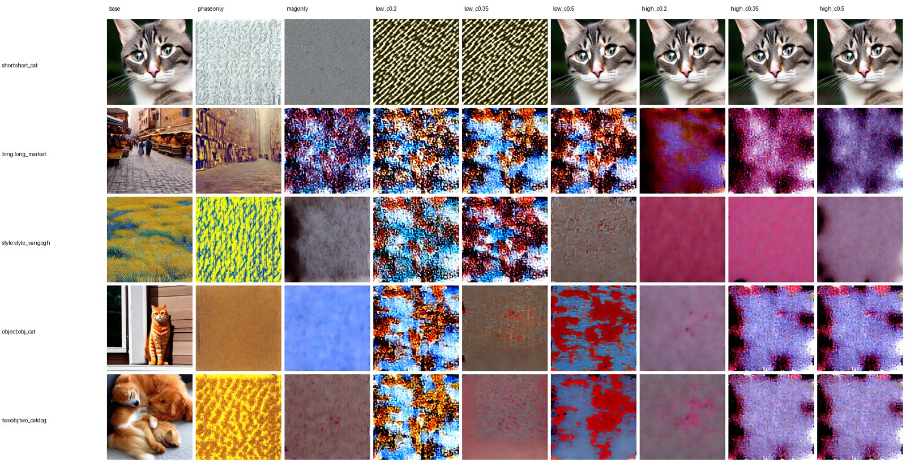
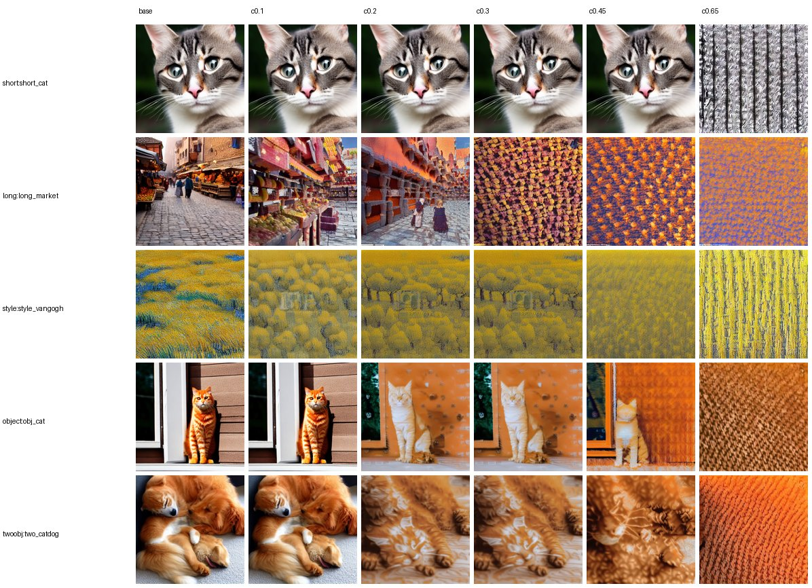
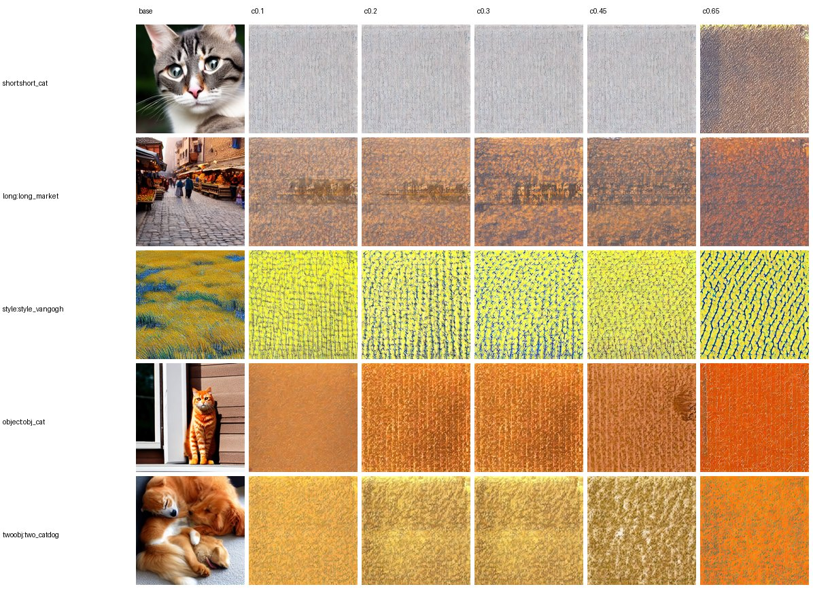
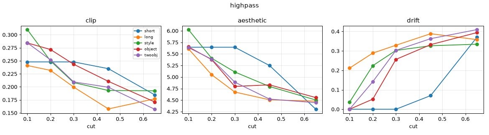
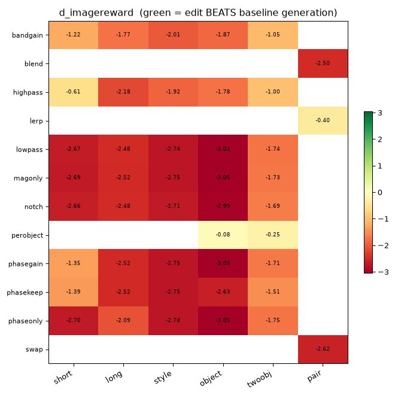

# E35 — Token-frequency operator sweep on SD1.5 (scenarios × operators × params)

**Thread:** text-freq · **Model:** SD1.5 (CLIP-77 conditioning) · **Status:** mapped
**Lineage:** E24 (band-swap merge), E30 (phase carries content on Flux/T5), E32 (per-object band gain) — this is the systematic cross-architecture map of that toolkit.

---

## Motivation — what does each knob actually do, and to which prompts?

Across E24/E30/E32 we accumulated a sizeable toolkit of **token-axis FFT operators** applied to
the text conditioning, but only spot-checked individual pieces, mostly on Flux/T5. We never had a
single, controlled answer to the obvious question: **for every operator × every parameter level ×
every kind of prompt, what happens to (a) prompt adherence and (b) image fidelity, and how far does
the edit move the image?**

E35 builds that map on a *fast* model (SD1.5, ~5005 images in ~2.2 h on one GPU) so the whole
toolkit can be swept densely. Two things make it worth the GPU-hours:

1. **Cross-architecture confirmation.** SD1.5 uses CLIP's 77-token text encoder, not Flux's
   512-token T5. If the E30 phase>magnitude finding is a real property of the conditioning (and not
   a T5 artifact), it should reproduce on a completely different text encoder.
2. **The reference framing matters.** Scoring an edit against the *prompt* (CLIP-T) makes the
   unedited baseline the ceiling *by construction* — every edit can only look worse. E35 also
   re-references every edit to its **own same-seed baseline image** to ask the honest question:
   *does the operator make a better image than the model would have made on its own?*

## Method — what was actually done

### Signal and where the FFT lives

SD1.5 encodes a prompt with CLIP into a sequence embedding `E ∈ ℝ^{1×77×768}`. Every operator takes
the **token axis** (length 77), runs a real-FFT over it **per channel** on the *real-token span*
`E[:, :L]` (`L = attention_mask.sum()`; BOS/…/EOS are real tokens, the padding tail is never touched),
edits the spectrum, inverts, and we generate from the edited `prompt_embeds` (real CFG, guidance 7.5,
empty-string negative). All ops are real-in/real-out via `rfft`/`irfft` along the token axis, so the
edited embedding is the same shape and stays a valid conditioning tensor.

Normalised frequency `f ∈ [0,1]` along the token axis (`f = rfftfreq(L)·2`): **DC (f=0)** = the mean
across tokens (the prompt's bag-of-words "global gist"); **low f** = slow token-to-token variation;
**high f** = sharp token-to-token detail / word boundaries.

### The 13 operators (the actual equations)

Writing `F = rfft_token(E[:,:L])` (complex, shape `1×(L//2+1)×768`), `|F|` its magnitude, `∠F` its
phase, and `1_{[lo,hi]}` the band-mask:

| operator | what it does to `F` (then `irfft`) |
|---|---|
| **baseline** | identity (`E` unchanged) — the reference generation |
| **low-pass** `cut` | keep `[0, cut]`, zero the rest (DC always kept) |
| **high-pass** `cut` | keep `[cut, 1]` + DC, zero `(0,cut)` |
| **band gain** `band,gain` | `F ← F · (gain on the band, 1 elsewhere)`; DC fixed at unity so the global level isn't rescaled |
| **notch** `band` | zero one band, keep the complement incl. DC |
| **phase-only** | `F ← polar(1, ∠F)` — flatten *all* magnitudes to 1, keep phase |
| **mag-only** | `F ← polar(|F|, 0)` — flatten *all* phase to 0, keep magnitude |
| **phase band-keep** `band` | keep `∠F` inside the band, set phase=0 outside, keep `|F|` everywhere |
| **phase gain** `band,gain` | `∠F ← gain·∠F` inside the band (magnitude untouched) |
| **per-object band gain** | band-gain, but applied only to the *object phrase's* token sub-span (E32) |
| **band-swap** (A,B) | low band from prompt A, high band from prompt B, recombined |
| **band-blend** (A,B) | smooth (raised-cosine, width 0.15) crossfade A→B across `cut` |
| **lerp** (A,B) | `α·F_A + (1−α)·F_B` (a spectral linear interpolation of two prompts) |

`phase-only` and `mag-only` are the two key ablations: they decompose `F = |F|·e^{i∠F}` and keep
*only one factor*, so they directly test **which half of the spectrum carries the meaning**. For the
phase-keeping ops, DC (and even-`L` Nyquist) bins are forced to stay real so `irfft` remains
magnitude-preserving — a small but necessary Hermitian-symmetry detail.

### Why it should reveal something

The hypothesis (from E30) is that **token-axis phase carries the prompt's content** — the relational
"who-relates-to-whom" structure of the words — while **magnitude carries only coarse energy/level**.
If true, `phase-only` should stay recognizable and on-prompt while `mag-only` should collapse to
content-free mush, and `high-pass` (which keeps sharp token detail + DC) should beat `low-pass`
(which keeps only the slow gist) on adherence. E35 tests exactly these predictions at scale.

### Setup, grids, and metrics

- **Model.** SD1.5 (`StableDiffusionPipeline`, fp16, DDIM, 512px, guidance 7.5, 30 steps),
  generated from edited embeddings, **5 seeds per condition, batched**.
- **Prompt set.** 25 prompts in 5 categories — **short / long-detailed / art-style / single-object /
  two-object** (5 each); object/two-object prompts carry an object phrase; 6 distinct A/B **pairs**
  feed the two-prompt merge ops.
- **Parameter grids** (`--coverage thorough` default): low/high-pass `cut∈{.1,.2,.3,.45,.65}`; band
  gain `band{low,high}×gain{.25,.5,1.5,2,3}` at cut .25; notch & phase-keep over `cut`; phase gain
  `gain{.5,2}`; per-object `band×gain{.5,2}`; two-prompt swap over `cut`, blend, lerp.
  **≈1001 conditions × 5 seeds ≈ 5005 images.**
- **Metrics.** `clip` = CLIP-T adherence to the prompt (and vs object phrase / vs A,B for pairs);
  `aesthetic` = LAION predictor (no-reference fidelity, reuses the CLIP); image stats
  (sharpness / hf_frac / colorfulness); **drift** = `1 − cos(CLIP_img(baseline), CLIP_img(edit))`
  per (prompt, seed) — how far the edit moved the image. No SD1.5 real-image PSD reference exists, so
  fidelity is no-reference.

## Results

Ran on runai (SD1.5, 1001 conditions, 5005 images). Operator means (CLIP adherence / LAION aesthetic
/ baseline-drift), sorted by adherence; **baseline = 0.283 / 5.83 / —**:

| operator | CLIP ↑ | aesthetic ↑ | drift |
|---|---|---|---|
| baseline | 0.283 | 5.83 | — |
| lerp | 0.275 | 5.96 | 0.13 |
| **per-object band gain** | 0.274 | 5.63 | **0.09** |
| high-pass | 0.224 | 5.07 | 0.22 |
| band-blend | 0.213 | 4.68 | 0.36 |
| band gain | 0.212 | 4.86 | 0.26 |
| band-swap | 0.204 | 4.52 | 0.37 |
| **phase-only** | **0.187** | **4.47** | 0.36 |
| low-pass | 0.174 | 4.49 | 0.38 |
| notch | 0.171 | 4.40 | 0.39 |
| phase band-keep | 0.165 | 4.09 | 0.36 |
| phase gain | 0.165 | 4.24 | 0.37 |
| **mag-only** | **0.145** | **3.85** | **0.43** |

### 1. Phase ≫ magnitude carries the content — replicated on SD1.5/CLIP-77

`phase-only` (0.187 / 4.47) beats `mag-only` (0.145 / 3.85) on **both** adherence and fidelity, and
`mag-only` has the **largest drift** (0.43 — it moves furthest from the baseline). This reproduces
E30's Flux/T5 result on a completely different text encoder. The gap is **largest on long /
compositional prompts** (mag-only CLIP drops to ~0.13 on long/object/twoobj vs phase-only ~0.17–0.23).

The mechanism is visible directly: in the grid below, `phaseonly` (col 2) stays a recognizable,
on-prompt image (just texturally noisy because the magnitude is flat), while `magonly` (col 3)
collapses to content-free gray mush. The remaining columns sweep phase-band-keep low→high.



### 2. High-pass ≫ low-pass for adherence (0.224 vs 0.174)

Keeping **high-frequency token detail + DC** preserves far more prompt content (especially object
identity) than the low-frequency "gist" alone. High-pass stays mostly on-prompt even at large cuts;
low-pass smears the image into a textured blob as more high detail is removed.





The per-category sweep curves (CLIP / aesthetic / drift vs `cut`, one line per prompt category) make
the monotone trade-off explicit: as `cut` rises, adherence and aesthetic fall and drift rises, and
the slope is steepest on long/compositional prompts.



### 3. Localized / interpolation edits are the gentlest

`per-object band gain` (drift 0.09, CLIP 0.274 ≈ baseline) and `lerp` (drift 0.13) barely perturb the
image — per-object stays essentially at baseline (object CLIP 0.281 vs 0.284), consistent with E32's
small-but-real effect. Aggressive **single-band surgery** (low-pass / notch / phase-band-keep / phase
gain / mag-only) all fall to CLIP ~0.15–0.17 and aesthetic ~3.9–4.5 with large drift — it costs
adherence *and* fidelity.

### 4. Follow-up: vs the BASELINE GENERATION (the honest reference)

`e35_vs_baseline.py` re-references every edit to its **same-seed baseline image** and splits the
question in two. The directional metric `d_imagereward` (prompt-aware, learned, **not** capped at
baseline — so green/positive is achievable) answers *"does the operator beat the model's own
generation?"* The answer is a clean **no**:



Ranked by ΔImageReward (all-category mean): **per-object −0.17, lerp −0.40**, then everything else
−1.5…−2.6. On Δaesthetic only **lerp** is positive (+0.05) and per-object is ~0. The two
interpolation/localized ops are the *least harmful* (near no-ops); single-band surgery is uniformly
downhill. Merges still don't pull in B (`d_imagereward_B`: swap −0.07 / blend −0.07 / lerp +0.006) —
lerp's tiny B-gain is dwarfed by its A-cost — reproducing E24's "MERGE negative".

But the **distance** axis is clean and controllable: the operators are real, large, *ordered* move
knobs. LPIPS-from-baseline ranks per-object/lerp gentlest (0.34 / 0.42) and mag-only furthest (0.90),
with image-PSD-L2 telling the same story (per-object 0.50 → mag-only 2.29):


**Both reference framings now agree:** measured against the correct (uncapped, prompt-aware)
reference, the SD1.5 token-frequency toolkit is a clean **negative result as an image-*improvement*
tool**, while remaining a genuine **distance/diversity lever**. "Interesting by eye" is a tail/distance
effect (big LPIPS/PSD), not a mean-quality gain.

## Verdict

**MAPPED.** The toolkit is fully characterised on SD1.5: **phase carries content** (cross-architecture
confirm of E30 on CLIP-77, not just T5); **high-pass ≫ low-pass** for adherence; **per-object / lerp**
are do-little-harm near-no-ops; **most band surgery degrades both adherence and fidelity**. Against
the honest same-seed-baseline reference, **no operator improves on the model's own generation** — the
toolkit is a controllable *distance* knob, not a quality knob. Next: lift the strongest
operator×regime findings (phase>mag, high-vs-low) back to Flux for confirmation (feeds E33/E34).

## Caveats & next

- **No-reference fidelity.** Aesthetic + image-stats are proxies; there is no SD1.5 real-image PSD
  reference (only Flux). A follow-up could build one (encode ~500 COCO images).
- **CLIP-77 vs T5-512.** SD1.5 has far fewer tokens than Flux's T5, so band structure is coarser;
  absolute effects may differ from E24/E30/E32 — E35 characterises SD1.5, not Flux.
- **Per-object on CLIP** uses a token-id-subsequence fallback (slow tokenizer, no offsets); validated
  on all object prompts but can miss exotic phrasings.
- **Next:** lift the strongest operator×regime findings back to Flux; feed the TI (E33) and
  channel-axis (E34) proposals.

## Reproduce

```bash
python experiments/e35_op_sweep.py --part preflight                 # counts/spans/ETA, no GPU
python experiments/e35_op_sweep.py --part gen,analyze --coverage quick \
    --num_prompts 2 --seeds 2 --steps 8 --out_tag smoke             # smoke
bash experiments/cluster_e35_job.sh                                 # full sweep on runai
python experiments/e35_vs_baseline.py                               # vs-baseline view (tier 1)
python experiments/e35_vs_baseline.py --with_images                 # + LPIPS/SSIM/PSD/ImageReward
bash experiments/cluster_e35_vsbase_job.sh                          # vs-baseline views on runai
```

## Artifacts

- **Drivers:** `experiments/e35_op_sweep.py` (full sweep: ops, grids, plots, `index.html`),
  `experiments/e35_vs_baseline.py` (vs-baseline view), `experiments/e35_delta.py` (Δ-vs-prompt
  heatmaps). Operators live in `experiments/text_spectral_ops.py`; metrics reuse `e9_clipt.py`,
  `fidelity_metrics.py`, `clip_sim.py`, `e9_bandnorm_classes.py`.
- **Cluster:** `experiments/cluster_e35_job.sh` (full), `experiments/cluster_e35_vsbase_job.sh`.
- **Results (on /storage):** `/storage/malnick/colorful-noise/experiments/results/e35/` —
  `report.json` (1.9 MB; per (category, op, param, seed) raw + aggregates), `vs_baseline.json`,
  `index.html` / `delta.html` / `vs_baseline.html`, `plots/` (per-op sweeps + vs-base heatmaps),
  `grids/` (contact sheets), and 35 per-prompt image dirs. A `e35_smoke/` dir is the smoke run.
- **Figures** (this report, archived full-res under `roadmap_results/E35/`): `phase_vs_mag_grid`,
  `highpass_grid`, `lowpass_grid` (contact sheets); `vsbase_imagereward`, `vsbase_lpips`,
  `highpass_sweep` (plots).
