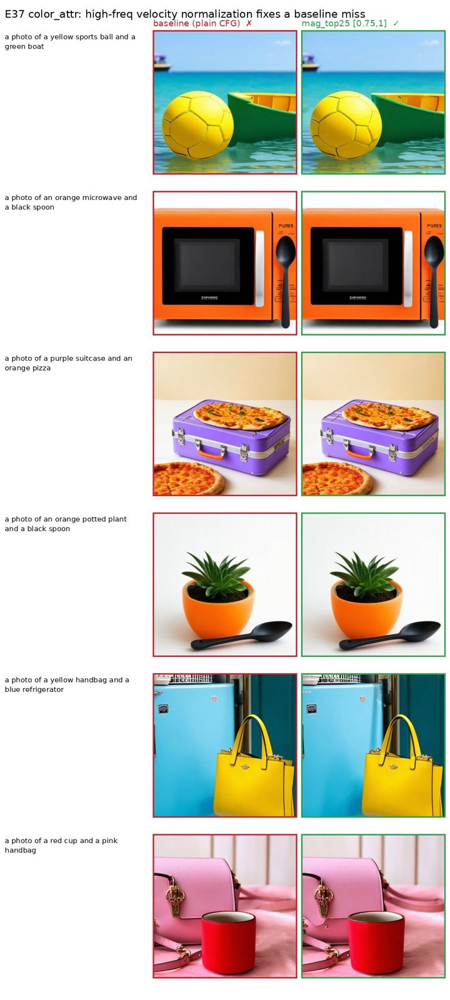
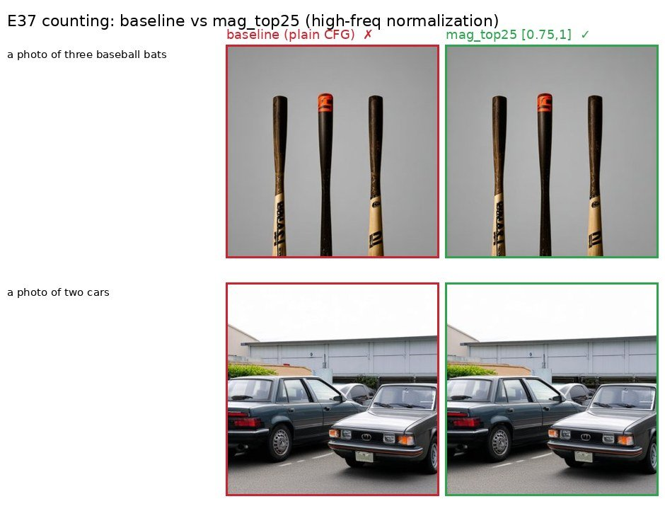

# E37 — Velocity spectral normalization: CFG velocity → cfg=1 amplitude (SD3.5)

**Thread:** spectral-power · **Model:** SD3.5-medium · **Benchmark:** GenEval (553 prompts) · **Status:** mapped
**Method note:** [`docs/methods/VELOCITY_SPECTRAL_MATH.md`](../methods/VELOCITY_SPECTRAL_MATH.md)

---

## TL;DR

During a Stable Diffusion 3.5 generation we edit the **CFG velocity** in frequency space:
keep its phase but pull its FFT **amplitude** toward the *same-step unconditional velocity*
`v_∅` (the cfg=1 flow field). On GenEval (553 prompts, 1 sample/prompt, 512px, guidance
w=4.5) the effect is **entirely band-dependent**: normalizing the **bottom 25%** of radial
frequencies, or the **full** band, *hurts* prompt adherence (Overall 0.561 / 0.524 vs baseline
0.644); normalizing only the **top 25%** (high-freq) slightly *beats* baseline (**0.655 vs
0.644**), with the gain concentrated in **color attribution** (0.48 → 0.54, 7 wins / 1 loss).
Low frequencies carry layout/composition (don't touch them); high frequencies are where CFG
over-amplifies magnitude without aiding composition, so normalizing them is free-to-beneficial.
Single-seed, so the +0.011 Overall is within seed noise — but the per-tag pattern is coherent.

## Motivation — fix the over-clamping `SBN→real` bug at its root

The latent **spectral band-normalization** clamp (E8/E16/E23, and its E36 latent-tab port) pulls
a generation's spectrum toward the natural cfg=1 spectrum — but the demo's every-step `SBN→real`
applied a **fixed clean-image target** at *every* step. The intermediate latent `z_t` is a
noise–data interpolant whose power is dominated by the noise level `σ_t`, so clamping it to a
clean-image statistic is only scale-correct at the *last* step; the noisy early steps over-clamp
and produce artifacts. **That bug is what prompted E37.**

The fix changes both the *object* and the *reference*:

- **Object:** edit the flow-matching **velocity** `v` (the transformer output the Euler step
  integrates), not the latent.
- **Reference:** clamp toward the **same-step unconditional velocity** `v_∅`, which classifier-free
  guidance already computes for free. Because `v_∅` is produced at the *current* noise level, its
  amplitude is the right scale at every step — **on-manifold by construction, in one pass** (no
  separate reference-logging run).

This needs *true* CFG (two forward branches), which the guidance-distilled FLUX lacks — so E37
moves to **SD3.5-medium**.

## Method — what is actually done

SD3.5 is a **rectified-flow** model: the transformer predicts a velocity `v_θ(z,t,c)` and the
image is the Euler integral `z_{t+1} = z_t + Δt · v`. Classifier-free guidance runs the
transformer on a batched `[uncond, cond]` input and combines the two outputs:

```
v_∅ = v_θ(z_t, t, ∅),   v_c = v_θ(z_t, t, c),   v_w = v_∅ + w·(v_c − v_∅)      (1)
```

with guidance scale `w` (here 4.5). At `w=1`, `v_w = v_∅` — the natural cfg=1 flow field. Larger
`w` improves adherence but **over-amplifies certain frequency magnitudes** (the over-contrasty CFG
look), while the **phase** of `v_w` carries layout/composition.

We take the unshifted 2-D DFT `V = fft2(v)` per channel (16 latent channels), define the
normalised radial frequency `r̂ ∈ [0,1]`, and partition it into B=24 annuli; a normalised band
`[ℓ,h]` selects the bins `S = {(u,v) : ℓ ≤ r̂ ≤ h}`.

![Method. (a) The normalised radial-frequency map; a band [ℓ,h] selects an annulus S. (b) The mag-transplant operator keeps the phase of v_w and pulls its in-band magnitude down from the CFG envelope |V_w| onto the cfg=1 envelope |V_∅| (green = the top-25% region). (c) The GenEval Overall ranking: pulling the low/full band toward cfg=1 hurts adherence, pulling only the high band helps.](figs/E37/method.jpg)

### The operator — per-bin magnitude transplant (`mag`)

Inside the band `S`, replace `|V_w|` with the unconditional magnitude `|V_∅|`, **keeping `v_w`'s
phase**, blended by strength `s` (E37 uses `s=1`):

```
|V_w'|[u,v] = (1−s)·|V_w| + s·|V_∅|   for (u,v) ∈ S \ {DC}        |V_w'| = |V_w|  elsewhere
V_w'        = |V_w'| · e^{ i·∠V_w }                                                   (2)
v_w'        = ifft2(V_w').real
```

Because `V_w` and `V_∅` are Hermitian (real velocity) and the band mask `S` is radial (even),
`|V_w'|` is even and `∠V_w` is odd, so `V_w'` is Hermitian and `ifft2` is real (verified residue
≈ 2.4e-7). The four self-conjugate bins (DC + 3 Nyquist) are restored from `V_w` to keep the
global level. At `s=0` the operator is the exact identity (‖v_w'−v_w‖∞ ≈ 7e-7).

Two companion operators share the plumbing but were **not** the GenEval headline: a per-**band**
mean-power match (`band power` / `psd_match`, the latent-SBN operator applied to the velocity),
and a band amplify/reduce gain. All act only inside `S` and only on a chosen step window
`[i_lo, i_hi]`; cost per fired step is two `fft2` + one `ifft2`, **no extra transformer forward**
(`v_∅, v_c` are already computed by CFG).

### Why it should work (and why same-step)

Eq. (1) reads `v_w = v_∅ + w·δ` with `δ = v_c − v_∅` the adherence direction. CFG inflates the
*magnitude* of `v_w` relative to `v_∅`; the operator deflates it back **band-selectively** while
keeping `v_w`'s phase — so it preserves the adherence-bearing *direction/layout* and only undoes
the magnitude over-shoot. Because the reference `v_∅` is the *same-step* field (same forward pass,
same `σ_t`), its amplitude is already at the right scale, so the edit stays on-manifold at every
step — the property the fixed clean-image `SBN→real` lacked.

### Interception & gating

`callback_on_step_end` fires *after* the Euler step and isn't given the velocity, so instead we use
the `e17_sd35.gen_sd3` pattern: monkeypatch `transformer.forward` to record the batched
`[v_∅, v_c]` output, and `scheduler.step` to run the closure on `model_output` (= `v_w`) *before*
the Euler update. The harness `experiments/e37_geneval.py` (`--part preflight,gen,score,summary,
site`) generates each condition over the 553 prompts with **seed = prompt-index, identical across
conditions** (paired comparison — a condition differs from baseline only by the operator). Ran
locally on one A5000 at ~3.5 s/img.

### Conditions & metric

| condition | op | band `[ℓ,h]` |
|---|---|---|
| `baseline` | — (plain CFG) | — |
| `mag_full` | mag transplant | `[0,1]` |
| `mag_top25` | mag transplant | `[0.75,1]` (high-freq) |
| `mag_bot25` | mag transplant | `[0,0.25]` (low-freq) |

**GenEval** = 553 prompts over 6 tags; **score = 1** if all required objects/counts/colours/relations
are detected, else 0. *Overall* = macro-mean of the 6 per-tag accuracies. **Scorer note:** we use
the GenEval **protocol** (official `evaluate()` decision logic, thresholds, colour templates, copied
verbatim) but with a **torchvision Mask R-CNN v2** detector + transformers CLIP colour classifier
instead of MMDetection's Mask2Former (`mmcv` is brittle on modern torch). Numbers **rank conditions
faithfully** but are not bit-identical to the Mask2Former leaderboard (our baseline 0.644 vs the
published ~0.71).

## Results

GenEval accuracy (per-tag and macro **Overall**); SD3.5-medium, n=1, 512px, w=4.5:

| condition | **Overall** | single | two_obj | counting | colors | position | color_attr |
|-----------|:-----------:|:------:|:-------:|:--------:|:------:|:--------:|:----------:|
| baseline (plain CFG)         | **0.644** | 0.963 | 0.879 | 0.537 | 0.766 | 0.240 | 0.480 |
| **mag_top25** `[0.75,1]`     | **0.655** | 0.963 | 0.879 | 0.550 | 0.777 | 0.220 | **0.540** |
| mag_bot25 `[0,0.25]`         | 0.561 | 0.912 | 0.808 | 0.425 | 0.681 | 0.190 | 0.350 |
| mag_full `[0,1]`             | 0.524 | 0.900 | 0.727 | 0.450 | 0.638 | 0.120 | 0.310 |

**Ranking: top-25% > baseline > bottom-25% > full** — band placement flips the sign.


- **High-freq normalization (top-25%) slightly beats baseline** (+0.011 Overall), driven by
  **color_attr +0.06** (7 prompts fixed, 1 regressed); single/two-object unchanged, colors/counting
  nudged up. On **counting** it is close to a wash (0.537 → 0.550, 3 wins / 2 losses).
- **Low-freq normalization (bottom-25%) hurts** (−0.083) and **full-band hurts most** (−0.120),
  worst on the compositional tags (two_object, color_attr, position) — pulling the adherence-bearing
  low band toward cfg=1 erodes composition.

**Interpretation:** *low-frequency velocity magnitude carries adherence/composition; high-frequency
is CFG's correctable over-amplification.* Touch only the high band.

The `color_attr` wins — each a baseline miss (✗) that high-freq normalization fixes (✓). The edits
are subtle (a small high-frequency magnitude correction), which is exactly why the per-tag *pattern*
is the real signal and the +0.011 Overall sits within single-seed noise:



On `counting` the high-band normalization is close to a wash; here are the cases it flips from a
baseline miss to a hit:



## Verdict

**MAPPED — touch only the HIGH band.** High-freq velocity normalization toward cfg=1 is
**free-to-beneficial** (+0.011 Overall, +0.06 color_attr at n=1, no compositional cost); low/full
bands **erode** compositional adherence (−0.08 / −0.12). The mechanism — keep phase (layout), pull
high-freq magnitude back to the on-manifold cfg=1 envelope — fixes the over-clamping `SBN→real`
bug at its root and stays on-manifold by using the same-step `v_∅`.

**Caveat:** single seed (n=1) → the +0.011 Overall is within seed noise; the per-tag pattern is the
real signal. The torchvision-detector scorer ranks faithfully but is not the Mask2Former leaderboard
scorer. **Next:** multi-seed (n=4) confirmation, a high-band cut sweep (`[0.5,1]`, `[0.85,1]`),
strength<1, a band-amplify (gain 1.6) on `[0.75,1]` over late-only timestep windows, the official
Mask2Former scorer, and DPG-Bench.

## Where the results live

The GenEval generation ran **locally on an A5000**; the raw per-condition PNGs and `report.json`
(gitignored `results/e37_geneval/`) were **not archived** to `/storage` and are no longer on this
machine. The surviving result artifacts are the two base64-embedded example sheets
`docs/e37_geneval_examples_color_attr.html` and `docs/e37_geneval_examples_counting.html` — the
`color_attr_wins`/`counting_wins` figures above are composited directly from those real generations.
The headline GenEval numbers are taken from the registry / `EXPERIMENTS.md` / probe log. **For the
centralized pass: a full re-run is needed to re-persist `results/e37_geneval/` (and to add the
multi-seed / official-scorer arms).**

## Artifacts

- **Driver:** `experiments/e37_geneval.py` (+ `experiments/geneval_score.py`, `geneval_data/`,
  `experiments/cluster_e37_geneval_job.sh`).
- **Operators:** `experiments/velocity_spectral_ops.py` (`cfg_velocity`, `mag_transplant_band`,
  `bandpower_match_band`, `band_gain_velocity`, `make_velocity_override`).
- **Method note:** [`docs/methods/VELOCITY_SPECTRAL_MATH.md`](../methods/VELOCITY_SPECTRAL_MATH.md).
- **Demo:** the **Velocity modulation** tab of `spectral_demo.py` (default `--model sd3.5-medium`).
- **Result example sheets:** `docs/e37_geneval_examples_{color_attr,counting}.html`.
- **Manifest:** `experiments/manifests/E37.json`.
- **Figures:** `docs/experiment-reports/figs/E37/{method,pertag,color_attr_wins,counting_wins}.jpg`.

## Reproduce

```bash
# local (A5000), per condition ~3.5 s/img:
python experiments/e37_geneval.py --part gen,score,summary \
    --conditions baseline,mag_full,mag_top25,mag_bot25 --guidance 4.5 --steps 28 --size 512
# example HTML (counting / color_attr), no GPU:
python experiments/e37_geneval.py --part site --compare mag_top25 --site_tag counting
python experiments/e37_geneval.py --part site --compare mag_top25 --site_tag color_attr
# cluster: experiments/cluster_e37_geneval_job.sh (ship via kubectl cp; /storage is not git)
```
