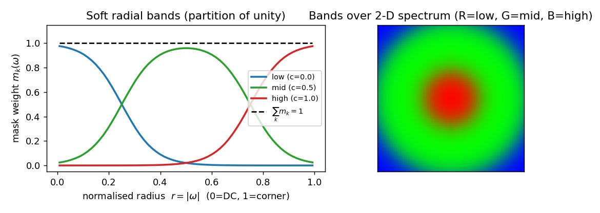

# E39 — Spectral band-AdaIN: a soft-band magnitude (mean+std) frequency knob in the sampler

**Thread:** style · **Model:** FLUX.1-dev (interactive demo) · **Status:** mapped
**Lineage:** generalizes E18 (Fourier-AdaIN) and the E8/E16/E23 SBN (spectral band normalization)

---

## Motivation — one sampler-side frequency operator, outside the network

The repo has accumulated several *frequency* manipulations: E18's Fourier-AdaIN, and the
E8/E16/E23 **SBN** (spectral band normalization, hard radial bands matching mean *power*). They all
live as one-off code. E39 asks: **can these be unified into a single, clean operator that sits in the
sampler — outside the network — and rewrites per-band magnitude statistics toward a chosen source
while reusing the content phase?**

The point is to have a **pure frequency knob** that is *orthogonal to the network's semantic AdaLN*.
A FLUX/DiT block has an internal **AdaLN**: a timestep+pooled-text vector `vec` drives per-block
shift/scale/gate in token-channel space — a **semantic / timestep** lever. E39 is the complementary
**frequency** lever; it never enters the network:

```
 t, g, c_pooled ─► vec ─► [per-block mod MLP] ─► shift/scale/gate     ◄── internal AdaLN (semantic)
 x_t (tokens) ─► [transformer] ─► v_θ
                                     │
                              FFT ─► band-AdaIN(sources) ─► iFFT       ◄── spectral AdaIN (this, freq)
                                     │  (latent freq space, in the sampler)
                              x_{t-Δ} = x_t + Δ · v_corr
```

The two are not interchangeable: AdaLN's `vec` path is the natural lever for *concept* steering;
spectral AdaIN is the right object for *geometry / frequency*-aware manipulation of the velocity or
latent.

## Method — soft-band magnitude AdaIN with content-phase reuse

### Soft radial bands (a partition of unity)

The 2-D FFT of a `(C,H,W)` field is binned by **normalised radial frequency** `r = |ω| ∈ [0,1]`
(`0` = DC / global tone, `1` = corner / finest detail), reusing `latent_spectral_ops.radial_norm`.
Instead of hard bands (the SBN's `band_index_map`, whose sharp edges *ring*), E39 uses **overlapping
Gaussian rings** normalised to a **partition of unity**:

```
m_k(ω) = exp(−½·((r − c_k)/w_k)²),   then   m_k ← m_k / Σ_j m_j   ⇒   Σ_k m_k(ω) = 1  ∀ω
```

Wider widths = softer overlap = less ringing; the masks blend *convexly* rather than cutting. Because
every mask is a function of `|ω|` only, it is symmetric under `ω → −ω` — the property that keeps the
output real (below).



### The operator (derivation)

For content velocity/latent `v` with `V = FFT(v)`, soft masks `M=(K,H,W)`, and per-band sources `S_k`:

```
μ^c_k, σ^c_k = mask-weighted (mean, std) of |V| under m_k          # band_moments(|V|, M)
μ^s_k, σ^s_k = mask-weighted (mean, std) of |S_k| under m_k
|Ṽ|_k = σ^s_k · (|V| − μ^c_k)/σ^c_k + μ^s_k        (per band, then clamp ≥ 0)   # the AdaIN step
|Ṽ|   = Σ_k m_k · |Ṽ|_k                            (convex reassembly)
out   = real( iFFT( |Ṽ| · e^{i∠V} ) )             (content phase; restore self-conj bins)
```

Two pieces matter and distinguish it from the prior SBN:

1. **Mask-weighted moments.** Because soft bands overlap and share frequencies, the per-band mean and
   std are computed *weighted by `m_k`* (`band_moments`), not over a hard partition.
2. **Full mean *and* std.** The SBN matched only mean *power*; E39 matches the **first and second
   moment** of the magnitude (AdaIN's `σ·(x−μ)/σ + μ` affine), giving a richer per-band rewrite.

**Phase — which carries layout/structure — is taken from the content and never touched.**

### Why it stays real (the Hermitian argument)

Every mask is a function of `|ω|`, hence symmetric under `ω → −ω`; combined with the reused content
phase the assembled spectrum is Hermitian, so `ifft2(.).real` discards only a tiny imaginary residue.
The 4 **self-conjugate bins** (DC + the Nyquist axes) are restored from the content via
`spectral_ops._restore_self_conj`, keeping realness *and* the DC mean exact. The pixel-sanity demo
(below) measures the residue at **~4.1e-7** (want `< 1e-3`).

### The four call patterns (one operator, `spectral_adain(v, sources, M)`)

`sources` is a length-`K` list, one per band, which makes every use the *same* call:

- `sources = [v, v, …]` → **identity** (sanity: `‖adain−v‖∞ < 5e-6`).
- `sources = [ref, ref, …]` → **moment-matching** to a reference (no free params).
- `sources = [A_low, v_high, …]` → a **mix** (e.g. low anchored to A, high left free).

Plus three library cousins:

- **Two-latent mixing** (`band_mag_mix`): `|Ṽ|_k = α_k|A_k| + (1−α_k)|B_k|`, phase from the content
  `A`. Low-band `α→0` imports B's color/global layout; high-band `α→1` keeps A's texture. Phase is
  **not** interpolated (it is circular — a linear blend is meaningless), always taken from `A`.
- **Single-pass self-AdaIN** (`adain_affine`, what the demo tab uses): the same affine but with
  **user-picked, absolute** targets held *constant* over the run; `μ^c_k, σ^c_k` are the **current**
  latent's own band moments each step (no reference, no second generation):
  `|Ṽ|_k = g_k·(|V|−μ^c_k)/σ^c_k + b_k`, with `g_k` = target std and `b_k` = target mean magnitude in
  **raw latent units**. Identity is `g_k≈σ_k, b_k≈μ_k`; the tab measures and reports the live per-band
  `μ_k, σ_k` so targets can be calibrated. `global` uses K=1 (whole spectrum); `3-band` uses 3 soft
  rings. One scalar `(g_k,b_k)` is shared across the 16 latent channels.
- **Learned schedule** (`BandSchedule`): replace the reference stats with a learnable per-band/per-time
  affine `|Ṽ|_k = g_k(t)·(|V|−μ^c_k)/σ^c_k + b_k(t)`. The params are a tiny `K × T_bins × 2` table — a
  **learned frequency-shaping schedule over the trajectory**.

## Results

E39 is an **operator-verification + interactive-demo** experiment; **no batch metrics were saved**
(see registry: "lives in the demo tab, no batch metrics saved"). The verification is two
non-interactive demos plus the live Spectral AdaIN tab.

### Demo 0 — pixel sanity (no model)

`spectral_adain` applied to two RGB images — **low band from B (a savana), high band + all phase from
A (a cat)** — using the exact same operator as the latent/velocity path. This validates FFT
convention, band partition, and realness before any FLUX dynamics:

| check | measured | target |
|---|---|---|
| imaginary residue (realness) | **4.1e-7** | `< 1e-3` |
| partition-of-unity `Σ_k m_k` | **[1.0000, 1.0000]** | `= 1` |
| change from A (mean abs) | 0.194 | (visible, layout-preserving) |


The radial magnitude spectrum makes the per-band rewrite explicit: in the low band (`r < 0.3`, shaded)
the output `|Ṽ|` is pulled off the content curve toward the source B's; the high band (and *all* phase)
tracks the content A:


### Spectral AdaIN tab (FLUX, interactive)

A single prompt, **one** generation pass: each step applies `adain_affine` with picked per-band targets
(`global` = one `(g,b)` over the whole spectrum; `3-band` = `(g,b)` per low/mid/high soft ring). The run
reports the measured per-band `μ_k, σ_k` for calibration. It is a **live frequency dial**, exercised
interactively rather than benchmarked.

### Demo 3 — learned schedule (FLUX + GPU)

Fits `BandSchedule` so a **low-guidance velocity is reshaped, per band and per timestep, into the
high-guidance (distilled-CFG) velocity**, by minimising `‖schedule(v) − v_ref‖²` over a few `(x_t, σ)`
pairs sampled across the trajectory. The fitted `g`/`b` heatmaps are the per-`(band,time)` correction —
"distilling a frequency correction into a `K×T×2` table". Conditioning the fit on a concept and reading
off which `(k,t)` cells are driven toward attenuation is the candidate **frequency-domain concept-erasure**
probe — an *open empirical question* (whether concepts have clean, separable band signatures), and this
demo is the test, not an assumption. *(FLUX-dev has no true `v_∅`, so demo3 uses the distilled velocity;
a true-CFG study would run on SD3.5.)*

## Verdict

**MAPPED (KEEP as a primitive).** A clean **soft-band magnitude AdaIN (mean+std)** that generalizes the
repo's SBN and E18's Fourier-AdaIN into one sampler-side operator, *outside* the network, orthogonal to
AdaLN. It is **verified real** (~4e-7 round-trip), partition-of-unity exact, and exposed as a live
frequency dial (global / 3-band) in the Spectral AdaIN demo tab. **It works as a knob but is not yet
benchmarked** — no adherence/fidelity numbers vs E18/E23, and the learned `BandSchedule` / erasure mode
is designed but not exercised at scale.

**Next:** quantify the operator vs E18/E23 on adherence/fidelity on the eval fixture; exercise the
learned `BandSchedule` (and the concept-erasure read-off); per-channel or relative-multiplier targets;
full-complex (real/imag) moment matching for the erasure probe.

## Caveats

- The tab's targets are **absolute** (raw latent units) and **constant** over the run, while the band's
  natural scale **drifts** along the trajectory — read the reported `μ_k, σ_k` and start near them.
- One `(g_k,b_k)` is shared across the **16 latent channels** (which have different per-channel scales).
- **Latent**-band ↔ perceptual-attribute mapping is empirical (the VAE means latent freq ≠ pixel freq);
  sweep to map it.

## Reproduce

```bash
# Demo 0 — pixel sanity, no GPU (the figures above are from this):
python experiments/e39_spectral_adain.py demo0 \
    colorful_noise/inputs/cat_orange.png colorful_noise/inputs/savana.png --out e39_demo0.png

# Spectral AdaIN tab — interactive (FLUX): single-pass self-AdaIN, global / 3-band
python experiments/spectral_demo.py --model flux-dev        # open the "Spectral AdaIN" tab

# Demo 3 — fit the learned schedule (FLUX + GPU):
python experiments/e39_spectral_adain.py demo3 --bands 4 --tbins 4 --steps 200
```

## Artifacts

- **Operator:** `experiments/spectral_adain.py` (`soft_band_masks`, `band_moments`, `spectral_adain`,
  `band_mag_mix`, `adain_affine`, `BandSchedule`); reuses `radial_norm` / `hybrid_split_2d`
  (`latent_spectral_ops.py`) and `_restore_self_conj` (`spectral_ops.py`).
- **Demos / driver:** `experiments/e39_spectral_adain.py` (`demo0` pixel sanity, `demo3` learned
  schedule); the interactive tab lives in `experiments/spectral_demo.py`.
- **Manifest:** `experiments/manifests/E39.json`.
- **Results location:** no batch `results/` dir exists (interactive operator). The figures in this
  report are regenerated locally (`demo0` + two matplotlib method diagrams) and archived full-res to
  `/storage/malnick/colorful-noise/roadmap_results/E39/`.
- **Figures:** `docs/experiment-reports/figs/E39/{bands,spectrum,demo0_pixel_sanity}.jpg`.
