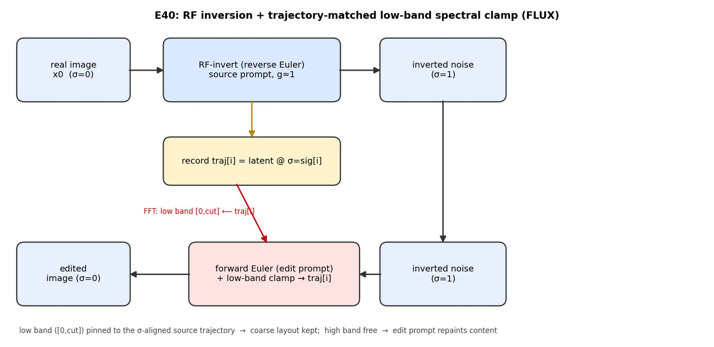
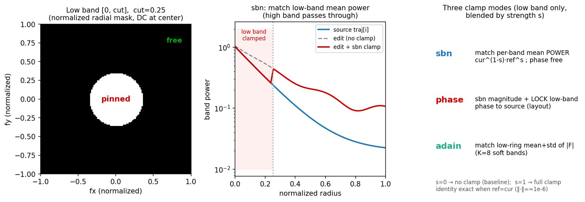

# E40 — RF inversion + trajectory-matched low-band spectral clamp (FLUX)

**Thread:** style · **Model:** FLUX.1-dev · **Status:** active
**Successors:** [E41](EXPERIMENT_41.md) (calibrate this edit vs a fair RF-inv η baseline), then E42/E43.

---

## Motivation — preserve structure under an aggressive edit

We want to edit a **real image** with FLUX — change the *content/style* the edit prompt asks for —
while keeping the source's **structure** (where things are, the coarse layout), even when the edit is
aggressive (e.g. "cat → dog", "sunny → thunderstorm").

The repo already had a structure-locking editor: **BandLock** (E21/E22) clamps the generating latent
to a **single fixed source latent `x0`** at every denoising step. That reference is wrong at high noise
levels: early in generation the latent is mostly noise, so pulling it toward the *clean* `x0` fights
the sampler and drifts. The question of E40: does clamping to the source's **inversion trajectory**
(the source as it looked *at each noise level*), instead of a fixed clean `x0`, preserve structure
where BandLock drifted?

## Method — what was actually done

Three steps, all on FLUX's rectified-flow velocity field `v(x, σ, C)` (Euler integration on the
`flux_sigmas` grid):

1. **RF-invert** the real image to noise: integrate the velocity ODE **backwards** (σ: 0 → 1) under the
   **source** caption, and **record the unpacked latent at every σ node** — the inversion *trajectory*
   `traj[i]` = source latent at noise level `sig[i]`. FLUX is guidance-distilled, so inversion is most
   faithful at **inv_guidance ≈ 1**.
2. **Regenerate** forward (σ: 1 → 0) from that inverted noise under the **edit** prompt.
3. At each step `i`, **clamp the latent's low-frequency band `[0, cut]` back toward `traj[i]`** at the
   matching σ. Low bands carry coarse layout/global color; high bands carry texture/edges. Pinning the
   low band keeps *where things are*; freeing the high band lets the edit prompt repaint *what they are*.



### Why the trajectory reference (vs fixed x0)

Inversion and generation walk the **same** σ grid, so generation step `i` sits at the same noise level
as `traj[i]`. The clamp therefore pulls "the source **as it looked at this noise level**" rather than
"the clean source" at every step — a σ-aligned reference. This is the one conceptual change from
BandLock (E21/E22 clamp to a fixed clean `x0`). It also doubles as a **drift-correction** probe:
re-imposing the recorded spectrum counteracts RF-inversion drift (cf. E21's failed SD3.5
reconstruction, where the inverted-noise std blew up to ~1.11).

### The clamp (one new operator, three modes)

At step `i`, with current unpacked latent `g` and reference `r = traj[i]`, pull `g`'s **low band only**
(`[0, cut]`, bands above `cut` pass through) toward `r`, blended by `strength s ∈ [0, 1]`
(`s=0` = no clamp = baseline, `s=1` = full clamp). `cut` is a **normalized radius** of the 2-D FFT
(`0` = DC/global tone … `1` = corner/finest detail). All three modes reuse existing spectral primitives:

| mode | operation (low band, `spectral_ops` / `spectral_adain`) | what it locks |
|---|---|---|
| **sbn** | match per-`(channel, radial-band)` **mean power**; target `cur^{1−s}·ref^{s}`, high bands gain 1; phase free (`psd_match`) | low-band energy / global tone |
| **phase** | sbn on magnitude **plus** lock low-band **phase** to the source (`band_phase_swap(r, out, q, mag_from="B")`) | layout (phase carries structure) |
| **adain** | match low-ring **mean + std** of `|F|` on `K=8` soft bands (`spectral_adain`), then blend `g·(1−s)+out·s` | low-band first+second moments |

The key formula (sbn) — a per-band geometric power blend toward the reference, applied only inside the
low band:

```
tgt_power[low]  =  cur_power[low]^(1−s)  ·  ref_power[low]^s        (high bands: tgt = cur → untouched)
gen' = psd_match(gen, tgt)               # rescale each band's magnitude to sqrt(tgt/cur); phase free
```



Identity is exact: clamping a latent to itself (`r = g`) is a no-op for all three modes
(`‖clamp − g‖∞ ≈ 1e-6`, asserted in the `preflight` part), and the high-band magnitude is provably
untouched for sbn.

### Knobs and the trade-off they sweep

- **`cut`** (0–1) — how much of the spectrum is pinned. Small `cut` pins only the coarsest
  structure/color (most of the image stays editable); large `cut` pins more (tighter structure, weaker
  edit). One `cut` is consistent across modes because both the SBN hard-band centers and the AdaIN
  soft-band centers are normalized by the corner radius.
- **`strength`** (0–1) — clamp blend. For `phase`, governs the magnitude part only (the phase lock is
  hard — phase is circular, so a linear blend is meaningless).
- **clamp window** (`--schedule` all/early/late) — which steps clamp. Clamping only **early/high-σ**
  steps sets coarse structure then frees late steps for edit detail; clamping all steps preserves most.
- **`inv_guidance`** ≈ 1.0 — most faithful inversion for distilled FLUX.

### Harness

`e40_spectral_invert.py` (`--part preflight,gen,analyze`). `gen` per source: VAE-encode the real image
(or generate one from the source prompt), RF-invert under the source caption, then emit conditions
**`recon`** (edit=source, no clamp — the inversion+plumbing **gate**, should reproduce the source),
**`recon_clamp`** (edit=source, with clamp — a tighter **drift-correction** check), **`edit_noclamp`**
(plain RF-inversion edit baseline), and **`edit_{sbn,phase,adain}`**. `analyze` scores CLIP→edit
(adherence), CLIP→source (content kept), pixel-distance to source, and aesthetic, and writes
`results/e40/index.html`; it also reports the **inverted-noise std** (≈1.0 = clean Gaussian inversion).

## Results

E40 shipped as a **live, interactive feature** (the **RF inversion** tab in `spectral_demo.py`,
`--model flux-dev`: upload an image + source caption + edit prompt; A/B of edit-no-clamp vs
edit-with-clamp), not as a saved quantitative sweep. The verdict here is **qualitative**:

- The σ-aligned trajectory reference **keeps the coarse layout while the high band follows the edit**.
  The chosen demo defaults are **mode = sbn, cut = 0.25, strength = 0.5** — at that setting the edited
  image is essentially the no-clamp baseline but a bit cleaner / structurally tighter, observed on a
  "two dancers" photo edited to LEGO.
- Where BandLock (fixed `x0`, E21/E22) **drifted**, the per-σ trajectory clamp preserves structure —
  this is the headline qualitative claim that motivated the line.

**No `results/e40/` metrics directory was ever produced for E40 itself** (config/metrics/artifacts in
`manifests/E40.json` are empty; `results/e40/` exists but is empty on every checkout). The two figures
above are generated matplotlib schematics of the **actual operation** (the real FFT radial-mask binning
and the sbn power blend), not output grids, because no result grids were saved. The **quantitative**
validation of this edit came in the **successor E41**, which factored E40's invert + low-band clamp into
`invert_core` and benchmarked it against a fair RF-inversion η baseline on ~140 PIE-Bench images: it
**beats vanilla RF-inversion on every metric** (DINO struct 0.162 vs 0.199, LPIPS 0.50 vs 0.60, CLIP-dir
0.140 vs 0.123) and ties the η frontier at matched editability. See [E41](EXPERIMENT_41.md) for numbers.

## Verdict

**KEEP (qualitative) — the trajectory-matched low-band clamp preserves structure where fixed-`x0`
BandLock (E21/E22) drifted; shipped as the live RF-inversion demo feature.** The principled change is
the **σ-aligned trajectory reference** instead of a fixed clean `x0`. It was not metricized within E40;
that calibration moved to **E41**, which confirmed the edit is a legitimate RF-inversion-class editor
(strictly beats vanilla RF-inv, ties the η frontier at matched editability). The open item E41 then
exposed: it **ties** rather than dominates at matched editability, so preserving structure *more* needs
another handle (→ E42 structure-gating, → E43 inversion-free FlowAlign).

## Artifacts

- **Driver:** `experiments/e40_spectral_invert.py` (`--part preflight,gen,analyze`; new code = the
  inversion loop + the low-band clamp; reuses `spectral_ops` / `spectral_adain` / E31/E7 FLUX plumbing).
- **Demo:** RF inversion tab in `experiments/spectral_demo.py` (`--model flux-dev`).
- **Manifest:** `experiments/manifests/E40.json` (backfill stub — empty config/metrics).
- **Results location:** none saved. The driver and the original narrative live on the unmerged worktree
  `.claude/worktrees/e40-spectral-invert/`; `results/e40/` is empty on every checkout and
  `/storage/.../roadmap_results/E40/` held no images before this backfill. Quantitative results for the
  same edit: [E41](EXPERIMENT_41.md) (`results/e41/`).
- **Figures:** `docs/experiment-reports/figs/E40/pipeline.jpg`, `figs/E40/lowband_clamp.jpg` (generated
  matplotlib schematics; full-res archived under `/storage/.../roadmap_results/E40/`).
