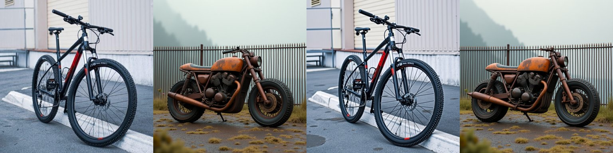

# E41 — Calibrating the spectral-clamp edit vs a fair RF-inversion (η) baseline (FLUX)

**Thread:** style · **Model:** FLUX.1-dev · **Benchmark:** PIE-Bench++ (140 images, stratified) · **Status:** mapped
**Predecessor:** E40 (RF-invert + low-band spectral clamp as a real-image editor, hand-set knobs, no fair baseline)
**Successors:** [E42](EXPERIMENT_42.md) (DINO-gated clamp, dead-end), [E43](EXPERIMENT_43.md) (drop inversion → FlowAlign)

---

## Motivation

E40 produced a real-image editor on FLUX by **RF-inverting** the source image to a noise + trajectory,
then re-generating under the edit prompt while **clamping the low-frequency band of the velocity** toward
the inverted trajectory. It worked on a hand-picked "dancers" example, but with two holes:

1. **Hand-set global knobs.** The clamp's band, strength, and step window were tuned by eye on one image.
   Are those knobs near-optimal per image, and does a *single* global setting suffice for deployment?
2. **No fair baseline.** RF-inversion (Rout et al.) has an **η** knob that trades editability ↔ faithfulness,
   so comparing our edit to a single arbitrary RF-inversion point is not a fair fight. The repo had **no η
   controller** at all (the edit pass was plain reverse-Euler, i.e. η=0).

The question E41 asks: **at equal editability, can our spectral-clamp edit match or beat RF-inversion's own
η frontier on structure preservation — and does one global knob get us there?**

## Method — the actual operation

### The edit operator (what the clamp does)

For each PIE-Bench image we run the shared `invert_core` path:

1. **RF-invert** the source under the source prompt → noise `x_noise` + per-step trajectory `traj`
   (`ic.rf_invert`).
2. **Re-generate** under the edit prompt with `ic.forward_edit`. At each step in an early window
   `[0, interval_end·(T−1)]`, the predicted velocity's **low-frequency band** is pulled toward the
   inverted trajectory. Three clamp modes were searched:
   - `phase` — lock the **phase** of the low band (radial band `[0, phase_hi]`), keep magnitude free;
   - `sbn` — spectral-band-normalization style low-band replacement (`cut` = band cutoff, `strength` = mix);
   - `adain` — per-band AdaIN of the velocity spectrum onto the inverted trajectory's band statistics.

   Conceptually the edit holds the **coarse spatial layout** (low-frequency content, where DINO
   self-similarity structure lives) close to the source while letting high frequencies follow the edit prompt.

### The fair RF-inversion baseline (the η controller)

The key infrastructure addition is an **RF-inversion η controller** in `invert_core.forward_edit`:

```
v ← v + η · (v_target − v),     v_target = (x − x₀)/σ
```

applied over an early step window `[0, ETA_STOP·T]` (`ETA_STOP = 0.6`). This is the standard RF-inversion
faithfulness pull toward the source latent `x₀`:

- **η = 0** ⇒ the plain inversion edit = **vanilla** (no clamp, no pull);
- **η = 1** ⇒ ≈ reconstruction (the source comes back);
- intermediate η slides faithfulness ↑ / editability ↓.

`DEFAULT_ETA = 0.9` is the out-of-the-box faithfulness point; `ETA_SWEEP = {0, 0.2, 0.4, 0.6, 0.8, 1.0}`
traces the whole curve. The controller was **validated** by reproducing E40's saved dancers run:
MSE(ours, saved edit) and MSE(η=0, saved baseline) matched, and MSE(η=1 recon, source) was small —
confirming η=1 is reconstruction (`--part verify`).

### Calibration — two ways to set our knobs

- **Per-image oracle** (`--part calibrate`): an **Optuna TPE** active loop (~20 trials/image) over
  `mode / cut / strength / interval_end / phase_hi`, **warm-started** from the dancers prior plus a
  prompt-distance heuristic (small prompt move ⇒ lock harder). The objective is **constrained**:

  ```
  minimize  DINO_struct(edit, source)
  s.t.      CLIP_dir(edit) ≥ CLIP_dir(vanilla)        # match vanilla's editability
  scalarized: struct + 100 · max(0, base_cd − cd)
  ```

  i.e. *preserve as much structure as possible without losing editability vs the vanilla edit.* Every
  trial trace is saved so the operating point is re-selectable with no GPU.
- **Global knob** (`--part gridsweep` + `gridpick`): a **fixed 54-point grid**
  (`mode × cut × strength × interval_end`, `phase_hi` fixed) swept **identically on every image**, then
  the single knob with the best mean structure s.t. mean editability ≥ vanilla is picked. This is the
  deployable, no-per-image-tuning point.

### Metrics

`struct_metrics.py`: **DINO self-similarity structure distance** ↓ (PIE-Bench's headline structure metric),
**CLIP-directional** editability ↑, plus LPIPS / DSSIM / CLIP-T and masked-background PSNR/LPIPS. The
stratified PIE-Bench++ loader (`piebench.py`) gives 14 images × 10 edit types = 140, with masks.
Run as sharded RunAI jobs across A6000/H100 (`cluster_e41_job.sh`, `submit_e41.sh`).

## Results (140 PIE-Bench++ images)

| method | DINO struct ↓ | LPIPS ↓ | DSSIM ↓ | CLIP-dir ↑ | CLIP-T ↑ |
|---|---|---|---|---|---|
| **ours (per-image)** | **0.162** | **0.502** | **0.438** | **0.140** | **0.272** |
| vanilla RF-inv (η=0) | 0.199 | 0.595 | 0.504 | 0.123 | 0.269 |
| default RF-inv (η=0.9) | 0.067 | 0.156 | 0.118 | 0.010 | 0.228 |

**1. Beats vanilla RF-inversion on every axis.** Ours has lower structure distance, lower LPIPS/DSSIM,
*and* higher editability than the out-of-the-box (η=0) edit. Per edit-type, ours < vanilla structure on
**~135/140** images (and 14/14 on 7 of the 10 edit types).

**2. The default η=0.9 barely edits.** Its CLIP-dir of 0.010 is essentially reconstruction — its low
structure distance is an artifact of *not editing*, which is exactly why a single-η comparison is unfair
and the **η sweep** is the honest baseline.

**3. At matched editability, ours ties the η frontier — it does not beat it.** Interpolating RF-inversion's
mean η curve at each image's editability:

- mean(ours_struct − RFinv_struct) = **−0.0003** (essentially zero), ours wins **31/63** interpolatable images;
- on **77/140** images ours edits **beyond RF-inversion's entire η range** — more editable than even η=0,
  a region η cannot reach (η only moves editability *down* from vanilla);
- feasible (ours ≥ vanilla editability): **135/140**.


**4. The frontier-trap.** The plot above is the headline finding of the whole line: our spectral knob, no
matter how it is calibrated, **slides *along* the RF-inversion structure-vs-editability frontier — it never
pushes the frontier outward.** The per-image *oracle* sits right on the η curve; matched-editability gain is
≈0. This "frontier trap" is the motivation for E42 (gate the clamp by structure) and E43 (drop inversion
entirely for FlowEdit/FlowAlign), and was re-confirmed three more times through E46/E47.

**5. One global knob ≈ the per-image oracle.** A single grid-picked global knob lands essentially on top of
the per-image-oracle mean, i.e. per-image calibration buys almost nothing over a fixed deployable setting —
the per-image win is **oracle-only**. (See [memory: E41 global-knob finding].) Both sit at the same place
relative to the η frontier.


### Qualitative examples

source · vanilla (η=0) · default-η (η=0.9) · ours. The default-η column barely changes the image
(near-reconstruction); ours applies the edit while holding layout closer than vanilla.




## Verdict

**MAPPED.** The low-band spectral-clamp edit is a **legitimate RF-inversion-class editor**: it strictly
beats out-of-the-box (vanilla) RF-inversion on structure, perceptual distance, and editability
simultaneously on a standard benchmark, and it reaches an editability range η cannot. **But** at matched
editability it only **ties** RF-inversion's tuned η frontier (gap ≈ 0), and a single global knob already
matches the per-image oracle — so per-image calibration adds no real headroom. This is the **frontier-trap**:
one global spectral knob ≈ the RF-inversion η frontier; the per-image win is oracle-only. Preserving structure
*more* needs a different handle, which sets up **E42** (DINO-structure-gated clamp — turned out dead-end) and
**E43** (drop inversion for FlowEdit/FlowAlign — KEEP).

## Artifacts

- **Driver:** `experiments/e41_calibrate.py` (parts `verify` / `calibrate` / `analyze` / `correlate` /
  `gridsweep` / `gridpick`); helpers `invert_core.py` (η controller + edit core), `struct_metrics.py`,
  `piebench.py`, `clip_sim.py`.
- **Cluster:** `cluster_e41_job.sh`, `submit_e41.sh` (sharded RunAI across A6000/H100).
- **Log / writeup:** `experiments/e41_report.md`; registry entry id `E41` in
  `experiments/roadmap_registry.py`; summary in `experiments/EXPERIMENTS.md`.
- **Results location:** `/storage/malnick/colorful-noise/experiments/results/e41/` —
  `report.md`, `aggregate_pareto.png` (frontier), `aggregate_pareto_global.png` (global knob),
  `correlate.png`, `montage_*.png`, `items/*.json` (140 per-image: best params, full-suite metrics, all 20
  trial traces, 6-point η sweep on showcase images), `items_grid/*.json` (140 × 54-point global grid).
  Also a self-contained `index.html` explainer (`results/e41/index.html`, present locally and on /storage).
- **Figures:** archived full-res under `/storage/.../roadmap_results/E41/`; light JPEGs in
  `docs/experiment-reports/figs/E41/` (`frontier`, `global_knob`, `montage_motorcycle`, `montage_b`).
