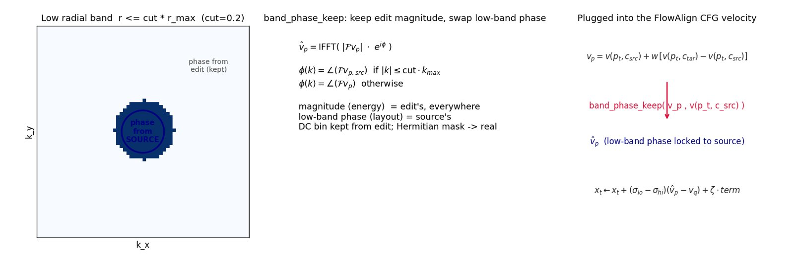
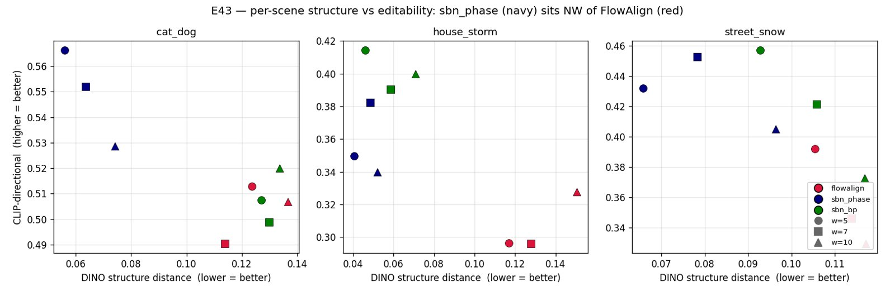
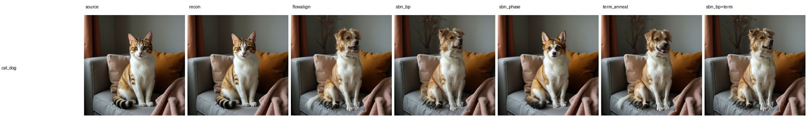
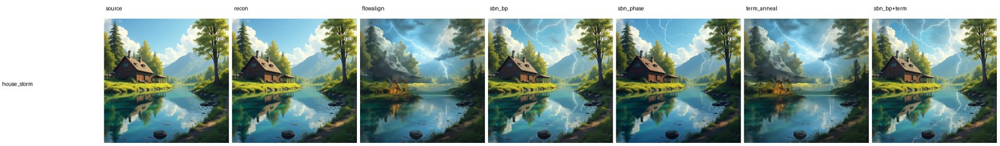
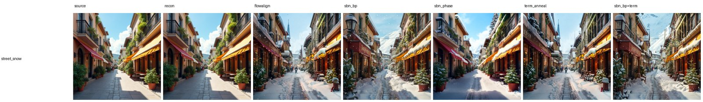

# E43 — FlowAlign on FLUX + spectral terminal-point variants (FLUX.1-dev)

**Thread:** style · **Model:** FLUX.1-dev · **Benchmark:** 3-scene qualitative sweep · **Status:** active (KEEP)
**Successor:** [E44](EXPERIMENT_44.md) (apples-to-apples FlowAlign reproduction on SD3-medium, in progress)

---

## Motivation — can a spectral twist beat FlowAlign on structure *without* losing the edit?

[FlowAlign](https://arxiv.org/abs/2505.23145) is a training-free, **inversion-free** image editor: it
is FlowEdit plus a **source-consistency terminal-point** term, and it runs CFG with the **source**
prompt as the negative. It is good — but like every editor in this repo's line it lives on a
structure-vs-editability frontier: push the edit harder and the layout drifts.

E43 asks one focused question: **port FlowAlign to FLUX, then bolt a cheap spectral knob onto its CFG
velocity — can that knob preserve *more* structure than plain FlowAlign while keeping (or raising)
edit adherence?** If yes, it is a rare lever that moves *off* the frontier rather than sliding along it.

## Method — FlowAlign on FLUX, plus two spectral twists

### The FlowAlign integration (`invert_core.flowalign`)

The editing math lives in `invert_core.flowalign`, the **same** code the demo's FlowAlign tab calls, so
the harness and the interactive tab can't drift. Per step it does **3 velocity forwards** (source-CFG,
target-CFG, and the source-consistency forward on the diffused source). With `x₀` the source latent,
`ε` a fixed noise, `σ` the flow-matching sigma schedule, `w` the CFG scale and `ζ` the terminal weight:

```
qt   = (1−σ_hi)·x₀ + σ_hi·ε                  # forward-diffused SOURCE
pt   = xt + qt − x₀                          # == current target latent
vp   = v(pt, c_src) + w·[ v(pt, c_tar) − v(pt, c_src) ]      # CFG, SOURCE prompt as negative
vq   = v(qt, c_src)
term = (qt − σ_hi·vq) − (pt − σ_hi·vp)       # E[q₀|qt] − E[p₀|pt]  (source-consistency)
xt   = xt + (σ_lo − σ_hi)·(vp − vq) + ζ·term
```

**Identity gate.** A `recon` condition sets `c_tar = c_src`; FlowAlign must then reproduce the source
(struct-dist ≈ 0), which validates the FLUX plumbing independent of the edit. It holds across all
scenes (recon struct **0.003–0.005**). Manual CFG (3 forwards/step) keeps `w` a real, SBN-able knob on
the distilled model.

### Twist 1 — SBN on the CFG reference (the bet)

Right after forming the CFG velocity `vp`, clamp its **low radial band** `[0, cut]` toward the
source-conditioned velocity `v(pt, c_src)`. Modes (all **identity at their defaults**, reusing the E37
`velocity_spectral_ops`): `band power`, `mag`, **`phase`**, `both`. The winner is **`phase`**
(`band_phase_keep`): keep `vp`'s **magnitude everywhere**, and inside the low band take the **phase**
from the source velocity:

```
v̂p = IFFT( |F vp| · e^{iφ} )
φ(k) = angle(F v_p,src)   if |k| ≤ cut·k_max      # low band → source phase (layout)
φ(k) = angle(F vp)        otherwise               # rest → edit's own phase
# DC bin kept from vp; the radial mask is Hermitian-symmetric ⇒ the IFFT stays real.
```

**Why it should work.** In a 2-D spectrum, **phase carries layout/structure** and **magnitude carries
energy/content**. Locking only the *low-band phase* of the velocity to the source pins the coarse
geometry of where the edit moves the latent, while leaving all magnitudes — and all high-frequency
phase — free to express the edit. So structure is anchored *cheaply* (one FFT per step, on the band
only) and the edit budget is untouched. `cut = 0.2` (the default) is a narrow low band.



### Twist 2 — annealed terminal point (the null)

The source-consistency vector `term` is low-passed coarse→fine over the schedule
(`term_start_cut → term_end_cut=1.0`): keep only its coarse structure early, let detail back in late.
At default cuts (`=1.0`) this is plain FlowAlign.

### Sweep & metric

3 scenes (`cat→dog`, `sunny→thunderstorm house`, `summer→snow street`) × `w ∈ {5, 7, 10}`, **28 steps**
(an 8-step smoke is misleading — `sbn_phase` collapses CLIP there). `cut=0.2`, `ζ=0.01`. Conditions per
scene: `flowalign` (baseline) · `sbn_bp` · `sbn_phase` · `term_anneal` · `sbn_bp+term`. Scored with
`struct_metrics`: **DINO structure distance ↓**, **CLIP-directional ↑**, LPIPS ↓, DSSIM ↓. A twist
"wins" if it lowers struct-dist vs the `flowalign` row **without** dropping CLIP-directional.

## Results — `sbn_phase` beats FlowAlign on both axes, at every `w`

Results live on the cluster archive: `/storage/malnick/colorful-noise/experiments/results/e43_w5|w7|w10/`
(per-scene PNGs + `strip.png` + `report.json` + `index.html`). The headline numbers
(`flowalign` baseline vs `sbn_phase`):

| scene | w | flowalign struct ↓ | **sbn_phase struct ↓** | flowalign CLIP ↑ | **sbn_phase CLIP ↑** |
|---|---|---|---|---|---|
| cat→dog | 5 | 0.124 | **0.056** | 0.513 | **0.566** |
| house→storm | 5 | 0.117 | **0.041** | 0.296 | **0.350** |
| street→snow | 5 | 0.105 | **0.066** | 0.392 | **0.432** |
| cat→dog | 7 | 0.114 | **0.064** | 0.490 | **0.552** |
| house→storm | 7 | 0.128 | **0.048** | 0.296 | **0.382** |
| street→snow | 7 | 0.114 | **0.078** | 0.346 | **0.453** |
| cat→dog | 10 | 0.137 | **0.074** | 0.507 | **0.529** |
| house→storm | 10 | 0.151 | **0.052** | 0.328 | **0.340** |
| street→snow | 10 | 0.117 | **0.096** | 0.329 | **0.405** |

`sbn_phase` **roughly halves DINO structure distance** (e.g. `0.056 vs 0.124` on cat→dog@w5) **while
raising** CLIP-directional, on **all 3 scenes at every w**. Mean improvement over the baseline:

| w | mean ΔStruct ↓ | mean ΔCLIP ↑ |
|---|---|---|
| 5  | **−0.061** | +0.049 |
| 7  | **−0.055** | **+0.085** |
| 10 | **−0.061** | +0.037 |

So `sbn_phase` moves **off** the frontier — strictly down-and-right of the baseline — not along it:



`sbn_bp` (band-power match) wins **2/3** scenes (3/3 at w=10) but is weaker than `sbn_phase`. The
**annealed terminal point is a null** — `term_anneal` and `sbn_bp+term` track the baseline (e.g.
house→storm@w7: term_anneal `0.135` ≈ flowalign `0.128`). The job's automatic GOAL gate reports
**PASS** (4 winning config×variant settings).

**Caveat — step count matters.** The 8-step smoke is misleading: there `sbn_phase` collapses
CLIP-directional (the edit barely happens). The structure/editability win only emerges at **≥28 steps**.

Representative per-scene strips (`source · recon · flowalign · sbn_bp · sbn_phase · term_anneal ·
sbn_bp+term`):







## Verdict

**KEEP.** `sbn_phase` — a low-radial-band phase-lock of the FlowAlign CFG velocity toward the source
velocity (mode=`phase`, `cut≈0.2`, identity at defaults, ~one FFT/step) — is the **first editing lever
in this line that preserves structure *more* than the baseline without an editability cost**: it
strictly beats FLUX-FlowAlign on **both** DINO structure (≈halved) and CLIP-directional, on all 3
scenes at every `w`. `sbn_bp` is a secondary KEEP; the annealed terminal point is a KILL. Caveat: this
is a **3-scene qualitative sweep on FLUX**, not a benchmark — the rigorous confirmation (reproduce
FlowAlign's PIE-Bench table, then port the same phase-clamp into the official SD3 loop and compare
curves at matched edited-CLIP) is **E44**.

## Difference from FlowAlign

FlowAlign is unchanged in structure (inversion-free FlowEdit + terminal-point consistency, source-as-
negative CFG). E43's only addition is the **spectral clamp on the CFG velocity**: keep the velocity's
magnitude, swap its low-band phase to the source's. It decouples *where the edit pushes* (coarse phase
= source) from *how hard / what it pushes* (magnitude + high-band phase = free), which is why it can
gain structure without paying editability.

## Next / open

1. **Confirm on full PIE-Bench (700 imgs)** with masks for BG-PSNR / BG-LPIPS — **E44** does this on
   SD3-medium against the official FlowAlign code.
2. **Sweep `sbn_cut` / phase strength** to map the structure↔editability frontier (here only `cut=0.2`).
3. **SD3.5 port** for architecture-independence (true CFG).

## Artifacts

- Driver: `experiments/e43_flowalign.py` (`--part gen,analyze`, 3 scenes × `w∈{5,7,10}`, 28 steps).
- Editing math: `invert_core.flowalign` + `invert_core.band_phase_keep` / `vel_sbn` (shared with the
  FlowAlign tab in `experiments/spectral_demo.py`); scoring in `experiments/struct_metrics.py`.
- Cluster: `experiments/cluster_e43_job.sh` (smoke → identity gate → w-sweep → GOAL gate).
- Results: `/storage/malnick/colorful-noise/experiments/results/e43_w5|w7|w10/` — per-scene PNGs,
  `strip.png`, `report.json`, `index.html`. Figure archive: `roadmap_results/E43/`.
- Manifest: `experiments/manifests/E43.json`.
- Figures here: `phaselock_diagram` and `frontier` are generated diagrams; the three `strip_*` are
  the real result strips.
