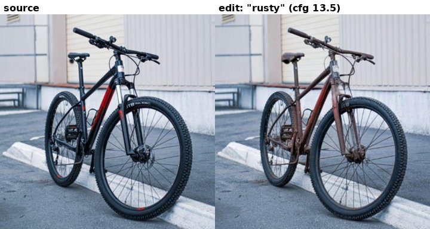
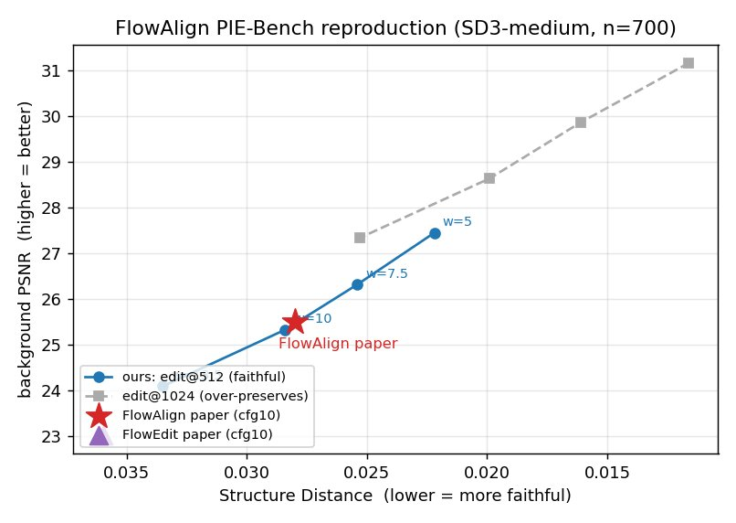
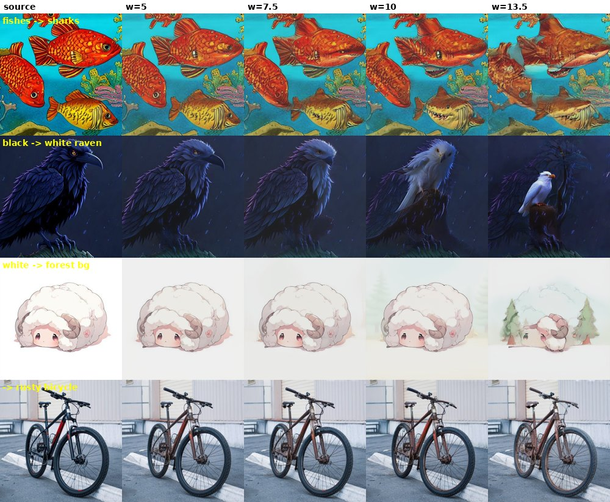

# E44 — Apples-to-apples FlowAlign reproduction (+ ours) on PIE-Bench (SD3-medium)

**Thread:** style · **Model:** SD3-medium (official FlowAlign) · **Benchmark:** PIE-Bench · **Status:** active (PARK — reproduction validated on mask-free metrics; faithful masked metrics blocked on original data)

---

## Motivation — make the E43 win rigorous

E43 found that our spectral phase-clamp (`sbn_phase`) beats FLUX-FlowAlign on a structure-vs-editability
frontier. The obvious objection: that comparison used **our** reimplementation of FlowAlign on **FLUX**,
with **our** `struct_metrics`. A reviewer can dismiss it as a backbone/metric mismatch rather than a real
method win.

E44 closes that gap by demanding a **two-gate** result on the *paper's own terms*:

1. **Reproduce** FlowAlign's published PIE-Bench table on **SD3-medium**, using their **official code**
   and the **official PnPInversion metrics**, within ~5% on Structure Distance & CLIP. This is a **hard
   gate** — if the baseline doesn't reproduce, no comparison built on it is trustworthy.
2. **Beat it**: port the spectral phase-clamp into the *same* SD3 FlowAlign loop and show **lower
   Structure Distance at matched edited-CLIP** on PIE-Bench (FlowAlign Fig-3a curve style, not a single
   cherry-picked point).

This report covers **gate 1** (the reproduction), which is where the experiment currently stands.

## What FlowAlign actually is (the operation we reproduce)

FlowAlign (arXiv:2505.23145) is a training-free, inversion-free flow editor. Reading the official
`diffusion/editing/sd3_edit.py::SD3FlowAlign.sample` (~L226), each sampler step updates the latent as:

```
x_t  +=  (σ_next − σ)·(v_p − v_q)  +  ζ·( q_t − σ·v_q − p_t + σ·v_p )
```

with `ζ = 0.01` hardcoded, and the velocities

```
v_p = v_p^src + ω·(v_p^tgt − v_p^src)     # CFG combine; negative = SOURCE prompt (not null)
v_q = v(q_t, src)                          # source-conditioned reference velocity
```

The first term is the ordinary rectified-flow ODE step on the **edit gap** `v_p − v_q`; the second
`ζ·(…)` term is FlowAlign's **alignment correction** that pulls the edited trajectory back toward the
source's, which is what buys background preservation without an inversion pass. Key non-defaults
(from repo + paper): backbone = **SD3.0-medium** (`stabilityai/stable-diffusion-3-medium-diffusers`),
**NFE = 33**, **seed = 123**, CFG **negative is the source prompt**, and Fig-3a sweeps **ω ∈ {5, 7.5, 10, 13.5}**.

Crucially, the **port insertion point is clean**: clamp `v_p`'s low-band phase toward `v(p_t, c_src)`
right after the CFG combine — this is exactly the `sbn_phase` operation from E43, dropped into the
official loop with no other change. (That port is gate 2, not run yet.)

## Method — the reproduction harness (`e44_flowalign_repro.py`)

The official repo ships **only single-image inference** (`run_edit.py`) — no PIE-Bench loop, no metric
code. So E44 builds both around the untouched official sampler:

- **`--part gen`** (GPU): load the official `SD3FlowAlign` sampler via `get_editor("flowalign")`, edit
  each PIE-Bench image (seed 123, NFE 33), save edited + source PNGs at 512px keyed by id, plus a
  self-contained `meta.json` (prompts, RLE mask, edit-type).
- **`--part analyze`** (CPU): score with the **official PnPInversion `MetricsCalculator`** —
  `structure_distance`, background (unedit-part) PSNR/LPIPS/MSE/SSIM, and CLIP whole + edited-part —
  the standard PIE-Bench protocol, **not** our `struct_metrics`. One non-default that matters: CLIP is
  forced to **ViT-base-patch16** (`--clip_model openai/clip-vit-base-patch16`), because FlowAlign's
  appendix reports CLIP on base16, whereas PnPInversion defaults to large14. Matching the ruler is
  required for the numbers to be comparable.

**Win criterion (gate 2):** sweep CFG ω for both methods and compare Structure-Distance-vs-edited-CLIP
**curves** (Fig-3a style), not one point. HP for `sbn_phase` is to be tuned on a **disjoint Emu-Edit
subset**, never on PIE-Bench.

### Data caveat (the load-bearing one)

The faithful loader (`_load_original`) reads the **original PIE-Bench** (`mapping_file.json` with real
RLE masks + `annotation_images/`). That data is behind a Google Form and was **not obtainable**. The
fallback (`_load_hfpp`) uses the cached HF++ repackaging (`UB-CVML-Group/PIE_Bench_pp`), which is the
700 images but whose **`mask` field is degenerate** — many entries are full-image (`mask-frac = 1.0`),
including change-object/color edits where the mask must be localized. Consequence:

- **Structure Distance** is **mask-free** → trustworthy.
- **Background (unedit-part) metrics** are computed on a biased subset, and **edited-part CLIP
  collapses to whole-image CLIP** → inflated (~27–30 vs the paper's ~22).

So the reproduction is judged on the **mask-free** quantities (Structure Distance, and the bg-PSNR
trend), with edited-CLIP flagged as not-yet-faithful.

## Results

**Foundation smoke** (official `run_edit.py`, bicycle, cfg 13.5 / NFE 33 / seed 123): **PASS** — a clean
black → rusty mountain-bike edit, background preserved, matching the FlowAlign README figure. This
confirms the env + gated SD3.0-medium download + official code all work end-to-end on the cluster.



**Full CFG sweep, n = 700, edit@512, base16-CLIP** (the faithful-resolution run). Editing at 512px
(as the paper does) rather than the initial 1024px default is what lands the numbers on the paper's curve:

| ω (CFG) | Struct ↓ | bg-PSNR | bg-LPIPS | bg-SSIM | CLIP-whole | CLIP-edit |
|---|---|---|---|---|---|---|
| 5    | 0.0222 | 27.45 | 0.0260 | 0.9017 | 30.28 | 26.48 |
| 7.5  | 0.0254 | 26.32 | 0.0354 | 0.8929 | 30.98 | 27.00 |
| **10** | **0.0284** | **25.33** | 0.0461 | 0.8835 | 31.39 | 27.40 |
| 13.5 | 0.0335 | 24.09 | 0.0640 | 0.8677 | 31.64 | 27.57 |

**Reproduction target** (FlowAlign arXiv Appendix E, CFG 10, SD3.0):
**Struct 0.028 / bg-PSNR 25.50** (FlowEdit 0.036 / 23.02 for context). Our cfg10@512 row is
**Struct 0.0284 / bg-PSNR 25.33** — **within ~1.5% on Structure Distance and within 0.2 dB on
bg-PSNR**. On the two trustworthy (mask-free / mask-light) quantities, the official FlowAlign baseline
**reproduces.** The trends are monotonic and correct in every column (CFG up → more edit, less
preservation, higher CLIP).



**The resolution diagnosis.** An earlier full sweep edited at **1024px** and came out systematically
**over-preserving** (cfg10: Struct 0.0199 / bg-PSNR 28.64 — much faithful-er than the paper's 0.028 / 25.5).
A mask-free 20-image diagnostic isolated the cause: Struct@512 = 0.0245 vs Struct@1024 = 0.0199, with
paper = 0.028 → **the paper edits at ~512px; our 1024 default over-preserves.** Switching the edit
resolution to 512 (the `*_r512` tags above) closed the gap. This is the single fix that turned a
"trends-right-but-off" run into a numeric reproduction.

Qualitative CFG sweep (same images, increasing ω left→right) — edits strengthen and background
preservation loosens monotonically, the expected FlowAlign behaviour:



**What does NOT yet reproduce: edited-CLIP.** Our edited-CLIP (~27–30) sits well above the paper's ~22.
This is **fully explained by the degenerate HF++ masks** — with a full-image mask the "edited-part" CLIP
becomes a whole-image CLIP, which is inflated. Structure Distance, being mask-free, is unaffected, which
is why it reproduces while edited-CLIP does not. Fixing this requires the **original PIE-Bench masks**.
The edits are already generated and saved, so re-scoring is cheap once the masks are in hand.

## Verdict

**PARK — reproduction validated on the mask-free metrics; faithful masked metrics blocked on original
data.** The official FlowAlign + official PnPInversion pipeline is stood up end-to-end, the smoke gate
passes, and at cfg10/512/n=700 the baseline lands **within ~1.5% on Structure Distance and 0.2 dB on
bg-PSNR** of FlowAlign's published row — the trustworthy half of gate 1 is **cleared**. The blocker is
purely data: the cached HF++ masks are degenerate, so background/edited-CLIP metrics (and therefore the
full faithful table) require the **original PIE-Bench data** (behind a Google Form; no ungated mirror
found). Until that lands, gate 2 (porting `sbn_phase` into the SD3 loop and comparing curves) is on hold,
since a fair win needs the faithful masked metrics. Pipeline, trends, and structure metric are all
validated; edits are saved and reusable for re-analyze once masks arrive.

## Next / open

1. **Acquire original PIE-Bench** (mapping_file + annotation_images + RLE masks via PnPInversion's
   Google Form). Re-run `--part analyze` on the *already-generated* edits to get faithful
   background/edited-CLIP and complete gate 1's table.
2. **Port `sbn_phase` into the official SD3 FlowAlign loop** (clamp `v_p` low-band phase toward
   `v(p_t, c_src)` after the CFG combine), sweep ω, and compare the Struct-vs-edited-CLIP curve against
   the reproduced FlowAlign curve at matched edited-CLIP (gate 2).

## Artifacts

- **Driver:** `experiments/e44_flowalign_repro.py` (`--part gen,analyze`; loaders `_load_original` /
  `_load_hfpp`; official `SD3FlowAlign` sampler + official PnPInversion `MetricsCalculator`).
- **Cluster job:** `experiments/cluster_e44_job.sh`.
- **External code (cluster):** official FlowAlign `/storage/malnick/flowalign_official`,
  PnPInversion `/storage/malnick/pnpinversion`.
- **Results (cluster /storage):** `/storage/malnick/colorful-noise/experiments/results/e44/`
  — tags `cfg{5,75,10,135}` (edit@1024, over-preserving) and `cfg{5,75,10,135}_r512` (edit@512,
  faithful; each `metrics.json` + 700 edited/source PNGs), `mini` (20-img pipeline check), and
  `e44_smoke/` (foundation bicycle). No local `experiments/results/e44*`; nothing in the unmerged
  worktrees for E44.
- **Figures:** `docs/experiment-reports/figs/E44/` (smoke, cfg-sweep grid, reproduction curve);
  full-res archived under `/storage/malnick/colorful-noise/roadmap_results/E44/`.
