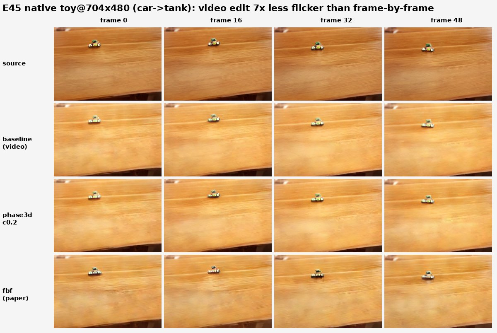
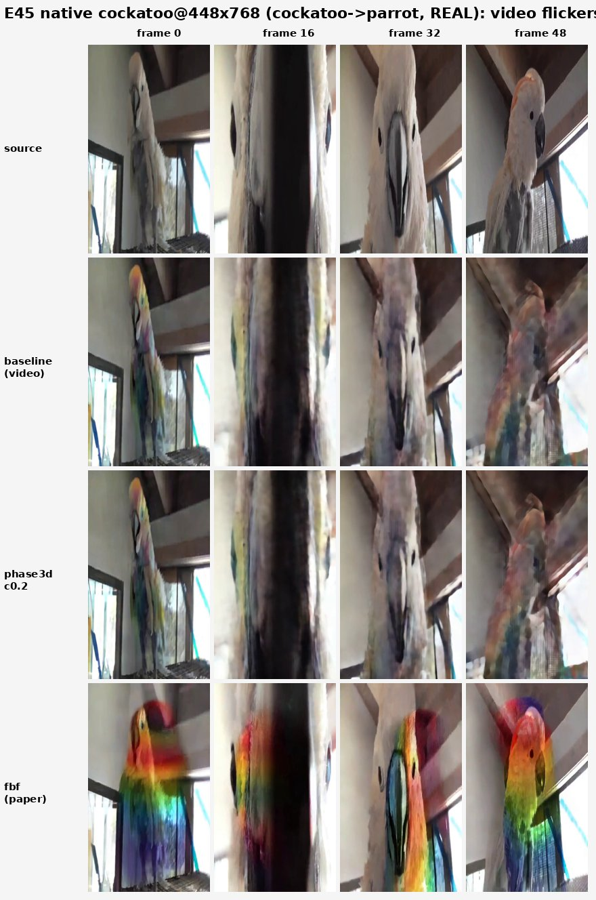

# E45 — FlowAlign on LTX-Video + spatiotemporal phase op (LTX-Video)

**Thread:** style · **Model:** LTX-Video · **Status:** active (CORRECTED — temporal hypothesis KILLed, structure benefit modest KEEP)
**Lineage:** E41 (global spectral knob = frontier trap) → E43 (low-band phase-keep beats FLUX-FlowAlign on structure) → **E45** (does the same op fix *temporal* flicker on real video editing?)

---

## Motivation — does a real video model + a spatiotemporal phase op fix FlowAlign's flicker?

FlowAlign ([arXiv:2505.23145](https://arxiv.org/abs/2505.23145)) is a training-free flow editor. The
paper edits *video* by running the editor **frame-by-frame on an image model (SD3)**, and admits in
its own limitations:

> "temporal consistency for the edited object is limited, as no explicit constraint is imposed."

E45 asks two coupled questions:

1. **Is that flicker intrinsic to FlowAlign, or an artifact of frame-by-frame image-model editing?**
   Run the same FlowAlign math on a *real video model* (LTX-Video), which denoises all frames jointly.
2. **Can our E41/E43 low-band phase-keep op — lifted into the *spatiotemporal (3D)* frequency domain —
   further constrain the residual flicker?** The 2D per-frame variant ≈ the paper's per-frame approach
   (a control); the **3D** variant (FFT over frame×H×W) is the bet, because only a 3D transform couples
   frames and so can act on *temporal* frequency.

The reliable prior from E43 is that the low-band phase-keep op preserves **structure** during editing.
The open bet here is **temporal coherence**.

## Method — FlowAlign ported to LTX, with a 2D/3D phase-keep on the CFG velocity

### FlowAlign on LTX

`e45_ltx_flowalign.py` ports the (model-agnostic) FlowAlign loop to LTX's velocity / latent-packing /
VAE / resolution-shifted sigma schedule (`ltx_velocity`, `ltx_pack`, `ltx_schedule`). Each step does
**3 velocity forwards**. Per step, with source latent `x0`, current edit `xt`, noise `eps`, and CFG
weight `w` (the source prompt acts as the negative):

```
qt   = (1 - s)·x0 + s·eps                       # forward-diffused source at sigma=s
pt   = xt + qt - x0                             # the target trajectory point
vp   = v(pt | C_src) + w·( v(pt | C_tar) − v(pt | C_src) )     # CFG edit velocity
vq   = v(qt | C_src)                             # source-anchor velocity
xt  += (s_lo − s_hi)·(vp − vq) + zeta·( (qt − s·vq) − (pt − s·vp) )   # FlowAlign update
```

`zeta` (=0.01) is FlowAlign's source-consistency term — the `E[q0|qt] − E[p0|pt]` difference of denoised
estimates that pins the edit to the source. **Identity gate:** setting `C_tar = C_src` must reproduce the
source clip; it does (recon L1 ≈ 0.004–0.005 across all runs), confirming the port is correct.

### The spatiotemporal phase-keep op (`band_phase_keep`)

The structure op acts on the **CFG edit velocity** `vp` each step, using the **source-anchor velocity**
`vq` as the phase reference. For a radial low band `r ∈ [0, cut]` (normalized frequency), it **keeps the
edit's magnitude but adopts the source's phase inside the band**:

```
φ_new(k) = φ_ref(k)·band(k) + φ_out(k)·(1 − band(k)),     |X_new(k)| = |X_out(k)|
X_new(k) = |X_out(k)|·exp(i·φ_new(k));   DC bin restored from X_out
```

- **`phase2d`** — FFT over `(H, W)` only, **per frame** independently → ≈ the paper's frame-by-frame
  structure constraint (a control).
- **`phase3d`** — FFT over `(F, H, W)` → a **spatiotemporal** transform. Low *temporal* frequencies are
  the slow, coherent component shared across frames, so keeping the source phase there should *directly*
  damp frame-to-frame flicker — the whole point of going 3D. This is the bet.

Structure rides on phase coherence; keeping the source's low-band phase re-anchors the edited frames to
the source layout/motion while letting magnitude (energy) carry the edit.

### Conditions and metrics

- **`fbf`** — the paper's method: each frame edited as an **independent 1-frame clip** with independent
  noise (`edit_fbf`). This is the flicker baseline to beat.
- **`baseline`** — plain FlowAlign on LTX (phase op off), the video-model edit.
- **`phase2d_c*` / `phase3d_c*`** — the phase op over an `sbn_cut` sweep.

Metric bundle (per condition, vs the source clip): **DINO structure-distance** (↓), **CLIP-directional**
editability (↑, per-frame averaged), and **RAFT warp-error** (the flicker axis): optical flow is computed
on the *source* clip (true motion), the edited frames are warped along it, and the residual is measured
both globally (`warpG`) and inside the **edited-region mask** (`warpM`, the headline — it isolates the
edited object the paper says flickers). FlowAlign hyperparams: `w=10, zeta=0.01`.

## Results

### The trap: resolution artifacts inflated the early (square-res) numbers

Probes S2–S7 ran at **256/512px square**. Square res distorts LTX (it wants larger, **non-square**
frames): 256² is too low-res, and 512² *squashes* a portrait clip into a square. At square res the early
story looked dramatic — frame-by-frame flickered at `warpM` 0.052 while the video edit sat at ~0.0011, a
**46× reduction**, and `phase3d` cut warp another ~20% vs the video baseline where `phase2d` did not. S8
(`e45_compare`) diagnosed this by rendering canonical FlowEdit + every FlowAlign variant at **native
704×480** — all rendered clean — so the headline numbers were **re-run at native res (S9)** and the early
claims were retracted.

### Native-res numbers (S9 — the trustworthy run)

**native_toy @704×480, generated (car→tank)** — identity recon L1 = 0.0047:

| cond | struct ↓ | clip ↑ | warpG ↓ | warpM ↓ |
|---|---|---|---|---|
| baseline (video) | 0.0774 | +0.1745 | 0.000163 | 0.000151 |
| phase2d_c0.2 | 0.0742 | +0.1822 | 0.000164 | 0.000150 |
| phase3d_c0.2 | 0.0749 | +0.1912 | 0.000171 | 0.000156 |
| fbf (paper) | 0.0870 | +0.1630 | 0.001275 | 0.001063 |

→ On generated/easy content the **video edit is 7.1× less flicker than frame-by-frame** (`warpM` 0.00015
vs 0.00106), and the phase op improves **both** structure *and* editability (goal PASS). (At native res
the metrics are much healthier than the distorted 256²: structure ~halved, CLIP roughly doubled.)

**native_cockatoo @448×768, REAL footage (cockatoo→rainbow parrot)** — identity recon L1 = 0.0217:

| cond | struct ↓ | clip ↑ | warpG ↓ | warpM ↓ |
|---|---|---|---|---|
| baseline (video) | 0.1295 | +0.1333 | 0.01680 | 0.03934 |
| phase2d_c0.2 | 0.1261 | +0.1254 | 0.01617 | 0.04105 |
| phase3d_c0.2 | 0.1284 | +0.1345 | 0.01635 | 0.04003 |
| fbf (paper) | 0.1288 | +0.2494 | 0.02593 | 0.02929 |

→ **REVERSAL.** On real footage with genuine motion the **video baseline flickers *more* than
frame-by-frame** (`warpM` 0.039 vs 0.029 — video is 0.7×, i.e. *worse*), and the phase op gives **no
temporal benefit** (~0.040 ≈ baseline). `fbf` also edits much harder here (CLIP +0.249 vs +0.133).


The still montages (frames 0/16/32/48) show the behavior the warp metric measures — note `fbf` (bottom
row) is the per-frame paper method:





### What survives

The one finding that holds at native res across **both** scenes is a **small, consistent
structure-preservation improvement** from the phase op (toy 0.074 vs 0.077; cockatoo 0.126–0.128 vs
0.130) — consistent with E43 on images. The big temporal numbers do not survive.

## Verdict

**CORRECTED (native res): the temporal claims do NOT generalize.**

- On **generated/easy** content (toy) the video edit *is* temporally smoother than frame-by-frame (7×)
  and the phase op improves structure + editability — video wins.
- On **real footage with motion** (cockatoo) the video-model edit flickers **as much or more** than
  frame-by-frame, and the phase op gives **no** temporal benefit. The "video ≫ frame-by-frame on flicker"
  and "3D-phase reduces flicker" claims were **resolution artifacts** (256/512 square distortion), not a
  bug — the port is correct (identity recon ~0.005).
- The reliable finding is the **modest structure-preservation** edge from the phase op (as in E43).

**Temporal hypothesis = KILL as a general claim. Structure-preservation benefit = modest KEEP.**
Do not publish the temporal win. The warp metric on real footage is itself confounded (source-flow warp
of a *changed* object), so a temporal claim would need a multi-clip real-video set (e.g. DAVIS) + a
perceptual flicker measure. The phase op's honest value is structure preservation — evaluate that on a
real-video edit benchmark.

## Artifacts

- **Driver:** `experiments/e45_ltx_flowalign.py` (parts: `smoke` / `gen` / `analyze` / `compare`;
  `flowalign_video`, `flowedit_video`, `band_phase_keep`, RAFT `warp_error`).
- **Probe log:** `experiments/e45_log.md` (S0–S9; S8 = distortion diagnosis, S9 = native-res correction).
- **Results (native-res, trustworthy):**
  `/storage/malnick/colorful-noise/experiments/results/e45_native_toy/` and `.../e45_native_cockatoo/`
  (each: `source/recon/baseline/phase2d_c0.2/phase3d_c0.2/fbf.mp4` + `gen_report.json`). Diagnostic
  clips: `.../e45_compare/`. Mirror copies also live on the unmerged worktree
  `.claude/worktrees/e44-ltx-flowalign/experiments/results/e45_native_clips/` and `e45_compare_clips/`.
- **Figures:** `docs/experiment-reports/figs/E45/` (frame montages + warp bar chart); full-res archive at
  `/storage/.../roadmap_results/E45/`.
- **Demo:** LTX-Video FlowAlign tab in `spectral_demo.py` (`--model ltx`).
