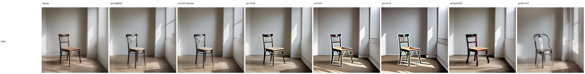
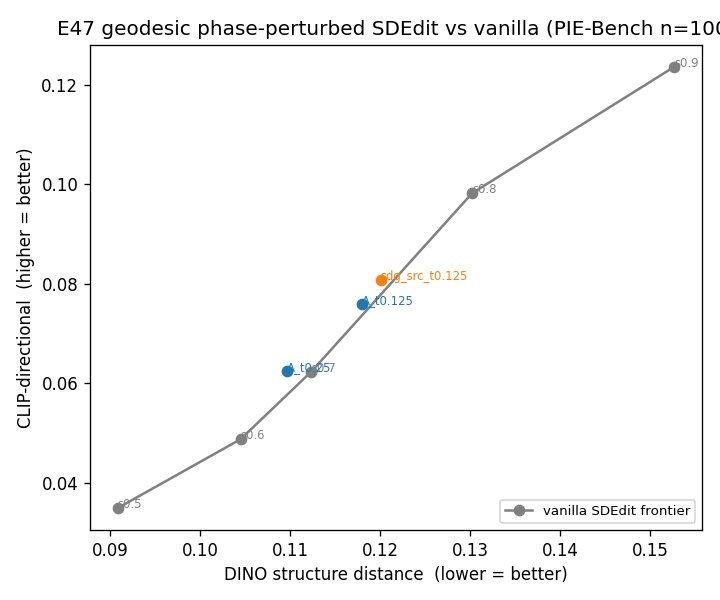

# E47 — Geodesic phase-perturbed SDEdit: fast, structure-preserving editing (SDXL)

**Thread:** fast-edit · **Model:** SDXL · **Benchmark:** PIE-Bench (`PIE_Bench_pp`) · **Status:** active (KEEP)
**Predecessor:** [E46](EXPERIMENT_46.md) (chord seed-phase transplant, KILLed)

---

## Motivation — fast *and* good editing

Training-free image editing has two camps, both with a cost:

- **Inversion-based** (DDIM/RF inversion + P2P/MasaCtrl/…): faithful, but you pay a **full extra
  pass** to walk the image back to a seed (≈17+17 NFE).
- **FlowEdit / FlowAlign / AlignFlow** (training-free flow editors): no inversion, but **>2 NFE per
  step** (≈33 NFE).
- **SDEdit** is the cheap one — a single partial-noising pass — but it **trades structure for edit
  strength**: to actually change the content you must noise hard, which destroys layout.

We want **fast (SDEdit-cost) AND good (inversion-quality structure)**. The question of E47: can a
**near-free spectral move** (one FFT, zero extra NFE) buy back SDEdit's structure?

## The line this sits in (why E47 is not E46)

E41 found the **frontier-trap**: spectral/structural knobs slide *along* the SDEdit↔inversion
structure-vs-editability frontier, never push it out. E46 confirmed it a 4th time — transplanting the
source FFT **phase** into a fresh seed, mixed by a **chord** `unit((1−γ)e^{iφ₀}+γe^{iφ₁})`, traced a
frontier at-or-inside vanilla SDEdit's and was **KILLed**. Two flaws of that approach, both fixed here:

1. **The chord is not the right interpolation.** Summing two unit phasors and renormalizing travels
   the *chord* of the unit circle: variable angular speed, and when the phasors are near-antipodal
   (δ≈±π) the chord passes near the origin and the renormalized phase **flips discontinuously** →
   jitter / fringing.
2. **It was not apples-to-apples.** E46 built a *new seed* (or replaced SDEdit's whole noise),
   conflating "how much source we keep" with "the phase trick."

## Method — geodesic perturbation of the SDEdit latent

Standard SDEdit forms a partially-noised latent at strength `s`:
`x_std = √ᾱ·x₀ + √(1−ᾱ)·ε` (white ε), then denoises toward the target prompt. By FFT linearity
(`x₀ ⟂ ε`), `X_std(k) = √ᾱ·X₀(k) + √(1−ᾱ)·E(k)` — its **magnitude** is the correct strength-`s`
energy spectrum (low-k source-dominated, high-k noise), and its **phase** is a fixed SNR-weighted
blend you don't control.

**E47 keeps the magnitude and rotates only the phase along the geodesic:**

```
φ_new(k) = φ_std(k) + τ(k) · wrap( φ_target(k) − φ_std(k) ),     |X_new| = |X_std|
wrap(δ)  = ((δ + π) mod 2π) − π                # shortest signed arc, per frequency k
```

- **τ = 0 ⇒ x_std exactly ⇒ vanilla SDEdit** (a sanity arm reproduces it to fp precision — the
  geodesic is a *pure perturbation*, nothing else changes).
- **target = source phase** ⇒ **structure-restore** (push the noised phase back toward the clean
  layout); **target = white** ⇒ **edit-boost**. `τ` can be **per radial-frequency band** (restore the
  coarse layout, leave/​whiten detail).

### Geodesic vs linear (the core distinction)

Each frequency's phasor lives on the unit circle (|·|=1). The **chord** (E46) cuts straight across
and is renormalized → variable angular velocity + the antipodal flip. The **geodesic**
`φ₀ + τ·wrap(δ)` rotates at **constant angular velocity along the arc** — smooth, monotone, no flip.
(Implementation note: an intermediate `τ` breaks Hermitian symmetry at the self-conjugate DC/Nyquist
bins — a 9e-2 imaginary leak that `.real` would silently corrupt — so those 4 bins are restored from a
Hermitian-safe reference; verified leak → ~2e-7.)

### Energy / phase decoupling (why it can win where E46 could not)

Structure rides on **phase coherence**; energy rides on **magnitude**. Because E47 sets magnitude =
the strength-`s` SDEdit energy and structure = the geodesic `τ` **independently**, you can hold the
*edit budget* fixed (strength) while dialing *structure* (τ). Contrast the two ways to be "ours":

- **A** = geodesic *noise* injected into SDEdit. Keeps the `√ᾱ·x₀` term **and** adds source-phase to
  the noise → structure is anchored *twice* → on a single hard image it **over-locks** (edit dies).
- **SDG** = geodesic on the noised *latent* phase. No second anchor; structure is purely the τ knob.

Direct proof of the decoupling (chair, matched structure ≈ 0.082): **A** gives +0.022 editability,
**SDG** gives +0.064 — 3× the edit at the same structure, because A pays extra `x₀` energy while SDG
only sharpens phase.


The SDG τ-sweep on the chair (τ=0 column reproduces vanilla; pushing τ toward the source phase
restores structure, toward white boosts the edit):



## Probes & results

Metric: DINO structure-distance (↓) × CLIP-directional editability (↑). "Win" = a point **NW** of the
vanilla SDEdit strength frontier {0.5,0.6,0.7,0.8,0.9}. 17 NFE (FlowAlign sampling budget), 1024px.

- **P0 (cluster, n=20):** variant **B** (full-gen geodesic seed, no x₀) — **WINNERS none**, dominated
  (white-magnitude seed is OOD). KILL B.
- **P1–P3 (local chair / 3 images):** A over-locks on the synthetic chair; **SDG** competitive
  (`SDG_src τ=0.25` = 0.082/+0.064 vs vanilla 0.107/+0.067 — better structure at matched edit);
  the spectral-geodesic form hugs the frontier from both sides. τ=0 ≡ vanilla validated.
- **P4 (cluster, n=20, apples-to-apples):** **both** light-τ arms beat the frontier — `A_t0.25` =
  0.108/+0.065 (**+0.025**, fills the s0.7→s0.8 Pareto gap); `sdg_src_t0.25` +0.002 (marginal).
- **P5 (cluster, n=100 confirmation):** the win **holds but the margin shrinks**:

| arm | struct ↓ | clip ↑ | vs frontier |
|---|---|---|---|
| vanilla s0.7 | 0.112 | +0.062 | — |
| vanilla s0.8 | 0.130 | +0.098 | — |
| **A_t0.125** | 0.118 | +0.076 | **WIN +0.002** |
| **A_t0.25** | 0.110 | +0.062 | **WIN +0.0045** (robust: won at n=20 *and* n=100) |
| A_t0.375 | 0.108 | +0.048 | no |
| sdg_src_t0.125 | 0.120 | +0.081 | WIN +0.003 |
| sdg_src_t0.25 | 0.112 | +0.062 | tie |

The margin **collapsed +0.025 (n=20) → +0.0046 (n=100)** because vanilla improved more than our arms
when averaged over 100 images. The point-estimate wins sit at structure ≈ 0.11 (≈ vanilla strength
0.65–0.7).

- **P5b (variance check — paired bootstrap, the decisive caveat).** 4000 resamples over the 100
  images (each arm and the vanilla frontier resampled *together*; margin = arm clip − interp(frontier
  @ arm struct)). **Every 95% CI crosses zero:**

| arm | margin | 95% CI | P(margin > 0) |
|---|---|---|---|
| A_t0.25 | +0.0046 | [−0.0069, +0.0155] | **0.78** |
| sdg_src_t0.125 | +0.0029 | [−0.0040, +0.0105] | 0.79 |
| A_t0.125 | +0.0022 | [−0.0085, +0.0126] | 0.65 |

The best arm is only **78% likely to be truly NW** of the frontier. So the n=100 advantage is a
point-estimate that **does not clear the noise.** (Analysis: `experiments/e47_analyze.py`.)



Full-resolution per-image grids (vanilla strength sweep × geodesic arms, ~100 rows) are archived
under `/storage/.../roadmap_results/E47/` (`confA_piebench_n100`, `confSDG_piebench_n100`).

## Verdict

**Directional, not yet significant — the strongest lead in the E41→E47 line, but not a demonstrated
win.** The point-estimate sits NW of the vanilla SDEdit frontier (consistent across n=20/100 and across
arms, A>SDG), via the two ingredients E46 lacked: the **geodesic** (smooth, constant-velocity, no
antipodal flip) and the **energy/phase decoupling** (structure on phase, edit budget on magnitude at a
fixed strength). **But the paired bootstrap shows the n=100 margin does not separate from zero**
(every 95% CI crosses 0; best arm P=0.78). So this is a **promising direction, not a win.**

Honest framing for the meeting: *we turned E46's KILL into a directionally-positive, principled lead —
interpolating phase correctly (geodesic) and decoupling it from energy — but it is not yet
statistically a win at n=100.* **Decide next:** (a) chase significance with n≈500 (~5× the run,
~halves the SE), (b) reframe the contribution around the consistent direction + mechanism, or
(c) accept it as a 5th frontier-trap confirmation.

## Difference from the two closest papers

Both are training-free, frequency-domain noise manipulations — so the distinction matters. We differ
on three axes (*phase vs magnitude*, *geodesic vs inject*, *editing vs generation*):

- **Colorful-Noise** (arXiv 2605.00548, this repo's basis): manipulates **low-frequency
  magnitude/noise** with image priors for **color/structure-conditioned generation**. E47 touches
  **phase** (not magnitude) and does **editing** via SDEdit.
- **Φ-Noise** (arXiv 2605.24509): injects **low-frequency phase** from a reference **video** into the
  noise to transfer **motion** for **video generation**. E47 (a) **geodesically interpolates** phase by
  a controllable `τ` (vs a hard inject/replace), (b) operates on the **SDEdit noised latent** as a
  perturbation with **τ=0 ≡ vanilla** (an editing knob, not a generation prior), and (c) targets
  **image editing** with explicit energy/phase decoupling and a matched-strength comparison.

## Next / open

1. **Constant-hyperparameter comparison (headline for the paper).** The paper-story needs a *fixed*
   operating point, not a swept frontier. Match **FlowAlign's SDEdit config** (`n_start=10, cfg=7,
   NFE=33` ≈ strength 0.30) and run vanilla vs geodesic at that single constant. ⚠️ Our wins are at
   structure ≈ 0.11 (≈ strength 0.65–0.7), **not** FlowAlign's lighter ~0.30 regime — so confirm
   whether a win survives at that fixed light point (and report where on the strength axis the win
   lives).
2. **Geodesic on top of inversion editors.** Many inversion editors use SDEdit-style *partial*
   noising at generation time (they don't run the full path) — the geodesic phase-perturbation can be
   dropped onto their partial-noising step, making it a reusable primitive rather than one pipeline.
3. **Scale + richer metrics:** full PIE-Bench with masked-background PSNR/LPIPS and CLIP-I, and
   architecture-independence on SD3.5/Flux.

## Artifacts

`experiments/e47_geodesic.py` (harness; helpers `sdedit_geodesic` / `sdedit_phase_geodesic` /
`spectral_geodesic_sdedit` / `geodesic_seed` / `two_band_t_field`), `experiments/cluster_e47_job.sh`
(stages `--sweepA/--sweepSDG`, `--confA/--confSDG`). Probe log `experiments/e47_log.md` (P0–P5).
Handoff `experiments/e47_handoff.md`. Manifest `experiments/manifests/E47.json`. Verdicts + grids:
`experiments/results/e47_conf{A,SDG}/` (on /storage; grids ~130 MB each).
