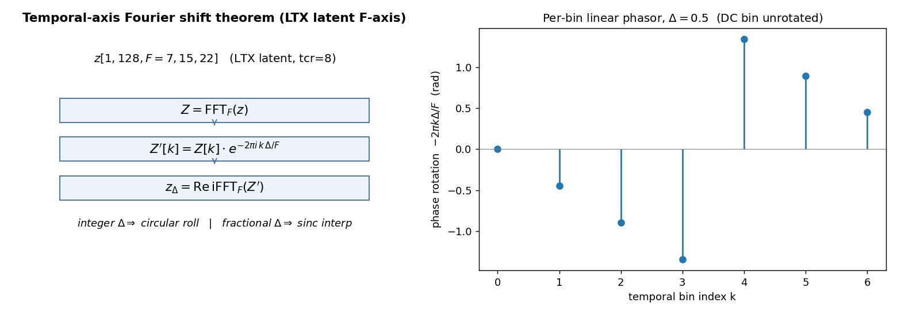
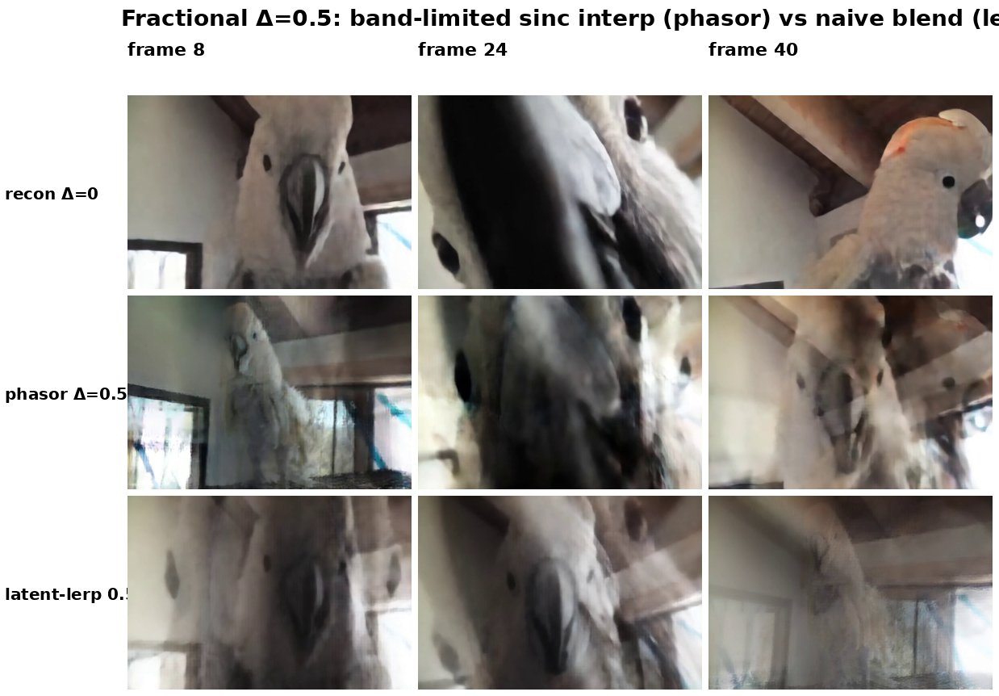

# E48 — Temporal-axis Fourier phasor on LTX latents: motion-carrier sanity

**Thread:** style · **Model:** LTX-Video · **Clip:** `imageio:cockatoo.mp4` (704×480, 49f) · **Status:** active (KEEP)
**Predecessor:** [E45](EXPERIMENT_45.md) (FlowAlign + spatial phase on LTX video)

---

## Motivation — is the LTX latent's *temporal* phase a usable motion carrier?

E45 showed spatial-phase preservation helps on LTX video. The natural follow-on: video latents
have a **temporal (frame) axis** too — is its **phase** a faithful, smoothly-manipulable carrier of
**motion**, the way spatial phase carries layout? If so, the intended deliverable is **temporal-only
phase preservation for edit consistency** (keep the motion while the prompt changes the content),
judged later on a flicker × editability frontier.

Before building that, E48 asks the prior, foundational question with **no model judgement at all**:
when we manipulate the temporal phase of the latent, does it (a) obey the math we expect and (b)
decode to coherent re-timed video? A blunt but important reframe drove the scope:

> A **linear** temporal phasor is a **circular shift** of the frames. It can re-time or interpolate,
> but it **cannot extrapolate genuinely-new frames** (no new motion content is synthesized). So E48
> only ever tests **re-timing / interpolation** — never extrapolation — and uses fractional
> interpolation purely as a **diagnostic** of whether the temporal phase is well-behaved.

## Method — the temporal Fourier shift theorem in latent space

The LTX VAE encodes the clip to a latent `z` of shape `(1, 128, F=7, 15, 22)` with temporal
compression ratio `tcr = 8` (≈ one latent frame per 8 pixel frames; the VAE encodes frame 0 as a
single pixel-frame and the rest as 8 each). E48 operates on the **F axis (dim 2)**.

The Fourier shift theorem on a single axis says a circular shift by `Δ` samples equals a per-bin
linear phase ramp in the FFT:

```
Z      = FFT_F(z)                                  # FFT along the temporal axis
Z'[k]  = Z[k] · exp(-2π i · k · Δ / F)             # k = fftfreq bin index, F = 7
z_Δ    = Re · iFFT_F(Z')                            # shifted / interpolated latent
```

- **Integer `Δ`** ⇒ exact **circular frame shift** (`z_Δ == torch.roll(z, Δ, dim=2)`).
- **Fractional `Δ`** ⇒ **band-limited sinc interpolation** between frames — *not* a per-frame blend.



**Why this is the right sanity check.** Spatial phase carrying layout (E43–E45) is established; the
open question is whether the *temporal* axis of this particular latent behaves like a clean,
linear, shift-equivariant time axis. If it does, the whole "preserve temporal phase to keep motion"
program is justified. The probe escalates from pure math to model behaviour in three checks:

1. **Operator correctness** (latent space, no VAE). Sanity on the code/FFT identities:
   integer phasor `==` `torch.roll`; `+0.5` then `−0.5` recovers `z`; two half-shifts `==` one
   integer shift.
2. **VAE temporal shift-equivariance** (integer `Δ=1`). The make-or-break test:
   does `decode(shift(z, 1))` equal a clean `tcr`-pixel-frame roll of `decode(z)`? If the latent
   F-axis is a faithful time axis, shifting one latent frame should equal shifting the video by
   `tcr = 8` pixel frames. Measured as PSNR; read on the **interior** (away from both wrap edges)
   because circular wrap and the `1 + 8k` VAE asymmetry corrupt the boundaries by construction.
3. **Fractional coherence** (`Δ=0.5`). Decode the half-shifted (interpolated) latent and compare it
   to a **naive latent-lerp** baseline `z_lerp = 0.5·z + 0.5·roll(z, −1)`. PSNR between them
   quantifies how far the principled sinc interpolation departs from a dumb each-frame-with-next
   average.

Driver: `experiments/e48_temporal_phasor.py`; reuses E45 `ltx_encode` / `ltx_decode` / `ltx_conform`.
VAE round-trip L1 on this clip = **0.0187** (clean baseline for reading the PSNRs below).

## Results

All three checks pass.

**1 · Operator correctness** — exact at float32 FFT precision:

| identity | max \|err\| |
|---|---|
| integer-shift `==` `torch.roll(·,1)` | 1.2e-6 |
| roundtrip `(+0.5, −0.5)` recovers `z` | 1.4e-6 |
| half + half `==` integer roll | 1.9e-6 |

**2 · VAE temporal shift-equivariance (`Δ=1`)** — `decode(shift1)` vs `roll(decode, tcr=8)`:

| region | PSNR |
|---|---|
| all frames | 19.80 dB |
| **interior `[16:33]`** | **37.67 dB** |

The interior number is the real one. **37.7 dB means shifting the latent by one frame ≈ a clean
8-pixel-frame shift of the decoded video** — the latent F-axis is a faithful, shift-equivariant
time axis. The low all-frames PSNR is *expected* boundary corruption: the circular wrap
(latent frame 6 → 0) does not match a pixel roll at the seam, and the LTX VAE's
frame0=1-pixel / rest=8-pixel asymmetry warps the very first frames. The filmstrip shows the
shifted row tracking the same head-motion as the source, one latent frame ahead:


**3 · Fractional coherence (`Δ=0.5`)** — PSNR(phasor, latent-lerp) = **12.54 dB**. The phasor
interpolation differs *substantially* from the naive blend: it is band-limited sinc interpolation,
not an each-frame-with-next average. Lower PSNR here is the desired outcome — it confirms the phasor
is doing real interpolation, not collapsing to a mean.



## Verdict

**KEEP.** The operator is correct (≤1.9e-6) and the LTX latent temporal axis is **shift-equivariant
in the interior (37.7 dB)** — temporal phase is a faithful, manipulable motion carrier, so the
intended deliverable (temporal-only phase preservation for edit consistency) is worth building.

Honest caveats carried forward:

1. **Equivariance is interior-only.** Boundaries are corrupted by the circular wrap plus the
   `1 + 8k` LTX VAE temporal asymmetry. The P1 deliverable *preserves* phase (no shift), so the wrap
   is not directly hit — but the boundary asymmetry is a real property of the LTX temporal VAE.
2. **`F_lat = 7`** (3 oscillatory bins) is fine for interpolation (a lossless invertible transform)
   but leaves essentially no room for spectral *modeling* — consistent with dropping extrapolation
   from scope entirely.

**Next (P1):** `mode="phaseT"` temporal-only phase preservation inside `flowalign_video`, vs vanilla
and the E45 `phase3d` arm, on native non-square dims + real footage. Frontier knob = phase-transplant
strength; metric = flicker (background-masked / warped-LPIPS self-consistency) × CLIP editability.
KEEP iff it **beats** the vanilla/`phase3d` frontier; KILL if it lands on it (the E41/E46 trap).

## Artifacts

- **Driver:** `experiments/e48_temporal_phasor.py` (`temporal_shift`, `psnr`; reuses E45
  `ltx_encode/decode/conform`).
- **Cluster job:** `experiments/cluster_e48_phasor.sh` (RunAI `e48-phasor`, A5000).
- **Log:** `experiments/e48_log.md` (P0 verdict; P1 plan).
- **Results location:** mp4 outputs on /storage at
  `/storage/malnick/colorful-noise/experiments/results/e48/{source,recon,shift_int1,shift_frac0.5,lerp0.5}.mp4`
  (also present in the unmerged worktree `e48-temporal-phasor`). Full-res copies + figure PNGs
  archived under `/storage/malnick/colorful-noise/roadmap_results/E48/`.
- **Figures:** `docs/experiment-reports/figs/E48/{method,shift_filmstrip,frac_phasor_vs_lerp}.jpg`
  (`method` is a generated matplotlib diagram; the other two are frame tilings extracted from the
  result mp4s).
